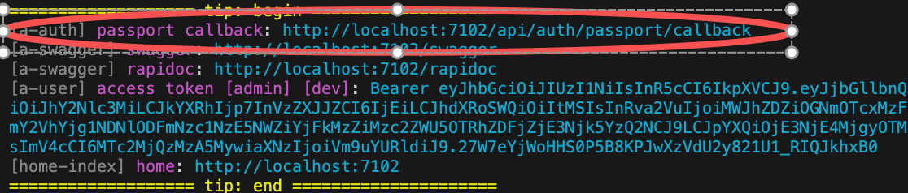

# Github Authentication

This module provides `Github Authentication` and supports mock user login in the development environment, making development and debugging very convenient

## Installing the module

``` bash
$ pnpm add vona-module-a-authgithub -w
```

## How to Use

### 1. Login

``` typescript
class ControllerStudent {
  @Web.get('login')
  @Passport.public()
  async login() {
    await this.bean.auth.authenticate(
      'a-authgithub:github',
      { state: { redirect: '/' } },
    );
  }
}
```

### 2. Logout

``` typescript
await this.bean.passport.signout();
```

### 3. Authentication Credentials

In App Config Setting Authentication Credentials

`src/backend/config/config/config.ts`

``` typescript
// onions
config.onions = {
  authProvider: {
    'a-authgithub:github': {
      clients: {
        default: {
          clientID: 'xxxxxx',
          clientSecret: 'xxxxxxx',
        },
      },
    },
  },
};
```

- `clients.default`: A Provider can set multiple Clients, the default is `default`

### 4. Adding More Client Credentials

* First, add the Client type definition using the interface merging mechanism

In the VSCode editor, enter the code snippet `recordauthclient`, and the code skeleton will be automatically generated:

``` typescript
declare module 'vona-module-x-x' {
  export interface IAuthProvider_xxx_ClientRecord {
    : never;
  }
}
```

Adjust the code:

``` typescript
declare module 'vona-module-a-authgithub' {
  export interface IAuthProviderGithubClientRecord {
    another: never;
  }
}
```

* Then set the authentication credentials in App Config

``` diff
// onions
config.onions = {
  authProvider: {
    'a-authgithub:github': {
      clients: {
        default: {
          clientID: 'xxxxxx',
          clientSecret: 'xxxxxxx',
        },
+       another: {
+         clientID: 'yyyyyy',
+         clientSecret: 'yyyyyyy',
+       },
      },
    },
  },
};
```

### 5. OAuth Authentication Callback URL

When using OAuth authentication, you need to provide the system's Callback URL on the OAuth website

VonaJS provides a unified Callback URL value and outputs it directly to the console during development for easy use



### 6. Disable `useMockForDev`

By default, mocking user login is allowed in the development environment

`useMockForDev` can be disabled in App Config

`src/backend/config/config/config.ts`

```typescript
// onions
config.onions = {
  authProvider: {
    'a-authgithub:github': {
      useMockForDev: false,
    },
  },
};
```

## Source Code Analysis

This section analyzes the core source code of the module `a-authgithub` to illustrate how to develop a new Auth Provider

For example, creating an Auth Provider: `github` in the module `a-authgithub`

### 1. Cli command

``` bash
$ vona :create:bean authProvider github --module=a-authgithub
```

### 2. Menu command

::: tip
Context Menu - [Module Path]: `Vona Bean/Auth Provider`
:::

## Auth Provider definition

``` diff
export interface IAuthProviderGithubClientRecord extends IAuthProviderClientRecord {}

export interface IAuthProviderGithubClientOptions extends IAuthProviderOauth2ClientOptions {
  userProfileURL?: string;
  userAgent?: string;
}

export interface IAuthProviderOptionsGithub extends IDecoratorAuthProviderOptions<
  keyof IAuthProviderGithubClientRecord,
  IAuthProviderGithubClientOptions
> {
  useMockForDev: boolean;
}

@AuthProvider({ useMockForDev: true, default: { confirmed: true, clientID: 'xxxxxx', clientSecret: 'xxxxxx' } })
class AuthProviderGithub {
  async strategy(_clientOptions, options) {
    return (this.app.meta.isTest || this.app.meta.isDev) && options.useMockForDev ? StrategyMock : StrategyGithub;
  }

  async verify(
    args,
    _clientOptions,
    _options,
    _state?,
  ) {
    return getStrategyOauth2Profile(args);
  }
}
```

- `IAuthProviderGithubClientRecord`: Define multiple Clients, with `default` defined by default
- `IAuthProviderGithubClientOptions`: Define Client options
- `IAuthProviderOptionsGithub`: Define the parameters of Auth Provider
- `strategy`: Returning the authentication strategy
- `verify`: Uses the utility method `getStrategyOauth2Profile` to extract Profile data from the authentication result and returns it to the system

## Profile

1. The Provider's `verify` only needs to return Profile data. The system will generate a User object based on the Profile data
2. The Profile contains an `id` field value
3. The OAuth provider ensures that a unique `id` value is generated for each different user

Profile has a unified interface definition:

``` typescript
export interface IAuthUserProfile {
  id: string;
  username?: string;
  displayName?: string;
  name?: IAuthUserProfileName;
  gender?: string; // male/female
  profileUrl?: string;
  emails?: IAuthUserProfilePropSlice[];
  photos?: IAuthUserProfilePropSlice[];
  locale?: keyof ILocaleInfos;
  confirmed?: boolean;
}
```

* `confirmed`: If `true`, it means the user has confirmed and no further `activation` operation is needed
