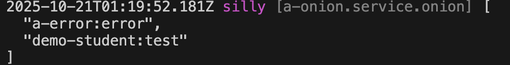

# Global Filter

## Create Filter

For example, create a global filter `test` in the module demo-student to check whether the current username is `test`. If not, an exception is thrown

### 1. Cli command

``` bash
$ vona :create:bean filter test --module=demo-student --boilerplate=global
```

### 2. Menu command

::: tip
Context Menu - [Module Path]: `Vona Aspect/Filter Global`
:::

## Filter Definition

``` typescript
export interface IFilterOptionsTest extends IDecoratorFilterOptionsGlobal {}

@Filter<IFilterOptionsTest>({ global: true })
export class FilterTest {
  async execute(_options: IFilterOptionsTest, next: Next): Promise<boolean> {
    const user = this.bean.passport.getCurrentUser();
    if (!user || user.name !== 'test') this.app.throw(403);
    // next
    return next();
  }
}
```

- `getCurrentUser`: Get the current user

## Using Filter

Unlike local filter, the system automatically loads global filters and makes them effective

## Filter Parameters

You can define parameters for filter, allowing for more flexible configuration of filter logic

For example, define the `name` parameter for the test filter to control the username that needs to be judged

### 1. Defining parameter types

``` diff
export interface IFilterOptionsTest extends IDecoratorFilterOptionsGlobal {
+ name: string;
}
```

### 2. Providing default values ​​for parameters

``` diff
@Filter<IFilterOptionsTest>({
  global: true,
+ name: 'test',
})
```

### 3. Using Parameters

``` diff
export interface IFilterOptionsTest extends IDecoratorFilterOptionsGlobal {
  name: string;
}

@Filter<IFilterOptionsTest>({
  global: true,
  name: 'test',
})
export class FilterTest extends BeanBase implements IFilterExecute {
  async execute(options: IFilterOptionsTest, next: Next): Promise<boolean> {
    const user = this.bean.passport.getCurrentUser();
-   if (!user || user.name !== 'test') this.app.throw(403);
+   if (!user || user.name !== options.name) this.app.throw(403);
    // next
    return next();
  }
}
```

### 4. Specify parameters when using

You can specify global filter parameters for a specific API

``` diff
class ControllerStudent {
  @Web.get()
+ @Aspect.filterGlobal('demo-student:test', { name: 'other-name' })
  async findMany() {}
}
```

- When using filter, just provide the parameter value directly

### 5. App config

Filter parameters can be configured in App config

`src/backend/config/config/config.ts`

``` typescript
// onions
config.onions = {
  filter: {
    'demo-student:test': {
      name: 'other-name',
    },
  },
};
```

### 6. Parameter precedence

`Specify parameters when using` > `App config` > `Default values`

## Filter Order

Since global filters ard loaded and enabled by default, VonaJS provides two parameters to control the order in which filter is loaded

### 1. dependencies

For example, the system has a built-in global filter `a-user:passport`, and we hope that the loading order is as follows: `a-user:passport` > `Current`

``` diff
@Filter({
  global: true,
+ dependencies: 'a-user:passport',
  name: 'test',
})
class FilterTest {}
```

### 2. dependents

The order of `dependents` is just the opposite of `dependencies`. We hope that the loading order is as follows: `Current` > `a-user:passport`

``` diff
@Filter({
  global: true,
+ dependents: 'a-user:passport',
  name: 'test',
})
class FilterTest {}
```

## Filter enable/disable

You can control `enable/disable` of global filter for certain APIs

### 1. Enable

* Disable for an API

``` diff
class ControllerStudent {
  @Web.get()
+ @Aspect.filterGlobal('demo-student:test', { enable: false })
  async findMany() {}
}
```

* Disable for all APIs

`src/backend/config/config/config.ts`

``` diff
// onions
config.onions = {
  filter: {
    'demo-student:test': {
+     enable: false,
    },
  },
};
```

### 2. Meta

Allows global filter to take effect in a specified operating environment

|Name|Type|Description|
|--|--|--|
|flavor|string\|string[]|See: [Runtime Environments and Flavors](../../techniques/mode-flavor/introduction.md)|
|mode|string\|string[]|See: [Runtime Environments and Flavors](../../techniques/mode-flavor/introduction.md)|
|instanceName|string\|string[]|See: [Multi-Instance/Multi-Tenancy](../../techniques/instance/introduction.md)|
|host|string\|string[]|Host|

* Example

``` diff
@Filter({
  global: true,
+ meta: {
+   flavor: 'normal',
+   mode: 'dev',
+   instanceName: '',
+   host: 'localhost:7102',
+ },
})
class FilterTest {}
```

### 3. match/ignore
    
You can enable/disable global filter for some specific APIs    

|Name|Type|Description|
|--|--|--|
|match|string\|regexp\|(string\|regexp)[]|For which APIs to enable|
|ignore|string\|regexp\|(string\|regexp)[]|For which APIs to disable|

## Inspect

You can directly inspect the currently effective global filter list in the Controller action

``` diff
class ControllerStudent {
  @Web.get()
  async findMany() {
+   this.bean.onion.filter.inspect();
  }
}
```

- `this.bean.onion`: Get the global Service instance `onion`
- `.filter`: Get the Service instance related to the filter
- `.inspect`: Output the currently effective global filter list

When accessing the `findMany` API, the current list of global filter in effect will be automatically output to the console, as shown below:


