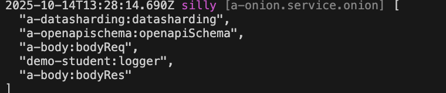

# Global Interceptor

## Create Interceptor

For example, we create a Global Interceptor `logger` in the module demo-student

### 1. Cli command

``` bash
$ vona :create:bean interceptor logger --module=demo-student --boilerplate=cli/interceptorGlobal/boilerplate
```

### 2. Menu command

::: tip
Context Menu - [Module Path]: `Vona Aspect/Interceptor Global`
:::

## Interceptor Definition

``` typescript
export interface IInterceptorOptionsLogger extends IDecoratorInterceptorOptionsGlobal {}

@Interceptor<IInterceptorOptionsLogger>({ global: true })
export class InterceptorLogger extends BeanBase implements IInterceptorExecute {
  async execute(_options: IInterceptorOptionsLogger, next: Next) {
    const timeBegin = Date.now();
    const res = await next();
    const timeEnd = Date.now();
    console.log('time: ', timeEnd - timeBegin);
    return res;
  }
}
```

- `IInterceptorOptionsLogger`: Defines interceptor parameters
- `execute`: Outputs execution time

## Using Interceptor

Unlike local interceptor, the system automatically loads global interceptors and makes them effective

## Interceptor Parameters

You can define parameters for interceptor, allowing for more flexible configuration of interceptor logic

For example, define the `prefix` parameter for the logger interceptor to control the output format

### 1. Defining parameter types

``` diff
export interface IInterceptorOptionsLogger extends IDecoratorInterceptorOptionsGlobal {
+ prefix: string;
}
```

### 2. Providing default values ​​for parameters

``` diff
@Interceptor<IInterceptorOptionsLogger>({
  global: true,
+ prefix: 'time',
})
```

### 3. Using Parameters

``` diff
export interface IInterceptorOptionsLogger extends IDecoratorInterceptorOptionsGlobal {
  prefix: string;
}

@Interceptor<IInterceptorOptionsLogger>({
  global: true,
  prefix: 'time',
})
class InterceptorLogger {
  async execute(options: IInterceptorOptionsLogger, next: Next) {
    const timeBegin = Date.now();
    const res = await next();
    const timeEnd = Date.now();
-   console.log('time: ', timeEnd - timeBegin);
+   console.log(`${options.prefix}: `, timeEnd - timeBegin);
    return res;
  }
}
```

### 4. Specify parameters when using

You can specify global interceptor parameters for a specific API

``` diff
class ControllerStudent {
  @Web.get()
+ @Aspect.interceptorGlobal('demo-student:logger', { prefix: 'elapsed' })
  async findMany() {}
}
```

- When using interceptor, just provide the parameter value directly

### 5. App config

Interceptor parameters can be configured in App config

`src/backend/config/config/config.ts`

``` typescript
// onions
config.onions = {
  interceptor: {
    'demo-student:logger': {
      prefix: 'elapsed',
    },
  },
};
```

### 6. Parameters precedence

`Specify parameters when using` > `App config` > `Default values`

## Interceptor Order

Since global interceptors ard loaded and enabled by default, VonaJS provides two parameters to control the order in which interceptor is loaded

### 1. dependencies

For example, the system has a built-in global interceptor `a-core:gate`, and we hope that the loading order is as follows: `a-core:gate` > `Current`

``` diff
@Interceptor({
  global: true,
+ dependencies: 'a-core:gate',
  prefix: 'time',
})
class InterceptorLogger {}
```

### 2. dependents

The order of `dependents` is just the opposite of `dependencies`. We hope that the loading order is as follows: `Current` > `a-core:gate`

``` diff
@Interceptor({
  global: true,
+ dependents: 'a-core:gate',
  prefix: 'time',
})
class InterceptorLogger {}
```

## Interceptor enable/disable

You can control `enable/disable` of global interceptor for certain APIs

### 1. Enable

* Disable for an API

``` diff
class ControllerStudent {
  @Web.get()
+ @Aspect.interceptorGlobal('demo-student:logger', { enable: false })
  async findMany() {}
}
```

* Disable for all APIs

`src/backend/config/config/config.ts`

``` diff
// onions
config.onions = {
  interceptor: {
    'demo-student:logger': {
+     enable: false,
    },
  },
};
```

### 2. Meta

Allows global interceptor to take effect in a specified operating environment

|Name|Type|Description|
|--|--|--|
|flavor|string\|string[]|See: [Runtime Environments and Flavors](../../techniques/mode-flavor/introduction.md)|
|mode|string\|string[]|See: [Runtime Environments and Flavors](../../techniques/mode-flavor/introduction.md)|
|instanceName|string\|string[]|See: [Multi-Instance/Multi-Tenancy](../../techniques/instance/introduction.md)|
|host|string\|string[]|Host|

* Example

``` diff
@Interceptor({
  global: true,
+ meta: {
+   flavor: 'normal',
+   mode: 'dev',
+   instanceName: '',
+   host: 'localhost:7102',
+ },
})
class InterceptorLogger {}
```

### 3. match/ignore

You can enable/disable global interceptor for some specific APIs

|Name|Type|Description|
|--|--|--|
|match|string\|regexp\|(string\|regexp)[]|For which APIs to enable|
|ignore|string\|regexp\|(string\|regexp)[]|For which APIs to disable|

## Inspect

You can directly inspect the currently effective global interceptor list in the Controller action

``` diff
class ControllerStudent {
  @Web.get()
  async findMany() {
+   this.bean.onion.interceptor.inspect();
  }
}
```

- `this.bean.onion`: Get the global Service instance `onion`
- `.interceptor`: Get the Service instance related to the interceptor
- `.inspect`: Output the currently effective global interceptor list

When accessing the `findMany` API, the current list of global interceptor in effect will be automatically output to the console, as shown below:


