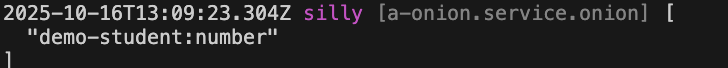

# Global Pipe

## Create Pipe

For example, create a global pipe `number` in the module demo-student to convert the request parameter to `number` type

### 1. Cli command

``` bash
$ vona :create:bean pipe number --module=demo-student --boilerplate=global
```

### 2. Menu command

::: tip
Context Menu - [Module Path]: `Vona Aspect/Pipe Global`
:::

## Pipe Definition

``` typescript
export type TypePipeNumberData = unknown;

export type TypePipeNumberResult = number;

export interface IPipeOptionsNumber extends IDecoratorPipeOptionsGlobal {}

@Pipe<IPipeOptionsNumber>({ global: true })
class PipeNumber {
  async transform(value: TypePipeNumberData, _metadata: RouteHandlerArgumentMeta, _options: IPipeOptionsNumber): Promise<TypePipeNumberResult> {
    const valueNew = Number(value);
    if (Number.isNaN(valueNew)) this.app.throw(400);
    return valueNew;
  }
}
```

- `TypePipeNumberData`: Input parameter type
- `TypePipeNumberResult`: Result type
- `IPipeOptionsNumber`: Defines pipe parameters
- `transform`: Parameter evaluation and conversion

## Using Pipe

Unlike local pipe, the system automatically loads global pipes and makes them effective

## Pipe Parameters

You can define parameters for pipe, allowing for more flexible configuration of pipe logic

For example, define the `errorCode` parameter for the number pipe. If the incoming request parameter is not of type number, an exception is thrown with the error code `errorCode`

### 1. Defining parameter types

``` diff
export interface IPipeOptionsNumber extends IDecoratorPipeOptionsGlobal {
+ errorCode: number;
}
```

### 2. Providing default values ​​for parameters

``` diff
@Pipe<IPipeOptionsNumber>({
+ errorCode: 400,
})
```

### 3. Using Parameters

``` diff
export interface IPipeOptionsNumber extends IDecoratorPipeOptionsGlobal {
  errorCode: number;
}

@Pipe<IPipeOptionsNumber>({
  global: true,
  errorCode: 400,
})
export class PipeNumber extends BeanBase implements IPipeTransform<TypePipeNumberData, TypePipeNumberResult> {
  async transform(value: TypePipeNumberData, _metadata: RouteHandlerArgumentMeta, options: IPipeOptionsNumber): Promise<TypePipeNumberResult> {
    const valueNew = Number(value);
-   if (Number.isNaN(valueNew)) this.app.throw(400);
+   if (Number.isNaN(valueNew)) this.app.throw(options.errorCode);
    return valueNew;
  }
}
```

### 4. Specify parameters when using

You can specify global pipe parameters for a specific API

``` diff
class ControllerStudent {
  @Web.get(':id')
+ @Aspect.pipeGlobal('demo-student:number', { errorCode: 500 })
  async findOne(id: number) {}
}
```

- When using pipe, just provide the parameter value directly

### 5. App Config

Pipe parameters can be configured in App Config

`src/backend/config/config/config.ts`

``` typescript
// onions
config.onions = {
  pipe: {
    'demo-student:number': {
      errorCode: 500,
    },
  },
};
```

### 6. Parameter precedence

`Specify parameters when using` > `App Config` > `Default values`

## Pipe Order

Since global pipes ard loaded and enabled by default, VonaJS provides two parameters to control the order in which pipe is loaded

### 1. dependencies

For example, the system has a built-in global pipe `a-xxx:yyy`, and we hope that the loading order is as follows: `a-xxx:yyy` > `Current`

``` diff
@Pipe({
  global: true,
+ dependencies: 'a-xxx:yyy',
  errorCode: 400,
})
class PipeNumber {}
```

### 2. dependents

The order of `dependents` is just the opposite of `dependencies`. We hope that the loading order is as follows: `Current` > `a-xxx:yyy`

``` diff
@Pipe({
  global: true,
+ dependents: 'a-xxx:yyy',
  errorCode: 400,
})
class PipeNumber {}
```

## Pipe Enable/Disable

You can control `enable/disable` of global pipe for certain APIs

### 1. Enable

* Disable for an API

``` diff
class ControllerStudent {
  @Web.get(':id')
+ @Aspect.pipeGlobal('demo-student:number', { enable: false })
  async findOne(id: number) {}
}
```

* Disable for all APIs

`src/backend/config/config/config.ts`

``` diff
// onions
config.onions = {
  pipe: {
    'demo-student:number': {
+     enable: false,
    },
  },
};
```

### 2. Meta

Allows global pipe to take effect in a specified operating environment

|Name|Type|Description|
|--|--|--|
|flavor|string\|string[]|See: [Runtime Environments and Flavors](../../env-config/mode-flavor/introduction.md)|
|mode|string\|string[]|See: [Runtime Environments and Flavors](../../env-config/mode-flavor/introduction.md)|

* Example

``` diff
@Pipe({
  global: true,
+ meta: {
+   flavor: 'normal',
+   mode: 'dev',
+ },
})
class PipeNumber {}
```

### 3. match/ignore
    
You can enable/disable global pipe for some specific APIs    

|Name|Type|Description|
|--|--|--|
|match|string\|regexp\|(string\|regexp)[]|For which APIs to enable|
|ignore|string\|regexp\|(string\|regexp)[]|For which APIs to disable|

## Inspect

You can directly inspect the currently effective global pipe list in the Controller action

``` diff
class ControllerStudent {
  @Web.get(':id')
  async findOne(id: number)() {
+   this.bean.onion.pipe.inspect();
  }
}
```

- `this.bean.onion`: Get the global Service instance `onion`
- `.pipe`: Get the Service instance related to the pipe
- `.inspect`: Output the currently effective global pipe list

When accessing the `findOne` API, the current list of global pipe in effect will be automatically output to the console, as shown below:


