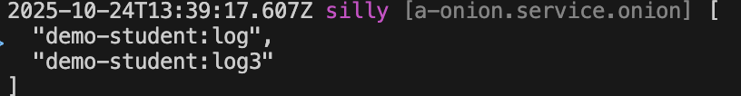

# External Aspect

Applies logic to any method of any class from the outside without changing the class source code

## Create Target Class

External aspect can be implemented for any class. Below, taking Service as an example, create a Service `test` in the module demo-student with the following code:

``` typescript
@Service()
export class ServiceTest extends BeanBase {
  private _name: string;

  protected __init__() {
    this._name = '';
  }

  protected async __dispose__() {
    this._name = '';
  }

  get name() {
    return this._name;
  }

  set name(value) {
    this._name = value;
  }

  actionSync(a: number, b: number) {
    return a + b;
  }

  async actionAsync(a: number, b: number) {
    return Promise.resolve(a + b);
  }
}
```

## Create External Aspect

Next, create an external aspect `log` to provide extension logic for the properties and methods of Class `ServiceTest`

### 1. Cli command

``` bash
$ vona :create:bean aop log --module=demo-student
```

### 2. Menu command

::: tip
右键菜单 - [Module Path]: `Vona Aspect/Aop`
:::

## AOP Definition

``` typescript
import { BeanAopBase } from 'vona';
import { Aop } from 'vona-module-a-aspect';

@Aop({ match: 'demo-student.service.test' })
export class AopLog extends BeanAopBase {}
```

- `@Aop`: This decorator is used to implement the `external aspect`
- `match`: This option is used to associate the `AopLog` class with the `ServiceTest` class, which beanFullName is `demo-student.service.test`

|name|type|description|
|--|--|--|
|match|string\|regexp\|(string\|regexp)[]|For which classes to enable|

## Aspect: Synchronous method

Outputs execution time for `ServiceTest#actionSync`

In the VSCode editor, enter the code snippet `aopactionsync` to automatically generate a code skeleton:

``` typescript
action: AopAction<ClassSome, 'action'> = (_args, next, _receiver) => {
  return next();
};
```

Adjust the code and add log logic

``` typescript
actionSync: AopAction<ServiceTest, 'actionSync'> = (_args, next, _receiver) => {
  const timeBegin = Date.now();
  const res = next();
  const timeEnd = Date.now();
  console.log('actionSync: ', timeEnd - timeBegin);
  return res;
};
```

- `actionSync`: Provides the `actionSync` method with the same name to implement custom logic

## Aspect: Asynchronous method

Outputs execution time for `ServiceTest#actionAsync`

In the VSCode editor, enter the code snippet `aopaction` to automatically generate a code skeleton:

``` typescript
action: AopAction<ClassSome, 'action'> = async (_args, next, _receiver) => {
  return await next();
};
```

Adjust the code and add log logic

``` typescript
actionAsync: AopAction<ServiceTest, 'actionAsync'> = async (_args, next, _receiver) => {
  const timeBegin = Date.now();
  const res = await next();
  const timeEnd = Date.now();
  console.log('actionAsync: ', timeEnd - timeBegin);
  return res;
};
```

- `actionAsync`: Provides the `actionAsync` method with the same name to implement custom logic

## Aspect: getter

Outputs execution time for `ServiceTest#get name`

In the VSCode editor, enter the code snippet `aopgetter` to automatically generate a code skeleton:

``` typescript
protected __get_xxx__: AopActionGetter<ClassSome, 'xxx'> = function (next, _receiver) {
  const value = next();
  return value;
};
```

Adjust the code and add log logic

``` typescript
protected __get_name__: AopActionGetter<ServiceTest, 'name'> = function (next, _receiver) {
  const timeBegin = Date.now();
  const value = next();
  const timeEnd = Date.now();
  console.log('get name: ', timeEnd - timeBegin);
  return value;
};
```

- `__get_name__`: Corresponding to the getter method `get name` of `ServiceTest`

## Aspect: setter

Outputs execution time for `ServiceTest#set name`

In the VSCode editor, enter the code snippet `aopsetter` to automatically generate a code skeleton:

``` typescript
protected __set_xxx__: AopActionSetter<ClassSome, 'xxx'> = function (value, next, _receiver) {
  return next(value);
}
```

Adjust the code and add log logic

``` typescript
protected __set_name__: AopActionSetter<ServiceTest, 'name'> = function (value, next, _receiver) {
  const timeBegin = Date.now();
  const res = next(value);
  const timeEnd = Date.now();
  console.log('set name: ', timeEnd - timeBegin);
  return res;
};
```

- `__set_name__`: Corresponding to the setter method `set name` of `ServiceTest`

## Aspect: `__init__`

Outputs execution time for `ServiceTest#__init__`

In the VSCode editor, enter the code snippet `aopinit` to automatically generate a code skeleton:

``` typescript
protected __init__: AopActionInit<ClassSome> = (_args, next, _receiver) => {
  next();
};
```

Adjust the code and add log logic

``` typescript
protected __init__: AopActionInit<ServiceTest> = (_args, next, _receiver) => {
  const timeBegin = Date.now();
  next();
  const timeEnd = Date.now();
  console.log('__init__: ', timeEnd - timeBegin);
};
```

- `__init__`: Provides the `__init__` method with the same name to implement custom logic

## Aspect: `__dispose__`

Outputs execution time for `ServiceTest#__dispose__`

In the VSCode editor, enter the code snippet `aopdispose` to automatically generate a code skeleton:

``` typescript
protected __dispose__: AopActionDispose<ClassSome> = async (_args, next, _receiver) => {
  await next();
};
```

Adjust the code and add log logic

``` typescript
protected __dispose__: AopActionDispose<ServiceTest> = async (_args, next, _receiver) => {
  const timeBegin = Date.now();
  await next();
  const timeEnd = Date.now();
  console.log('__dispose__: ', timeEnd - timeBegin);
};
```

- `__dispose__`: Provides the `__dispose__` method with the same name to implement custom logic

## Aspect: `__get__`

Extending magic method for `ServiceTest`

- See: [Magic Method](../internal/magic-method.md)

In the VSCode editor, enter the code snippet `aopget` to automatically generate a code skeleton:

``` typescript
protected __get__: AopActionGet<ClassSome> = (_prop, next, _receiver) => {
  const value = next();
  return value;
};
```

Adjust the code and add the custom field `red`

``` typescript
protected __get__: AopActionGet<ServiceTest> = (prop, next, _receiver) => {
  if (prop === 'red') return '#FF0000';
  const value = next();
  return value;
};
```

- `__get__`: Conventional magic method name

Provide type definitions for colors using the interface type merging mechanism

``` typescript
declare module 'vona-module-demo-student' {
  export interface ServiceTest {
    red: string;
  }
}
```

## Aspect: `__set__`

Extending magic method for `ServiceTest`

- See: [Magic Method](../internal/magic-method.md)

In the VSCode editor, enter the code snippet `aopset` to automatically generate a code skeleton:

``` typescript
protected __set__: AopActionSet<ClassSome> = (_prop, value, next, _receiver) => {
  return next(value);
};
```

Adjust the code to set the value for the custom field `red`

``` typescript
private _colorRed: string | undefined;

protected __set__: AopActionSet<ServiceTest> = (prop, value, next, _receiver) => {
  if (prop === 'red') {
    this._colorRed = value;
    return true;
  }
  return next(value);
};
```

- `__set__`: Conventional magic method name
- If a value is set for `prop`, return `true`; otherwise, invoke `next` method

Then adjust the `__get__` logic:

``` diff
protected __get__: AopActionGet<ServiceTest> = (prop, next, _receiver) => {
- if (prop === 'red') return '#FF0000';
+ if (prop === 'red') return this._colorRed;
  const value = next();
  return value;
}
```

## Aspect: `__method__`

Extending logic for any method of `ServiceTest`

In the VSCode editor, enter the code snippet `aopmethod` to automatically generate a code skeleton:

``` typescript
protected __method__: AopActionMethod<ClassSome> = (_method, _args, next, _receiver) => {
  return next();
};
```

Adjust the code and add log logic for `actionSync` and `actionAsync`

``` typescript
protected __method__: AopActionMethod<ServiceTest> = (method, _args, next, _receiver) => {
  if (method !== 'actionSync' && method !== 'actionAsync') {
    return next();
  }
  const timeBegin = Date.now();
  function done(res) {
    const timeEnd = Date.now();
    console.log(`method ${method}: `, timeEnd - timeBegin);
    return res;
  }
  const res = next();
  if (res?.then) {
    return res.then((res: any) => {
      return done(res);
    });
  }
  return done(res);
};
```

- `__method__`: Conventional magic method name
- `res?.then`: Determine whether the return value is a Promise object and perform different processing to make it compatible with `synchronous method` and `asynchronous method`

## AOP Order

For the same target Class, multiple AOPs can be associated. Therefore, VonaJS provides two parameters to control the execution order of AOPs

### 1. dependencies

For example, has another AOP `demo-student:log3`, and we hope that the execution order is as follows: `demo-student:log3` > `Current`

``` diff
@Aop({
  match: 'demo-student.service.test',
+ dependencies: 'demo-student:log3',
})
class AopLog {}
```

### 2. dependents

The order of `dependents` is just the opposite of `dependencies`. We hope that the execution order is as follows: `Current` > `demo-student:log3`

``` diff
@Aop({
  match: 'demo-student.service.test',
+ dependents: 'demo-student:log3',
})
class AopLog {}
```

## AOP enable/disable

You can control `enable/disable` of AOPs

### 1. Enable

`src/backend/config/config/config.ts`

``` diff
// onions
config.onions = {
  aop: {
    'demo-student:log': {
+     enable: false,
    },
  },
};
```

### 2. Meta

Allows AOPs to take effect in a specified operating environment

|Name|Type|Description|
|--|--|--|
|flavor|string\|string[]|See: [Runtime Environments and Flavors](../../techniques/mode-flavor/introduction.md)|
|mode|string\|string[]|See: [Runtime Environments and Flavors](../../techniques/mode-flavor/introduction.md)|

* Example

``` diff
@Aop({
+ meta: {
+   flavor: 'normal',
+   mode: 'dev',
+ },
})
class AopLog {}
```

## Inspect

可以直接在目标 Class action 中输出当前生效的 AOP 清单

You can directly inspect the currently effective AOP list in the target class action

``` diff
class ServiceTest {
  protected async __dispose__() {
+   this.bean.onion.aop.inspect();
    this._name = '';
  }
```

- `this.bean.onion`: Get the global Service instance `onion`
- `.aop`: Get the Service instance related to AOP
- `.inspect`: Output the currently effective AOP list

When the method is executed, the currently effective AOP list will be automatically output to the console, as shown below:


