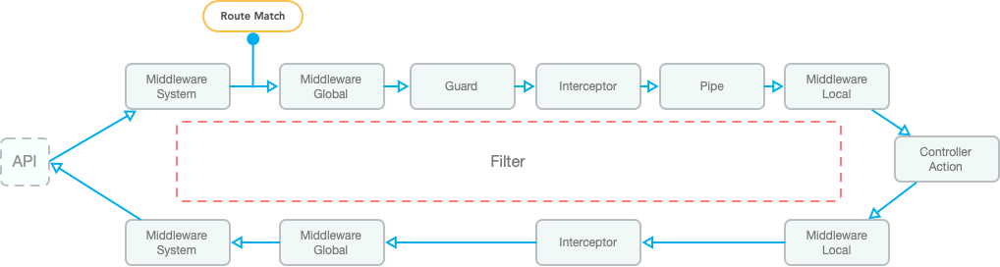

# Introduction

VonaJS AOP programming includes three capabilities:

1. `Controller Aspect`: Applies logic to controller methods
2. `Internal Aspect`: Applies logic to any method of any class within a class
3. `External Aspect`: Applies logic to any method of any class from the outside without changing the class source code

## Controller Aspect

### Controller Aspect List

* Middleware
* Guard
* Interceptor
* Pipe
* Filter

### Execution Sequence Diagram

The execution sequence diagram for controller aspects is as follows:



- `Onion Model`: `Middleware` and `Interceptor` support the `Onion Model`, allowing aspect logic to be executed before and after `Controller Action`
- `Middleware`: Three types of Middleware are provided for different execution sequence stages: `Middleware System`, `Middleware Global`, and `Middleware Local`, allowing for more refined aspect logic
- `Route Match`: Only the `Middleware System` is executed before route matching; the rest are executed after
- `Filter`: If an exception is thrown at any stage, `Filter` will be executed to customize the processing logic of `error information` and `error log`

## Internal Aspect

Internal aspects provide two mechanisms: `AOP Method` and `Magic Method`

### 1. AOP Method

Implement aspect logic directly on Class Method through decorator

#### Example: Database Transaction

``` diff
class ServiceStudent {
+ @Database.transaction()
  async update(id: TableIdentity, student: DtoStudentUpdate) {
    return await this.scope.model.student.update({
      ...student,
      id,
    });
  }
}
```

- `@Database.transaction`: A decorator implemented through the `AOP Method` mechanism that can directly provide database transaction capabilities

#### Example: Logging

``` diff
class ServiceStudent {
+ @Log()
  async update(id: TableIdentity, student: DtoStudentUpdate) {
    return await this.scope.model.student.update({
      ...student,
      id,
    });
  }
}
```

- `@Log`: A decorator implemented using the `AOP Method` mechanism directly provides logging capabilities

### 2. Magic Method

Dynamic properties or methods can be implemented through `__get__` and `__set__` within the Class

#### Example: Obtaining a model instance

``` diff
class ServiceStudent {
  async update(id: TableIdentity, student: DtoStudentUpdate) {
+   return await this.scope.model.student.update({
      ...student,
      id,
    });
  }
}
```

- `this.scope.model.xxx`: Instead of using `dependency injection`, `dependency lookup` is used to obtain the model instance directly from the scope object, simplifying the code writing style

#### Implementation Idea

The system provides a `ServiceModelResolver` class for dynamic model instance resolution. The code is as follows:

``` typescript
class ServiceModelResolver {
  protected __get__(prop: string) {
    const beanFullName = `${this[SymbolModuleScope]}.model.${prop}`;
    return this.bean._getBean(beanFullName as any);
  }
}
```

1. When `this.scope.model.student` is called, the `__get__` method is automatically executed, passing the `prop: 'student'` parameter
2. The `prop` parameter is combined with the current module name to form `beanFullName`
3. The model instance is retrieved from the global container using `beanFullName` and returned to the caller

## External Aspect

Using the `update` method of the `ServiceStudent` class as an example, we implement logging capabilities through the `external aspect`:

``` typescript
import { Aop } from 'vona-module-a-aspect';

@Aop({ match: 'demo-student.service.student' })
class AopLog {
  async update(_args: Parameters<any>, next: Function, _receiver: any) {
    const timeBegin = Date.now();
    const res = await next();
    const timeEnd = Date.now();
    console.log('time: ', timeEnd - timeBegin);
    return res;
  }
}
```

- `@Aop`: This decorator is used to implement the `external aspect`
- `match`: This option is used to associate the `AopLog` class with the `ServiceStudent` class, which beanFullName is `demo-student.service.student`
- `update`: Provides the `update` method with the same name as `ServiceStudent` in `AopLog` to implement custom logic
