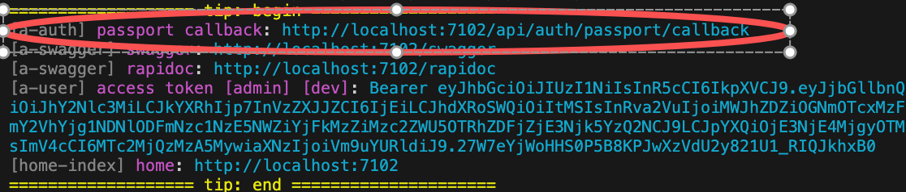

# OAuth Authentication

The module `auth-oauth` provides general `OAuth Authentication`, with built-in support for `GitHub` and other OAuth providers. It also supports mock user login in the development environment, making development and debugging very convenient.

## How to Use

### 1. Login

```typescript
class ControllerStudent {
  @Web.get('login')
  @Passport.public()
  async login() {
    await this.bean.auth.authenticate('auth-oauth:oauth', { clientName: 'github', state: { redirect: '/' } });
  }
}
```

### 2. Logout

```typescript
await this.bean.passport.signout();
```

### 3. Authentication Credentials

Set the authentication credentials in App Config.

`src/backend/config/config/config.ts`

```typescript
// onions
config.onions = {
  authProvider: {
    'auth-oauth:oauth': {
      clients: {
        github: {
          clientID: 'xxxxxx',
          clientSecret: 'xxxxxxx',
        },
      },
    },
  },
};
```

- `clients.github`: A Provider can set multiple Clients, currently built-in with `github`

### 4. Adding New OAuth Client Credentials

Taking `google` as an example:

1. Install the corresponding Strategy npm package

```bash
$ pnpm add passport-google-oauth20
```

2. Add Client type definitions using the interface merging mechanism

In VSCode editor, enter the code snippet `recordauthclient` to automatically generate the code skeleton:

```typescript
declare module 'vona-module-x-x' {
  export interface IAuthProvider_xxx_ClientRecord {
    : never;
  }
}
```

Adjust the code:

```typescript
declare module 'vona-module-auth-oauth' {
  export interface IAuthProviderOauthClientRecord {
    google: never;
  }
}
```

3. Set the authentication credentials in App Config and specify the corresponding `Strategy`

```typescript
import StrategyGoogle from 'passport-google-oauth20';

// onions
config.onions = {
  authProvider: {
    'auth-oauth:oauth': {
      clients: {
        google: {
          Strategy: StrategyGoogle,
          clientID: 'xxxxxx',
          clientSecret: 'xxxxxxx',
        },
      },
    },
  },
};
```

### 5. OAuth Authentication Callback URL

When using OAuth authentication, you need to provide the system's Callback URL on the OAuth website.

VonaJS provides a unified Callback URL value and outputs it directly to the console during development for easy use.



### 6. Disable `useMockForDev`

By default, mocking user login is allowed in the development environment.

`useMockForDev` can be disabled in App Config.

`src/backend/config/config/config.ts`

```typescript
// onions
config.onions = {
  authProvider: {
    'auth-oauth:oauth': {
      useMockForDev: false,
    },
  },
};
```

## Source Code Analysis

This section analyzes the core source code of the module `auth-oauth` to illustrate how to develop an OAuth2-based Auth Provider.

For example, creating an Auth Provider: `oauth` in the module `auth-oauth`

### 1. CLI Command

```bash
$ vona :create:bean authProvider oauth --module=auth-oauth
```

### 2. Menu Command

::: tip
Context Menu - [Module Path]: `Vona Bean/Auth Provider`
:::

## Auth Provider Definition

```typescript
export interface IAuthProviderOauthClientOptionsGithub extends IAuthProviderOauth2ClientOptions {
  userProfileURL?: string;
  userAgent?: string;
}

export interface IAuthProviderOauthClientRecord extends IAuthProviderClientRecord {
  github: IAuthProviderOauthClientOptionsGithub;
}

export interface IAuthProviderOauthClientOptions extends IAuthProviderOauth2ClientOptions {
  Strategy?: Constructable<StrategyBase>;
}

export interface IAuthProviderOptionsOauth extends IDecoratorAuthProviderOptions<
  IAuthProviderOauthClientRecord,
  IAuthProviderOauthClientOptions
> {}

@AuthProvider<IAuthProviderOptionsOauth>({
  base: {
    confirmed: true,
    clientID: 'Shoule specify clientID',
    clientSecret: 'Shoule specify clientSecret',
  },
  clients: {
    github: {
      Strategy: StrategyGithub,
    },
  },
})
class AuthProviderOauth extends BeanAuthProviderOauth2Base {
  async strategy(
    clientOptions: IAuthProviderOauthClientOptions,
    _options: IAuthProviderOptionsOauth,
  ): Promise<Constructable<StrategyBase>> {
    if (!clientOptions.Strategy) throw new Error('Should specify Strategy for oauth provider');
    return clientOptions.Strategy;
  }
}
```

- `IAuthProviderOauthClientRecord`: Defines multiple Clients, with built-in `github` Client definition
- `IAuthProviderOauthClientOptions`: Defines Client options, where the `Strategy` field specifies the OAuth authentication strategy
- `IAuthProviderOptionsOauth`: Defines the parameters of the Auth Provider
- `strategy`: Returns the authentication strategy based on the `Strategy` configured in the Client
- `verify`: Provided by the base class `BeanAuthProviderOauth2Base` by default, uses the utility method `getStrategyOauth2Profile` to extract Profile data from the authentication result and returns it to the system

### Custom OAuth Strategy

The module `auth-oauth` uses the `Strategy` field to specify the OAuth authentication strategy, allowing flexible support for different OAuth providers.

- Built-in strategy: The module has a built-in `github` Client configuration with the `passport-github` strategy

- Adding a new strategy: Taking `google` as an example, the following steps are required

1. Install the corresponding Strategy npm package

```bash
$ pnpm add passport-google-oauth20
```

2. Add a new Client type definition using the interface merging mechanism

```typescript
declare module 'vona-module-auth-oauth' {
  export interface IAuthProviderOauthClientRecord {
    google: IAuthProviderOauth2ClientOptions;
  }
}
```

3. Specify the corresponding `Strategy` in App Config

```typescript
import StrategyGoogle from 'passport-google-oauth20';

// onions
config.onions = {
  authProvider: {
    'auth-oauth:oauth': {
      clients: {
        google: {
          Strategy: StrategyGoogle,
          clientID: 'xxxxxx',
          clientSecret: 'xxxxxxx',
        },
      },
    },
  },
};
```

## Profile

1. The Provider's `verify` only needs to return Profile data. The system will generate a User object based on the Profile data
2. The Profile contains an `id` field value
3. The OAuth provider ensures that a unique `id` value is generated for each different user

Profile has a unified interface definition:

```typescript
export interface IAuthUserProfile {
  id: string;
  username?: string;
  displayName?: string;
  name?: IAuthUserProfileName;
  gender?: string; // male/female
  profileUrl?: string;
  emails?: IAuthUserProfilePropSlice[];
  photos?: IAuthUserProfilePropSlice[];
  locale?: keyof ILocaleRecord;
  confirmed?: boolean;
}
```

- `confirmed`: If `true`, it means the user has confirmed and no further `activation` operation is needed
