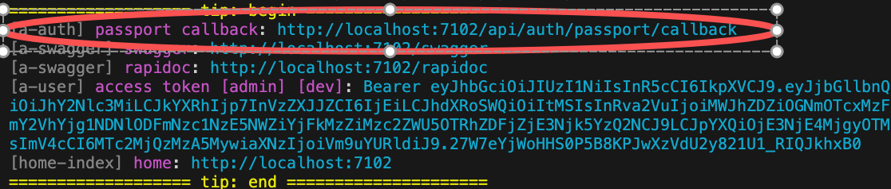

# Authentication System

The module `a-auth` provides a general authentication system, using `Auth Provider` to support various authentication methods

## Features

* `Auth Provider`: Supports various authentication methods, such as username/password authentication, OAuth authentication (Github), etc.

* `Clients`: A single provider can provide multiple credentials

* `Associate Authentication`: Allows associating multiple authentication methods with the same user

* `Migrate Authentication`: Allows migrating authentication methods from one user to another

## bean.auth

The module `a-auth` provides a global Bean `bean.auth`, allowing the use of authentication capabilities provided by all providers in a unified way

* Example: `Username/Password` Authentication

``` typescript
class ControllerStudent {
  @Web.get('login')
  @Passport.public()
  async login() {
    const jwt = await this.bean.auth.authenticate('a-authsimple:simple', {
      clientOptions: { username: 'admin', password:'123456' },
    });
    return jwt;
  }
}
```

* Simplified method:

``` typescript
class ControllerStudent {
  @Web.get('login')
  @Passport.public()
  async login() {
    const jwt = await this.bean.authSimple.authenticate(
      { username: 'admin', password:'123456' }
    );
    return jwt;
  }
}
```

* Example: `Github` Authentication

`Github` authentication is a separate module and needs to be installed in the project:

``` bash
$ pnpm add vona-module-a-authgithub -w
```

``` typescript
class ControllerStudent {
  @Web.get('login')
  @Passport.public()
  async login() {
    await this.bean.auth.authenticate(
      'a-authgithub:github',
      { state: { redirect: '/' } },
    );
  }
}
```

## OAuth Credentials

Using `Github` as an example, set the authentication credentials in the App Config

`src/backend/config/config/config.ts`

``` typescript
// onions
config.onions = {
  authProvider: {
    'a-authgithub:github': {
      clients: {
        default: {
          clientID: 'xxxxxx',
          clientSecret: 'xxxxxxx',
        },
      },
    },
  },
};
```

- `clients.default`: A Provider can set multiple Clients; the default is `default`

### How to Add More Client Credentials

* First, add Client type definitions using the interface merging mechanism

In VSCode In the editor, enter the code snippet `recordauthclient` to automatically generate the code skeleton:

``` typescript
declare module 'vona-module-x-x' {
  export interface IAuthProvider_xxx_ClientRecord {
    : never;
  }
}
```

Adjust the code:

``` typescript
declare module 'vona-module-a-authgithub' {
  export interface IAuthProviderGithubClientRecord {
    another: never;
  }
}
```

* Then set the authentication credentials in App Config

``` diff
// onions
config.onions = {
  authProvider: {
    'a-authgithub:github': {
      clients: {
        default: {
          clientID: 'xxxxxx',
          clientSecret: 'xxxxxxx',
        },
+       another: {
+         clientID: 'yyyyyy',
+         clientSecret: 'yyyyyyy',
+       },
      },
    },
  },
};
```

## OAuth Authentication Callback URL

When using OAuth authentication, you need to provide the system's Callback URL on the OAuth website

VonaJS provides a unified Callback URL value and outputs it directly to the console during development, making it convenient for us to use directly



## bean.auth.authenticate

### Method Definition

``` typescript
async authenticate<T extends keyof IAuthProviderRecord>(
  authProviderName: T,
  options?: IAuthenticateOptions<IAuthProviderRecord[T]>,
): Promise<IJwtToken | undefined>{}
```

### Return Value

* For authentication methods that do not require redirection, a jwt token is returned upon successful authentication

* For authentication methods requiring a redirect, the system will redirect directly upon successful authentication

### Parameters

|Name|Description|
|--|--|
|authProviderName|Provider name|
|options.clientName|Client name, defaults to `default`|
|options.clientOptions|Client options, different providers have different options definitions|
|options.state|Status value of this authentication|

* options.clientOptions

For OAuth authentication, the following basic fields are available:

|Name|Description|
|--|--|
|clientID|Credential ID|
|clientSecret|Credential Secret|
|scope|Authorization scope|
|confirmed|Whether the user is in a confirmed state|

::: tip
`confirmed`: Generally, for new users, if OAuth authentication returns a valid email, `confirmed=true` can be assumed, thus eliminating the need for subsequent `user activation` operation. The `confirmed` judgment rules can be flexibly customized according to business needs
:::

* options.state

|Name|Type|Description|
|--|--|--|
|intention|'register' \| 'login' \| 'associate' \| 'migrate'|The intent of this authentication, defaults to `login`|
|redirect|string \| undefined|The URL to redirect to after successful authentication|

::: tip
`redirect`: After successful OAuth authentication, a `code` value will be returned. This value will be appended to the URL Query, in the form of: `/?x-vona-oauth-code=xxxxxx`

The frontend obtains the `x-vona-oauth-code` value and then calls the backend API to exchange it for a `jwt token`
:::

## Passport API

The `home-user` module provides a set of `out-of-the-box` Passport API. The API can also be used to extend custom business logic

`src/suite/a-home/modules/home-user/src/controller/passport.ts`

|Name|Description|
|--|--|
|current|Get the current Passport|
|logout|Logout|
|register|Register new user|
|login|Login|
|loginOauth|OAuth authentication|
|associate|Associate authentication|
|migrate|Migrate authentication|
