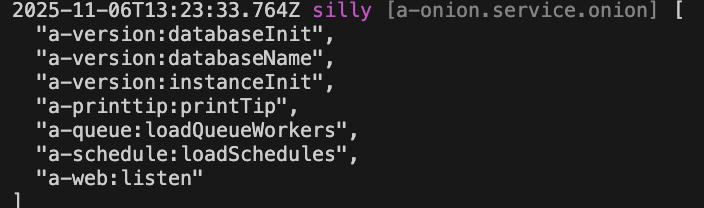

# Startup

VonaJS provides `startup`, which allow initialization logic to be executed when system starting or when instance initializing

## Startup Types

VonaJS provides two types of startups:

1. `App Startup`: Executed when system starting
2. `Instance Startup`: Executed when instance initializing. Because VonaJS supports `Multi-Instance/Multi-Tenancy`, the `instance startups` are automatically executed during each instance initialization

## Create Startup

For example, create a startup `log` in the module `demo-student` to output the current time to the console when system starting

### 1. Cli Command

``` bash
$ vona :create:bean startup log --module=demo-student
```

### 2. Menu Command

::: tip
Context menu - [Module Path]: `Vona Bean/Startup`
:::

## Startup Definition

``` typescript
@Startup()
export class StartupLog extends BeanBase implements IStartupExecute {
  async execute() {
    console.log('Current time: ', Date.now());
  }
}
```

- `execute`: Outputs the current time

## Startup Parameters

Parameters can be configured for startup

``` typescript
@Startup({
  instance: false,
  after: false,
  debounce: true,
  transaction: false,
})
export class StartupLog {}
```

| Name | Type | Description |
|--|--|--|
| instance | boolean | Whether it is an instance startup, defaults to `false` |
| after | boolean | Controls the timing of startup, defaults to `false` |
| debounce | boolean\| number | Execute Startup using debounce, defaults to `false` |
| transaction | boolean | Whether to enable database transaction, defaults to `false` |

- `after`:
  - `false`: Executes before `appReady` (app startup) or `instanceReady` (instance startup)
  - `true`: Executes after `appReady` (app startup) or `instanceReady` (instance startup) 
- `debounce`
  - `false`: Disable debounce
  - `true`: Use the system's default debounce time
  - `number(ms)`: Specify the specific debounce time

## App Config

You can configure startup parameters in App Config

`src/backend/config/config/config.ts`

``` typescript
// onions
config.onions = {
  startup: {
    'demo-student:log': {
      after: false,
      debounce: true,
      instance: false,
      transaction: false,
    },
  },
};
```

## Startup Order

Since startups ard loaded and enabled by default, VonaJS provides two parameters to control the order in which startup is loaded

### 1. dependencies

For example, the system has a built-in startup `a-web:listen`, and we hope that the loading order is as follows: `a-web:listen` > `Current`

``` diff
@Startup({
+ dependencies: 'a-web:listen',
})
class StartupLog {}
```

### 2. dependents

The order of `dependents` is just the opposite of `dependencies`. We hope that the loading order is as follows: `Current` > `a-web:listen`

``` diff
@Startup({
+ dependents: 'a-web:listen',
})
class StartupLog {}
```

## Startup Enable/Disable

You can control `enable/disable` of startup

### 1. Enable

`src/backend/config/config/config.ts`

``` diff
// onions
config.onions = {
  startup: {
    'demo-student:log': {
+     enable: false,
    },
  },
};
```

### 2. Meta

Allows startup to take effect in a specified operating environment

|Name|Type|Description|
|--|--|--|
|flavor|string\|string[]|See: [Runtime Environments and Flavors](../../env-config/mode-flavor/introduction.md)|
|mode|string\|string[]|See: [Runtime Environments and Flavors](../../env-config/mode-flavor/introduction.md)|

* Example

``` diff
@Startup({
+ meta: {
+   flavor: 'normal',
+   mode: 'dev',
+ },
})
class StartupLog {}
```

## Inspect

You can directly inspect the currently effective startup list

``` diff
class ControllerStudent {
  @Web.get('test')
  test() {
+   this.bean.onion.startup.inspect();
  }
}
```

- `this.bean.onion`: Get the global Service instance `onion`
- `.startup`: Get the Service instance related to the startup
- `.inspect`: Output the currently effective startup list

When accessing the `test` API, the currently effective startup list will be automatically output to the console, as shown below:


