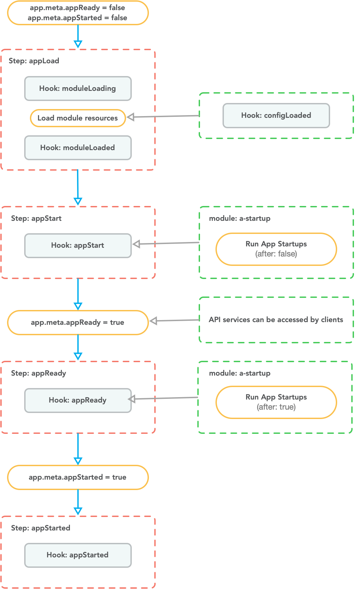

# App Startup Customization

VonaJS provides a `Hook/Monkey` mechanism that allows deep customization of the system during application startup

::: tip
Of course, for regular business needs, it is generally sufficient to just create a [Startup](../../distributed/startup/introduction.md)
:::

Before explaining the `Hook/Monkey` mechanism, it is necessary to first understand the timing of application startup and shutdown


## Application Startup Timing



The application startup timing is divided into four steps:

1. `appLoad`: Loads all modules. For each module, it triggers the hooks `moduleLoading`, `configLoaded`, and `moduleLoaded`
2. `appStart`: Triggers the hook `appStart`. For example, the module a-startup responds to this hook and executes `app startups(after: false)`. See: [Startup](../../distributed/startup/introduction.md)
   - After `appStart` is executed, it sets `app.meta.appReady=true`
   - At this point, all API services provided by the system can accept client requests
3. `appReady`: Triggers the hook `appReady`. For example, the module a-startup responds to this hook and executes `app startups(after: true)`. See: [Startup](../../distributed/startup/introduction.md)
4. `appStarted`: Triggers the hook `appStarted`

## Application Shutdown Timing


The application shutdown timing is divided into two steps:

1. `appClose`: Triggers the hook `appClose`
2. `appClosed`: Triggers the hook `appClosed`

## Hook List

The system provides three scenarios to respond to application startup/shutdown hooks:

1. `Module Main`: Respond to the module's own hooks in the module code
2. `Module Monkey`: Respond to system hooks in the module code
3. `App Monkey`: Respond to system hooks in the app code

For different scenarios, corresponding interface definitions are provided for different hooks, thereby standardizing the use of hooks

|Hook|Module Main Interface|Module Monkey Interface|App Monkey Interface|
|--|--|--|--|
|moduleLoading|IModuleMain|IMonkeyModule|IMonkeyModule|
|configLoaded|IModuleMain|IMonkeyModule|IMonkeyModule|
|moduleLoaded|IModuleMain|IMonkeyModule|IMonkeyModule|
|appStart||IMonkeyAppStart|IMonkeyAppStart|
|appReady||IMonkeyAppReady|IMonkeyAppReady|
|appStarted||IMonkeyAppStarted|IMonkeyAppStarted|
|appClose||IMonkeyAppClose|IMonkeyAppClose|
|appClosed||IMonkeyAppClosed|IMonkeyAppClosed|

## Create Module Main

### 1. Cli command

``` bash
$ vona :init:main demo-student
```

### 2. Menu command

::: tip
Context Menu - [Module Path]: `Vona Init/Main`
:::

### Module Main Definition

``` typescript
export class Main extends BeanSimple implements IModuleMain {
  async moduleLoading() {}
  async moduleLoaded() {}
  async configLoaded(_config: any) {}
}
```

## Create Module Monkey

### 1. Cli command

``` bash
$ vona :init:monkey demo-student
```

### 2. Menu command

::: tip
Context Menu - [Module Path]: `Vona Init/Monkey`
:::

### Module Monkey Definition

``` typescript
export class Monkey extends BeanSimple implements IMonkeyModule {
  async moduleLoading(_module: IModule) {}
  async moduleLoaded(_module: IModule) {}
  async configLoaded(_module: IModule, _config: any) {}
}
```

## Create App Monkey

### 1. Cli command

``` bash
$ vona :init:appMonkey
```

### 2. Menu command

::: tip
Context Menu - [Project Path/src]: `Vona Init/App Monkey`
:::

### App Monkey Definition

`src/backend/config/monkey.ts`

``` typescript
export class AppMonkey extends BeanSimple implements IMonkeyModule, IMonkeySystem {
  async moduleLoading(_module: IModule) {}
  async moduleLoaded(_module: IModule) {}
  async configLoaded(_module: IModule, _config: any) {}
  async appStart() {}
  async appReady() {}
  async appStarted() {}
  async appClose() {}
  async appClosed() {}
}
```
