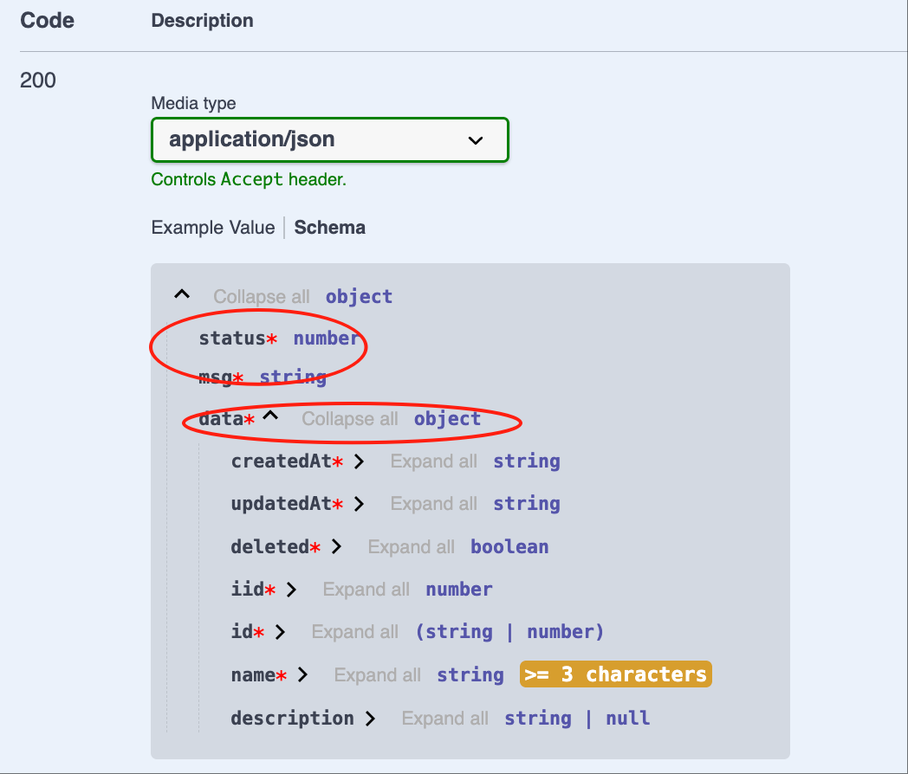

# Controller

## Create Controller

For example, we create a Controller `student` in the module demo-student: 

### 1. Cli command

``` bash
$ vona :create:bean controller student --module=demo-student
```

### 2. Menu command

::: tip
Context Menu - [Module Path]: `Vona Create/Controller`
:::

## Controller Definition

``` typescript{1,3}
@Controller<IControllerOptionsStudent>('student')
export class ControllerStudent extends BeanBase {
  @Web.post('')
  @Api.body(v.object(EntityStudent))
  async create(@Arg.body() student: DtoStudentCreate): Promise<EntityStudent> {
    return await this.scope.service.student.create(student);
  }
}
```

- Controller Path: `'student'`
- Action Path : `''`

## Routes

Like `Fastify`, Vona also uses [find-my-way](https://github.com/delvedor/find-my-way) as the routing library. All Controller Actions that use the `@Web` decorator will be automatically registered in the routing table

The route path is composed of the Controller Path and the Action Path

### General format

``` bash
Route Path = GlobalPrefix + Module Url + Controller Path + Action Path
```

- GlobalPrefix: Project configuration: `app.config.server.globalPrefix`, default is `/api`
- Module Url: The Url fragment generated by the module name. For example, the module Url of module demo-student is `demo/student`

For example, the route of Controller `teacher` in module demo-student is as follows:

|Controller Path|Action Path| Route Path|
|--|--|--|
|teacher|empty|/api/demo/student/teacher|
|teacher|:id|/api/demo/student/teacher/:id|

### Simplification rule 1

If the Controller Path is the same as the module name, the duplicate part will be automatically removed

For example, the route of Controller `student` in module demo-student is as follows:

|Controller Path|Action Path| Route Path|
|--|--|--|
|student|empty|/api/demo/student|
|student|:id|/api/demo/student/:id|

### Simplification rule 2

If the Controller Path or Action Path is prefixed with `/`, then the Module Url is automatically removed

|Controller Path|Action Path| Route Path|
|--|--|--|
|/student|empty|/api/student|
|/student|:id|/api/student/:id|

### Simplification rule 3

If the Controller Path or Action Path is prefixed with `//`, then the GlobalPrefix and Module Url are automatically removed

|Controller Path|Action Path| Route Path|
|--|--|--|
|//student|empty|/student|
|//student|:id|/student/:id|

For example, the homepage of the project has the following route:

|Controller Path|Action Path| Route Path|
|--|--|--|
|any value|//|/|

## Request Method

Vona uses decorators to define request methods. These decorators are put into a group `@Web`. Because there are many decorators, the grouping mechanism can reduce the mental burden. For example: we set a `post` method for `create`:

``` typescript
import { Web } from 'vona-module-a-web';

class ControllerStudent {
  @Web.post()
  async create() {}
}
```

* Method decorator list

|Name|Description|
|--|--|
|@Web.post|post|
|@Web.get|get|
|@Web.delete|delete|
|@Web.put|put|
|@Web.patch|patch|
|@Web.options|options|
|@Web.head|head|

## Request Parameters

We need to get various parameters from the request, such as `Query`, `Params`, `Body`, `Headers`, etc. Similarly, Vona also provides many decorators for obtaining parameters. We also put all parameter decorators into the group `@Arg` to reduce the mental burden. For example, if we want to obtain the data of a student, the requested URL is `/?id=1`:

``` typescript
class ControllerStudent3 {
  @Web.get()
  findOne(@Arg.query('id') id: number) {}
}
```

Depending on the characteristics of the parameters, different types of parameters allow the specification of field names, such as specifying `id` in the query decorator. We can also obtain the entire query object without specifying the field name

For example, the URL is `/?id=1&name=tom`:

``` typescript
class DtoStudentInfo {
  id: number;
  name: string;
}

class ControllerStudent3 {
  @Web.get()
  findOne(@Arg.query() query: DtoStudentInfo) {
    console.log(query.id, query.name);
  }
}
```

* Parameter decorator list

|Name|Description|
|--|--|
|@Arg.param|Param|
|@Arg.query|Query|
|@Arg.body|Body|
|@Arg.headers|Headers|
|@Arg.fields|Fields|
|@Arg.field|Field|
|@Arg.files|Files|
|@Arg.file|File|
|@Arg.user|The current user|

## Parameter Validation

Vona Based on [Zod](https://zod.dev), a very concise and flexible mechanism is provided to verify request parameters

- See: [Validation](../../techniques/validation/introduction.md)

## Swagger/OpenAPI

Vona implements a very convenient `Swagger/OpenAPI` based on [@asteasolutions/zod-to-openapi](https://github.com/asteasolutions/zod-to-openapi). `Swagger/OpenAPI` in Vona still uses the decorators in [Validation](../../techniques/validation/introduction.md), and provides extension tools to set metadata related to OpenAPI

- See: [Swagger/OpenAPI](../../techniques/openapi/introduction.md)

## Response Body

Vona provides a mechanism similar to [Validation](../../techniques/validation/introduction.md), which specifies the type of the Response body and automatically generates Swagger/OpenAPI metadata

### 1. Automatically infer Zod Schema: Basic type/Dto/Entity

If the body type is `Basic type/Dto/Entity`, then the system will automatically infer the corresponding Zod Schema and automatically generate Swagger/OpenAPI

* Example: `string`

``` typescript{3}
class ControllerStudent {
  @Web.get()
  findOne(): string {
    return 'Tom';
  }
}
```


* Example: `EntityStudent`

``` typescript{3}
class ControllerStudent {
  @Web.get()
  findOne(): EntityStudent {
    return {} as EntityStudent;
  }
}
```


* List of types that can be automatically inferred

|Name|Description|
|--|--|
|string|z.string()|
|number|z.number()|
|boolean|z.boolean()|
|Dto|z.object({...})|
|Entity|z.object({...})|

### 2. Specify Zod Schema

We can also explicitly specify Zod Schema and automatically generate Swagger/OpenAPI

* Example: `string[]`

Use the decorator `@Api.body` to specify Zod Schema. Zod Schema usage rules are consistent with [Validation](../../techniques/validation/introduction.md)

``` typescript{5}
import { Api } from 'vona-module-a-openapi';

class ControllerStudent {
  @Web.get()
  @Api.body(v.array(String))
  findOne(): string[] {
    return ['Tom'];
  }
}
```


* Example: `Promise<EntityStudent>`

``` typescript{3}
class ControllerStudent {
  @Web.get()
  @Api.body(EntityStudent)
  async findOne(): Promise<EntityStudent> {
    return {} as EntityStudent;
  }
}
```


## Response Body Wrapper Object

By default, Vona automatically provides a wrapper object for the Response body. For example, if we want to return a body of type `string`, the actual returned data type is:

``` typescript
{
  code: string;
  message: string;
  data: string;
}
```

We can also use the decorator `@Api.bodyCustom` to customize the wrapper object

### 1. Disable the wrapper object

You can disable the wrapper object and directly return the Response body itself

``` typescript{3}
class ControllerStudent {
  @Web.get()
  @Api.bodyCustom(false)
  findOne(): string {
    return 'Tom';
  }
}
```


### 2. Provide a custom wrapper object

* First, define the wrapper function:

``` typescript
export function bodySchemaWrapperCustom(bodySchema: any) {
  return z.object({
    status: z.number(),
    msg: z.string(),
    data: bodySchema,
  });
}
```

* Then pass the wrapper function `bodySchemaWrapperCustom` to the decorator `@Api.bodyCustom`

``` typescript{3}
class ControllerStudent {
  @Web.get()
  @Api.bodyCustom(bodySchemaWrapperCustom)
  findOne(): string {
    return 'Tom';
  }
}
```


* If the type of Response body is `Promise<EntityStudent>`, the code is as follows:

``` typescript{3}
class ControllerStudent {
  @Web.get()
  @Api.bodyCustom(bodySchemaWrapperCustom, EntityStudent)
  async findOne(): Promise<EntityStudent> {
    return {} as EntityStudent;
  }
}
```



## More Swagger/Openapi configuration

### 1. @Api.contentType

Set the response content type

``` typescript
@Api.contentType('application/xml')
```

### 2. @Api.exclude

Do not display this API in Swagger/Openapi metadata. This decorator can be used in Controller/Action

``` typescript
@Api.exclude()
```

### 3. @Api.header/@Api.headers

Define Request headers

``` typescript
@Api.header({ name: 'x-request-header', description: 'request header' })
// Define multiple headers at once
@Api.headers([{ name: 'x-request-header', description: 'request header' }])
```

### 4. @Api.httpCode

Set the response http code

``` typescript
@Api.httpCode(400)
```

### 5. @Api.setHeader

Set the response headers 

``` typescript
@Api.setHeader('x-response-header', 'value')
// Set multiple headers at once
@Api.setHeader({ 'x-response-header1': 'value1', 'x-response-header2': 'value2' })
```

### 6. @Api.tags

Set the grouping information in Swagger/Openapi. This decorator can be used for Controller/Action

``` typescript
@Api.tags(['Student'])
```

## Action options

### 1. Example

You can pass more options when defining the request method of Action

``` typescript
class ControllerBook {
  @Web.get(':id', {
    tags: ['Book'],
    description: 'Find a book',
  })
  findOne(@Arg.param('id') id: number): EntityBook {}
}
```

- tags: Set the grouping information in Swagger/Openapi
- description: Set the description information in Swagger/Openapi

### 2. description supports i18n

First, define the language resources:

* English: `src/module/demo-student/src/config/locale/en-us.ts`

``` typescript
export default {
  FindBook: 'Find a book',
};
```

* Chinese: `src/module/demo-student/src/config/locale/zh-cn.ts`

``` typescript
export default {
  FindBook: 'Find a book',
};
```

Use the `$locale` method for language translation, and support automatic type hints for language resources

``` typescript
import { $locale } from '../.metadata/index.ts';

@Web.get(':id', {
  description: $locale('FindBook'),
})
```

### 3. Action options list

|Name|Description|
|--|--|
|public|Whether need Request Header: `authentication`, default is true|
|description|API description|
|summary|API summary|
|httpCode|Response http code|
|contentType|Response content type|
|bodySchema|Response body schema|
|bodySchemaWrapper|Response body wrapper|
|exclude|Whether to display this API in Swagger/Openapi metadata, default is false|
|tags|API tag grouping|
|operationId|API operation ID, default is methodName|
|headers|Define Request Headers|
|setHeaders|Set Response Headers|

## Controller options

### 1. Example

You can pass more options when defining a Controller

``` typescript
@Controller('book', {
exclude: false,
tags: ['Book'],
})
class ControllerBook {}
```

- exclude: Do not display all APIs of this Controller in Swagger/Openapi metadata
- tags: API

### 2. Controller options list

|Name|Description|
|--|--|
|exclude|Do not display all APIs of this Controller in Swagger/Openapi metadata|
|tags|API tag grouping|
|actions|Define Action options|
|enable|Whether to enable Controller|
|meta|Enable Controller based on conditions|

### 3. App config configuration

Controller options can be configured in App config

For example, by default, `http://localhost:7102/swagger` is only valid in unit test/local development environment. If you want to make Swagger accessible in the production environment, you can configure it in App config

`src/backend/config/config/config.prod.ts`

``` typescript
// onions
config.onions = {
controller: {
'a-swagger:swagger': {
meta: {
mode: ['test', 'local', 'prod'],
},
},
},
};
```

### 4. actions

Provide actions options in Controller options, allowing us to configure the Action options in any Controller in App config

For example, we set the action options of `findOne` in the `ControllerBook` class in App config:

`src/backend/config/config/config.local.ts`

``` typescript
// onions
config.onions = {
controller: {
'demo-student:book': {
actions: { 
findOne: { 
description: 'Find a book!!!', 
}, 
}, 
}, 
},
};
```