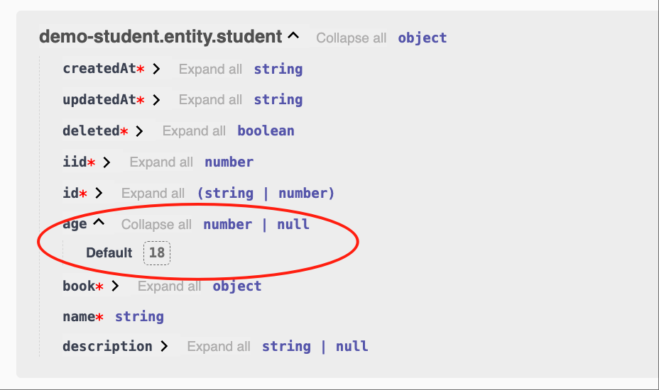

# Entity

## Create Entity

For example, we create an Entity `student` in the module demo-student

### 1. Cli command

``` bash
$ vona :create:bean entity student --module=demo-student
```

### 2. Menu command

::: tip
Context Menu - [Module Path]: `Vona Create/Entity`
:::

## Entity Definition

``` typescript
@Entity<IEntityOptionsStudent>('demoStudent')
export class EntityStudent extends EntityBase {}
```

- Inherited from the `EntityBase` class
- Use the `Entity` decorator
- Set the corresponding data table name

## table name

Vona is a modular system, and different modules can manage their own data tables independently. In order to avoid table name conflicts, Vona has agreed on a default combination mechanism for data table names. Of course, you can also provide your own table name, but you need to evaluate the risk of table name conflicts yourself

### 1. General format

``` bash
tableName = moduleName + entityName
```

For example, the entity `book` of the module demo-student has a corresponding data table name of: `demoStudentBook`

### 2. Simplified rules

If `entityName` has the same name as `moduleName`, the duplicate part will be automatically removed

For example, the entity `student` of the module demo-student has a corresponding data table name of: `demoStudent`

## @Api.field

Generally speaking, when defining a field, you need to specify the field type, validation rules, and Swagger/Openapi metadata

In `Entity` You only need to use the `@Api.field` decorator to provide all the above information, making the code more concise and intuitive

The parameter usage mechanism of the `@Api.field` decorator is similar to the Controller request parameter, see:
- [Validation](../../techniques/validation/introduction.md)
- [Swagger/Openapi](../../techniques/openapi/introduction.md)

## Field type and validation rules

### 1. Automatically infer Zod Schema: Basic type/Dto/Entity

If the field type is `Basic type/Dto/Entity`, then the system will automatically infer the corresponding Zod Schema and automatically generate Swagger/Openapi

* Example: `string`

``` typescript
class EntityStudent {
  @Api.field()
  name: string;
}
```


* Example: `EntityBook`

``` typescript
class EntityStudent {
  @Api.field()
  book: EntityBook;
}
```


* List of automatically inferred types

|Name|Description|
|--|--|
|string|z.string()|
|number|z.number()|
|boolean|z.boolean()|
|Dto|z.object({...})|
|Entity|z.object({...})|

### 2. Specify Zod Schema

We can also explicitly specify Zod Schema and automatically generate Swagger/Openapi

* Example: `number, >=18`

``` typescript
class EntityStudent {
  @Api.field(z.number().min(18))
  age: number;
}
```


### 3. Extending Zod Schema properties

We can also extend new properties based on the existing Zod Schema

* Example: `number, optional, default value is 18`

``` typescript
class EntityStudent {
  @Api.field(v.default(18), v.optional())
  age?: number;
}
```

The above code is equivalent to:

``` typescript
class EntityStudent {
  @Api.field(z.number().optional().default(18))
  age?: number;
}
```

Also equivalent to:

``` typescript
class EntityStudent {
  @Api.field(v.default(18), z.number().optional())
  age?: number;
}
```



### 4. Special tool: Array

For Array type parameters, Vona also provides convenient tools

* Example: `number[]`

``` typescript
class EntityStudent {
  @Api.field(v.array(Number))
  bookIds: number[];
}
```

Equivalent to:

``` typescript
class EntityStudent {
  @Api.field(v.array(z.number()))
  bookIds: number[];
}
```


* Example: `EntityBook[]`

``` typescript
class EntityStudent {
  @Api.field(v.array(EntityBook))
  books: EntityBook[];
}
```


These utility methods for extending Zod Schema are put into the decorator group `v` to reduce the mental burden

## Swagger/Openapi

Vona also provides many extension tools for setting metadata related to Openapi

|Name|Description|
|--|--|
|v.default|default|
|v.optional|optional|
|v.openapi|openapi|
|v.title|title|
|v.description|description|
|v.example|example|

### 1. Example: v.title

`title='Name'`

``` typescript
class EntityStudent {
  @Api.field(v.title('Name'))
  name: string;
}
```


### 2. Example: v.openapi

We can use `v.openapi` to set more metadata at once

`title='Name', example='Tom'`

``` typescript
class EntityStudent {
  @Api.field(v.openapi({ title: 'Name', example: 'Tom' }))
  name: string;
}
```


## I18n

Vona provides I18n for Openapi. For example, `title` is `Name`, and the steps to support multiple languages ​​are as follows:

### 1. Provide language resources

For how to add language resources, see: [I18n](../../essentials/scope/locale.md)

* English: `src/module/demo-student/src/config/locale/en-us.ts`

``` typescript
export default {
  Name: 'Name',
};
```

* Chinese: `src/module/demo-student/src/config/locale/zh-cn.ts`

``` typescript
export default {
  Name: '姓名',
};
```

### 2. Use $locale

Use the `$locale` method for language translation, and support automatic type hints for language resources

``` typescript
import { $locale } from '../.metadata/index.ts';

@Api.field(v.title($locale('Name')))
```

- English


- Chinese


## Entity Options

|Name|Description|
|--|--|
|table|The table name corresponding to entity|
|independent|Whether to display independently in Swagger/Openapi, the default is false|
|openapi|Metadata related to Swagger/Openapi|
|fields|Define Fields options|

- independent: If the Controller Action references entity, then the entity is automatically output to Swagger/Openapi. If `independent: true` is specified, the entity will always be output to Swagger/Openapi

### 1. Example: openapi

Provide description information for entity so that it can be displayed in Swagger/Openapi

``` typescript
@Entity({
  openapi: { description: 'Student' },
})
class EntityStudent {}
```

* Support I18n

(Creating language resources: omitted)

``` typescript
import { $locale } from '../.metadata/index.ts';

@Entity({
  openapi: { description: $locale('Student') },
})
class EntityStudent {}
```

### 2. Example: fields

Change the validation rules of the field `age` to: `number, optional, default value is 16`

Change the openapi metadata of the field `name` to: `title: 'Student Name'`

``` typescript
@Entity({
  fields: {
    age: z.number().optional().default(16),
    name: { title: 'Student Name' },
  },
})
class EntityStudent {}
```

## App config configuration

Entity options can be configured in App config

`src/backend/config/config/config.dev.ts`

``` typescript
// onions
config.onions = {
  entity: {
    'demo-student:student': {
      openapi: {
        description: 'Student',
      },
      fields: {
        age: z.number().optional().default(16),
        name: { title: 'Student Name' },
      },
    },
  },
};
```

## Base class: EntityBase

By default, entity inherits from the base class `EntityBase`. EntityBase provides several commonly used fields. You can implement your own base class according to business needs

|Name|Type|Description|
|--|--|--|
|id|TableIdentity|TableIdentity is a union type of string and number|
|createdAt|Date|Creation time|
|updatedAt|Date|Update time|
|deleted|boolean|Soft deletion|
|iid|number|Instance ID/Tenant ID|

- id: Use the `TableIdentity` type to support business systems of any size

## id: TableIdentity

The key field `id` uses the `TableIdentity` type to support business systems of any size. When we use `int64` as the database field type, the value read from the database is of `string` type

``` typescript
export type TableIdentity = string | number;
```

* Set the default field type

When creating a data table, the system will use `int` or `int64` as the type of the id field according to the current configuration, and the default is `int64`

`src/backend/config/config/config.dev.ts`

``` typescript
// modules
config.modules = {
  'a-database': {
    'table': {
      // number -> int
      // string -> int64
      identityType: 'number',
    },
  },
};
```
