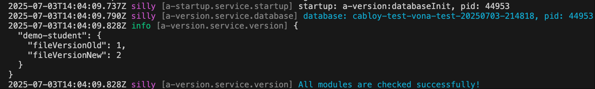
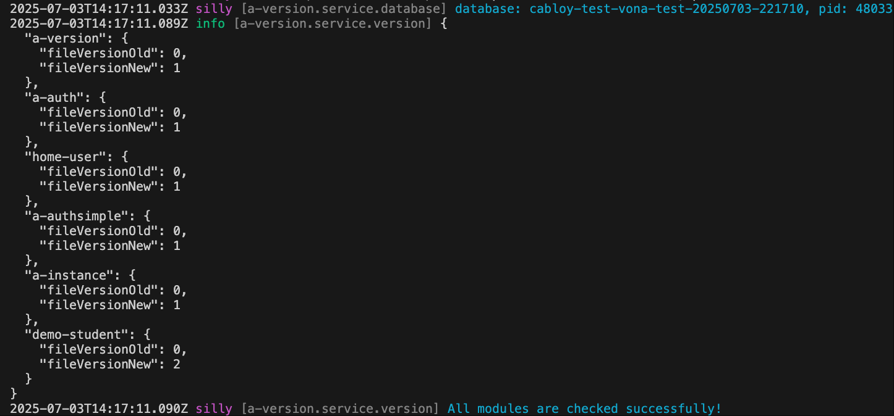

# Migration and Changes

Vona provides a unique migration mechanism that adapts to the development and continuous iteration of large projects

## Features

1. `Support modular system`: Take business modules as units, automatically detect whether the module has changed when the system starts, and automatically execute the change logic

2. `Support multi-tenancy`: Provide independent initialization data for different tenants

3. `Support unit-test`: Provide test data for the test environment

4. `Support production environment`: Can be executed safely and effectively in the production environment

5. `Support type system`: Provide type hints to make the code higher quality and easier to maintain

6. `More powerful execution environment`: Migration code can use the complete ecosystem provided by Vona

## Define data version

Configure the current data version of the module in the module's `package.json`

`src/module/demo-student/package.json`

``` typescript
{
  "name": "vona-module-demo-student",
  "vonaModule": {
    "fileVersion": 1
  },
}
```

- fileVersion: When the module has been released, the next time the database schema changes, `fileVersion` needs to be incremented by `+1`

## Create meta.version

Vona uses Bean `meta.version` to uniformly manage module migration codes

### 1. Cli command

``` bash
$ vona :create:bean meta version --module=demo-student
```

### 2. Menu command

::: tip
Context Menu - [Module Path]: `Vona Meta/Version`
:::

## meta.version Definition

``` typescript
@Meta()
export class MetaVersion extends BeanBase {}
```

- Inherited from `BeanBase` class
- Use `Meta` decorator

## Change-scenario

Vona provides three change-scenarios. You can inherit the corresponding interface and implement the corresponding method according to business needs

|Scenario|Interface|Method|Description|
|--|--|--|--|
|update|IMetaVersionUpdate|update|Changes in database schema, such as creating a new data table, adding fields, etc.|
|init|IMetaVersionInit|init|Provide initialization data for different instances/tenants|
|test|IMetaVersionTest|test|Provide test data for the test environment|

## update: Database schema migration

For example, the current data version of the module demo-student is `1`, and we create a data table `demoStudent` for `version 1`

``` typescript
@Meta()
export class MetaVersion extends BeanBase implements IMetaVersionUpdate {
  async update(options: IMetaVersionUpdateOptions) {
    if (options.version === 1) {
      await this.bean.model.createTable('demoStudent', table => {
        table.basicFields();
        table.string('name', 50);
        table.string('description', 255);
      });
    }
  }
}
```

- `table.basicFields`: Create 5 basic fields: `id/iid/deleted/createdAt/updatedAt`
- `table.string`: Create a field of type `string`

Vona uses `knex` at the bottom. For more details, see: [knex](https://knexjs.org/)

In order to make the code higher quality and easier to maintain, we can also use a typed code style

``` typescript
@Meta()
export class MetaVersion extends BeanBase implements IMetaVersionUpdate {
  async update(options: IMetaVersionUpdateOptions) {
    if (options.version === 1) {
      const entityStudent = this.scope.entity.student;
      await this.bean.model.createTable(entityStudent.$table, table => {
        table.basicFields();
        table.string(entityStudent.name, 50);
        table.string(entityStudent.description, 255);
      });
    }
  }
}
```

## init: Initialize data

For example, we initialize a student data

``` typescript
@Meta()
export class MetaVersion extends BeanBase implements IMetaVersionInit {
  async init(options: IMetaVersionInitOptions) {
    if (options.version === 1) {
      await this.scope.model.student.insert({
        name: 'Tom',
        description: 'This is a student',
      });
    }
  }
}
```

Automatically write data in the database:

``` typescript
{
  id: '1',
  createdAt: 2025-07-03T13:39:22.642Z,
  updatedAt: 2025-07-03T13:39:22.642Z,
  deleted: false,
  iid: 1,
  name: 'Tom',
  description: 'This is a student'
}
```

Where `iid: 1` is the Id of the current instance/tenant. Therefore, if there are multiple instances/tenants, the `init` method will be executed once for each instance/tenant. Therefore, the data of instances/tenants are isolated

## test: test data

For example, add a student data, which is only used in the test environment

``` typescript
@Meta()
export class MetaVersion extends BeanBase implements IMetaVersionTest {
  async test(_options: IMetaVersionTestOptions) {
    await this.scope.model.student.insert({
      name: 'Jimmy',
      description: 'Only used in unit test',
    });
  }
}
```

- The data added in the `test` method is only valid in the test/development environment, and the `test` method will not be executed in the production environment

## Version change

If we need to create a new data table, such as `Book`, in subsequent business iterations. Then, the execution steps are as follows:

### 1. Increment fileVersion

``` typescript
{
  "name": "vona-module-demo-student",
  "vonaModule": {
    "fileVersion": 2 // 1 -> 2
  },
}
```

### 2. Create Entity: EntityBook

``` typescript
@Entity('demoStudentBook')
export class EntityBook {
  @Api.field()
  name: string;
}
```

### 3. Modify update/init/test

Write migration code in `update/init/test` as needed. Here, we only need to create a new data table in `update`

``` typescript
@Meta()
export class MetaVersion extends BeanBase implements IMetaVersionUpdate {
  async update(options: IMetaVersionUpdateOptions) {
    if (options.version === 1) {
      ...
    }
    if (options.version === 2) {
      const entityBook = this.scope.entity.book;
      await this.bean.model.createTable(entityBook.$table, table => {
        table.basicFields();
        table.string(entityBook.name, 255);
      });
    }
  }
}
```

### 4. Execute migration code

When the system starts, it will automatically detect whether the module needs to be changed, and automatically execute the migration code

``` bash
# Development environment
$ npm run dev
# Production environment
$ npm run start
```



## Support local development

When we develop locally, we need to frequently update the database schema for the current data version. Then, we do not need to modify `fileVersion`, but execute the following command to make the migration code effective

``` bash
$ npm run test
```

When we execute unit tests, the system will automatically delete the old database and create a new database, which will re-execute the migration code and then execute the unit test code

``` bash
$ npm run db:reset
```

This command is only used to recreate the database and re-execute the migration code


