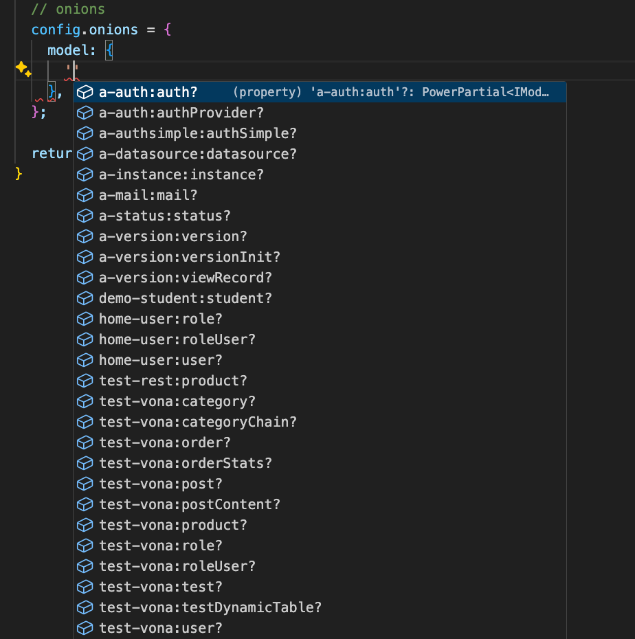

# Onion Name

The system will automatically assign an Onion name to each bean class as the following format:

```bash
{moduleName}:{beanName}
```

## For Example

* The module home-base provides a Service bean: ServiceMenu

|Class Name|Scene Name|Bean Identifier|Onion Name|Service Name|
|--|--|--|--|--|
|ServiceMenu|service|home-base.service.menu|home-base:menu|home-base:menu|

* The module demo-student provides a Model bean: ModelStudent

|Class Name|Scene Name|Bean Identifier|Onion Name|Model Name|
|--|--|--|--|--|
|ModelStudent|model|demo-student.model.student|demo-student:student|demo-student:student|

## App Config

With a common Onion name, you can modify the parameters of all bean classes in App Config

`src/backend/config/config/config.ts`

``` typescript
// onions
config.onions = {
  middleware: {
    'a-core:gate': {
      enable: false,
    },
  },
  model: {
    'demo-student:student': {
      cache: {
        query: false,
        entity: false,
      },
    },
  },
  schedule: {
    'a-orm:softDeletionPrune': {
      repeat: { every: 24 * 3600 * 1000 },
    },
  },
};
```

All configurations have type hints, as shown below:

* All Scene names type hints


* All Onion names type hints



* All parameters type hints


