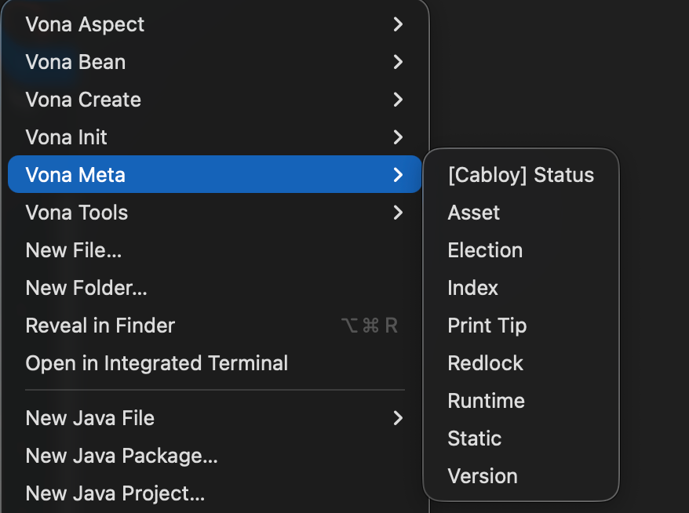

# Menu Commands

Vona provides a large number of menu commands based on Cli commands. Cli commands can be executed through menus, which significantly reduces the mental burden and improves the development experience

## VS Code Extension: [Vona - Official](https://marketplace.visualstudio.com/items?itemName=cabloy.vona-vscode)

In order to use menu commands, you need to install this extension

## Menus

### Vona Aspect

### Vona Bean

### Vona Create

### Vona Init

### Vona Meta

### Vona Tools

**Enjoy!**
