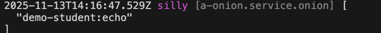

# Event Listener

An `event` can have multiple `event listeners`, which execute using the `onion model`

## Create Event Listener

For example, create an Event Listener `echo` in the module `demo-student`. When responding to an event, add a `!` suffix to the event parameter `Hello World` and pass the new parameter to the `next` method

### 1. Cli command

``` bash
$ vona :create:bean eventListener echo --module=demo-student
```

### 2. Menu command

::: tip
Context Menu - [Module Path]: `Vona Bean/Event Listener`
:::

## Event Listener Definition

### 1. Automatically Generated Code Skeleton

``` typescript
type TypeEventData = unknown; // TypeEventEchoData;
type TypeEventResult = unknown; // TypeEventEchoResult;

@EventListener({ match: 'some-module:echo' })
export class EventListenerEcho
  extends BeanBase
  implements IEventExecute<TypeEventData, TypeEventResult> {
  async execute(_data: TypeEventData, next: NextEvent<TypeEventData, TypeEventResult>): Promise<TypeEventResult> {
    // next
    return next();
  }
}
```

- `TypeEventData`: Defines the parameter type
- `TypeEventResult`: Defines the result type
- `match`: Specifies the events to listen for

|Name|Type|Description|
|--|--|--|
|match|string\|regexp\|(string\|regexp)[]|Specifies the events to listen for|

### 2. Adjust the code

``` diff
+ import type { TypeEventEchoData, TypeEventEchoResult } from './event.echo.ts';

+ type TypeEventData = TypeEventEchoData;
+ type TypeEventResult = TypeEventEchoResult;

+ @EventListener({ match: 'demo-student:echo' })
export class EventListenerEcho
  extends BeanBase
  implements IEventExecute<TypeEventData, TypeEventResult> {
+ execute(data: TypeEventData, next: NextEventSync<TypeEventData, TypeEventResult>): TypeEventResult {
+   const dataNew = `${data}!`;
    // next
+   return next(dataNew);
  }
}
```

- `TypeEventData`: Defines the parameter type
- `TypeEventResult`: Defines the result type
- `match`: Specifies the event name to listen for, `demo-student:echo`
- `execute`: To support both `asynchronous` and `synchronous` events, it's changed to a synchronous method
  - `next`: The type is changed to `NextEventSync`
- `dataNew`: Generate new event parameter value ​​and pass it to the `next` method

## Event Listener Order

Multiple Event Listeners can be associated with the same event. Therefore, VonaJS provides two parameters to control the execution order of Event Listeners

### 1. dependencies

For example, given an Event Listener `demo-student:echo3`, we want the execution order to be: `demo-student:echo3` > `Current`

``` diff
@EventListener({
  match: 'demo-student:echo',
+ dependencies: 'demo-student:echo3',
})
class EventListenerEcho {}
```

### 2. dependents

The order of `dependents` is exactly the opposite of `dependencies`. We want the execution order to be: `Current` > `demo-student:echo3`

``` diff
@EventListener({
  match: 'demo-student:echo',
+ dependents: 'demo-student:echo3',
})
class EventListenerEcho {}
```

## Event Listener Enable/Disable

You can control `enable/disable` of Event Listeners

### 1. Enable

`src/backend/config/config/config.ts`

``` diff
// onions
config.onions = {
  eventListener: {
    'demo-student:echo': {
+     enable: false,
    },
  },
};
```

### 2. Meta

Allows Event Listeners to take effect in a specified operating environment

|Name|Type|Description|
|--|--|--|
|flavor|string\|string[]|See: [Runtime Environments and Flavors](../../env-config/mode-flavor/introduction.md)|
|mode|string\|string[]|See: [Runtime Environments and Flavors](../../env-config/mode-flavor/introduction.md)|

* Example

``` diff
@EventListener({
+ meta: {
+   flavor: 'normal',
+   mode: 'dev',
+ },
})
class EventListenerEcho {}
```

## Inspect

You can directly inspect the currently effective event listener list

``` diff
class ControllerStudent {
  @Web.get('test')
  test() {
+   this.bean.onion.eventListener.inspectEventListener('demo-student:echo');
  }
}
```

- `this.bean.onion`: Get the global Service instance `onion`
- `.eventListener`: Get the Service instance related to the Event Listener
- `.inspectEventListener`: Output the list of currently effective Event Listeners, passing in the event name `demo-student:echo`

When accessing the `test` API, the list of currently effective Event Listeners will be automatically output to the console, as shown below:


