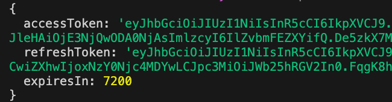

# JWT

VonaJS provides a powerful and flexible JWT capabilities based on [jsonwebtoken](https://github.com/auth0/node-jsonwebtoken)

## App Config

JWT configuration can be modified in the App Config:

`src/backend/config/config/config.ts`

``` typescript
// modules
config.modules = {
  'a-jwt': {
    tempAuthToken: {
      signOptions: { expiresIn: 5 * 60 },
    },
    base: {
      secret: undefined,
      signOptions: { issuer: env.APP_NAME },
      verifyOptions: { issuer: env.APP_NAME },
    },
    clients: {
      access: {
        signOptions: { expiresIn: 2 * 60 * 60 },
      },
      refresh: {
        signOptions: { expiresIn: 7 * 24 * 60 * 60 },
      },
    },
  },
};
```

|Name|Description|
|--|--|
|tempAuthToken|Configuration for temporary accessToken|
|base|Basic configuration, providing common base settings for all Clients|
|clients|Configures multiple Clients. The system provides built-in `access/refresh` Clients for generating `accessToken/refreshToken`|

- `signOptions`: see: [jsonwebtoken](https://github.com/auth0/node-jsonwebtoken)

## Adding a New Client

The following explains the Client configuration by adding a new Client

### 1. Adding Type Definition

Add a new Client type definition using the interface merging mechanism, such as `test`, to generate JWT tokens for testing scenarios

In the VSCode editor, enter the code snippet `recordjwtclient`, and the code skeleton will be automatically generated:

``` typescript
declare module 'vona-module-a-jwt' {
  export interface IJwtClientRecord {
    : never;
  }
}
```

Adjust the code, and then add `test`

``` diff
declare module 'vona-module-a-jwt' {
  export interface IJwtClientRecord {
+   test: never;
  }
}
```

### 2. Adding Client Configuration

`src/backend/config/config/config.ts`

``` typescript
// modules
config.modules = {
  'a-jwt': {
    clients: {
      test: {
        secret: 'xxxx',
        signOptions: { expiresIn: 2 * 60 * 60 },
      },
    },
  },
};
```

- `secret`: Can provide an individual `secret` value for the Client
  - If empty, the `base.secret` value is used
  - If `base.secret` is also empty, `this.app.config.server.keys[0]` is used

### 3. SERVER_KEYS

`env/.env`

``` typescript
# server

SERVER_KEYS = vona__1596889047267_3245
```

`src/backend/config/config/config.ts`

``` typescript
// server
config.server = {
  keys: (env.SERVER_KEYS || '').split(','),
};  
```

## Obtaining JWT Client Instance

``` typescript
class ControllerStudent {
  @Web.get('test')
  async test() {
    const jwtAccess = this.bean.jwt.get('access');
    const jwtRefresh = this.bean.jwt.get('refresh');
    const jwtTest = this.bean.jwt.get('test');
  }
}  
```

## Generate accessToken

``` typescript
class ControllerStudent {
  @Web.get('test')
  async test() {
    const jwtAccess = this.bean.jwt.get('access');
    const accessToken = await jwtAccess.sign({ userId: '1' });
  }
}  
```

## Generate JWT Tokens

Can generate `accessToken/refreshToken` at the same time

``` typescript
class ControllerStudent {
  @Web.get('test')
  async test() {
    const jwtTokens = await this.bean.jwt.create({ userId: '1' });
    console.log(jwtTokens);
  }
}  
```

As shown in the figure below:



## Generate temporary accessToken

In certain scenarios, an accessToken needs to be used in the URL query. In this case, a temporary accessToken needs to be generated. The `expiresIn` of a temporary accessToken is shorter than that of a regular accessToken, making it more secure

There are two ways to generate a temporary accessToken:

* `Method 1`

``` typescript
class ControllerStudent {
  @Web.get('test')
  async test() {
    const jwtAccess = this.bean.jwt.get('access');
    const accessToken = await jwtAccess.sign({ userId: '1' }, { temp: true });
  }
}  
```

* `Method 2`

``` typescript
class ControllerStudent {
  @Web.get('test')
  async test() {
    const accessToken = await this.bean.jwt.createTempAuthToken({ userId: '1' });
  }
}  
```

##  JWT Verification

``` diff
class ControllerStudent {
  @Web.get('test')
  async test() {
    const jwtAccess = this.bean.jwt.get('access');
    const accessToken = await jwtAccess.sign({ userId: '1' });
+   const payload = await jwtAccess.verify(accessToken);
    assert.deepEqual(payload, { userId: '1' });
  }
}  
```
