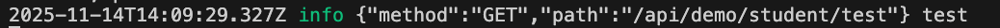
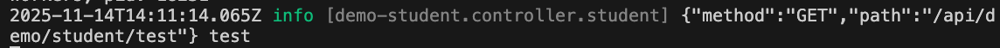

# Logger

VonaJS provides a powerful and flexible logging system based on [winston](https://github.com/winstonjs/winston).

## Features

1. `Clients`: Each client has independent configurations
2. `Children`: Child logs can be created for different scenarios
3. `Rotate`: Log files are rotated according to the specified rules
4. `Level`: The content written to log files can be controlled based on levels

## Log Directory

Different log directories are used by default for different runtime environments:

- `Test/Development`: `{project path}/.app/logs`

- `Production`: `{home}/vona/{project name}/logs`

Configuration can be modified in the App Config or .env file

### 1. App Config

`src/backend/config/config/config.ts`

``` typescript
// logger
config.logger = {
  baseDir: '/new/path',
};
```

### 2. .env

`env/.env`

``` typescript
# logger
LOGGER_DIR = /new/path
```

## App Config

Log configuration can be done in App Config:

`src/backend/config/config/config.ts`

``` typescript
// logger
config.logger = {
  baseDir: '/new/path',
  rotate: {},
  base: {},
  clients: {},
};
```

|Name|Description|
|--|--|
|baseDir|Log Directory|
|rotate|Log Rotate|
|base|Basic configuration, providing common basic configuration for all clients|
|clients|Configure multiple clients. The system provides a built-in `default` client, enabling out-of-the-box logging capabilities|

## Rotate

The system provides a default rotation configuration, which is enabled. You can modify the configuration in the App Config or .env file

### 1. App Config

`src/backend/config/config/config.ts`

``` typescript
// logger
config.logger = {
  rotate: {
    enable: true,
    options(filename: string) {
      return {
        filename: `${filename}-%DATE%.log`,
        datePattern: 'YYYY-MM-DD',
        maxSize: '20m',
        maxFiles: '7d',
      };
    },
  },
};
```

|Name|Description|
|--|--|
|enable|Whether Rotate is enabled|
|options|Returns Rotate configuration via function|
|options.filename|Filename template|
|options.datePattern|Date pattern|
|options.maxSize|Maximum size of each file|
|options.maxFiles|Keep only files from the last few days|

### 2. .env

`env/.env`

``` typescript
# logger
LOGGER_ROTATE_ENABLE = true
LOGGER_ROTATE_FILENAME = '{{filename}}-%DATE%.log'
LOGGER_ROTATE_DATEPATTERN = YYYY-MM-DD
LOGGER_ROTATE_MAXSIZE = 20m
LOGGER_ROTATE_MAXFILES = 7d
```

## How to add a new client

The following explains the Client configuration by adding a new Client

### 1. Adding Type Definition

Add a new Client type definition using the interface merging mechanism, such as `order`, to output independent order-related logs

In the VSCode editor, enter the code snippet `recordloggerclient`, and the code skeleton will be automatically generated:

``` typescript
declare module 'vona' {
  export interface ILoggerClientRecord {
    : never;
  }
}
```

Adjust the code, and then add `order`

``` diff
declare module 'vona' {
  export interface ILoggerClientRecord {
+   order: never;
  }
}
```

### 2. Adding Client Configuration

`src/backend/config/config/config.ts`

``` typescript
// logger
config.logger = {
  clients: {
    order(this: VonaApplication, clientInfo) {
      const transports = [
        this.bean.logger.makeTransportFile(clientInfo, 'order'),
        this.bean.logger.makeTransportConsole(clientInfo),
      ].filter(item => !!item);
      return { transports };
    },
  },
};
```

- `order`: Returns the Client configuration via a function. This configuration will be merged with the system-provided default configuration
  - Therefore, in general, only the required `transports` need to be constructed
- `clientInfo`: Contains environment information used to construct the `transport`
- `makeTransportFile`: Used to construct the file transport, requiring the log file name `order`
  - Since the file name template is `${filename}-%DATE%.log`, the actual generated file name is `order-2025-11-16.log`
- `makeTransportConsole`: Used to construct the console transport
- `filter`: The newly created transport instances may be undefined, therefore filtering is required

## Obtaining Logger Client Instance

There are two ways to obtain a Logger Client instance:

* `Method 1`

``` typescript
class ControllerStudent extends BeanBase {
  async test() {
    // logger: default
    const loggerDefault = this.bean.logger.default;
    // logger: order
    const loggerOrder = this.bean.logger.get('order');
  }
}
```

* `Method 2`

``` typescript
class ControllerStudent extends BeanBase {
  async test() {
    // logger: default
    const loggerDefault = this.$logger;
    // logger: order
    const loggerOrder = this.$loggerClient('order');
  }
}
```

`Method 2` is not only more concise, but it also automatically includes the `beanFullName` of the current Bean Class in the logs, making it easier to troubleshoot problems

* Example:

``` typescript
const loggerOrder = this.bean.logger.get('order');
loggerOrder.info('test');
```



``` typescript
// logger: default
this.$logger.info('test');
// logger: order
this.$loggerClient('order').info('test');
```



The image outputs beanFullName: `[demo-student.controller.student]`

## Obtaining Logger Child Instance

For the same Logger Client, multiple Child instances can be generated, each corresponding to a different scenario

For example, generating a Child `pay` will clearly display the `pay` information in the log

``` typescript
// child of logger-default
this.$loggerChild('pay').info('$50');
// child of logger-order
this.$loggerChild('pay', 'order').info('$50');
```


The image outputs Child name: `[pay]`

### Adding Type Definition

Similarly, a type definition for `pay` is required to support type hints

In the VSCode editor, enter the code snippet `recordloggerchild`, and the code skeleton will be automatically generated:

``` typescript
declare module 'vona' {
  export interface ILoggerChildRecord {
    : never;
  }
}
```

Adjust the code, and then add `pay`

``` diff
declare module 'vona' {
  export interface ILoggerChildRecord {
+   pay: never;
  }
}
```

## Log Message

### 1. General Usage

``` typescript
this.$logger.info('test');
```

### 2. String Interpolation

String interpolation is implemented based on [util.format](https://nodejs.org/dist/latest/docs/api/util.html#util_util_format_format_args)

``` typescript
this.$logger.info('%s has %d apples', 'Tom', 3);
```

### 3. Delayed Messages

Due to log level, some leveled messages are not written to files. Therefore, constructing excessively large message contents will waste system resources

* Example

``` typescript
const obj = { data: 'more info' };
this.$logger.debug(JSON.stringify(obj));
```

If the current level is `info`, then logs at the `debug` level will not be written to the file. Therefore, `JSON.stringify` will waste system resources

* Solution

A callback function can be provided. This function is executed only when writing to a file is required, thus generating the actual message

``` typescript
const obj = { data: 'more info' };
this.$logger.debug(() => {
  return JSON.stringify(obj);
});
```

### 4. Multi-Child

Multi-Child Loggers can be created from the current Logger instance, thus passing more metadata to the log message

``` typescript
this.$logger.child({ requestId: '451' }).child({ extra: 'some info' }).info('test');
this.$logger.child({ requestId: '578', extra: 'some info' }).info('test');
```

As shown below: `requestId/extra`


