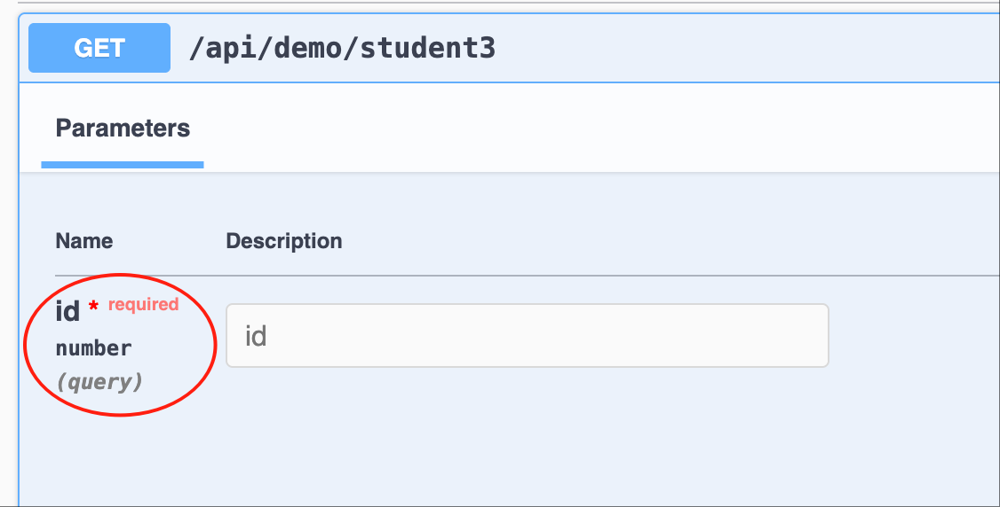
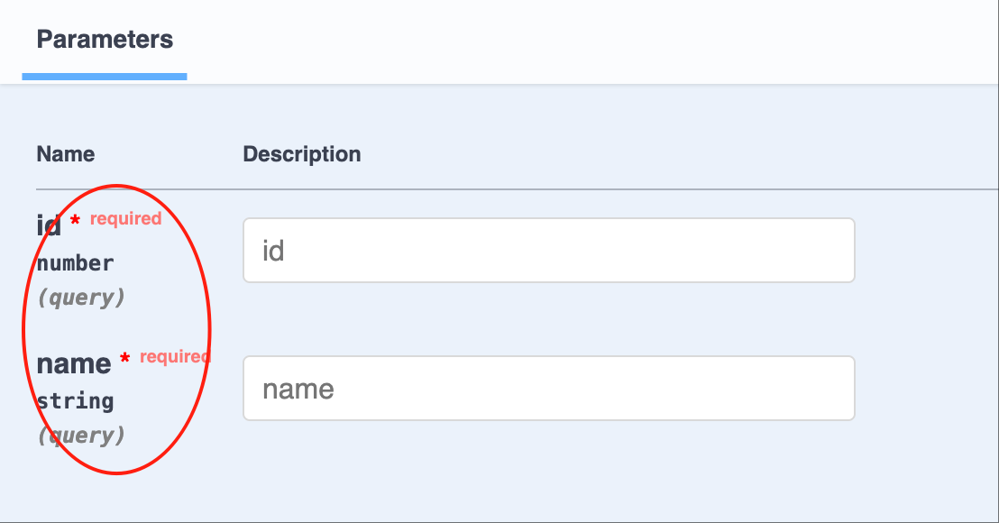
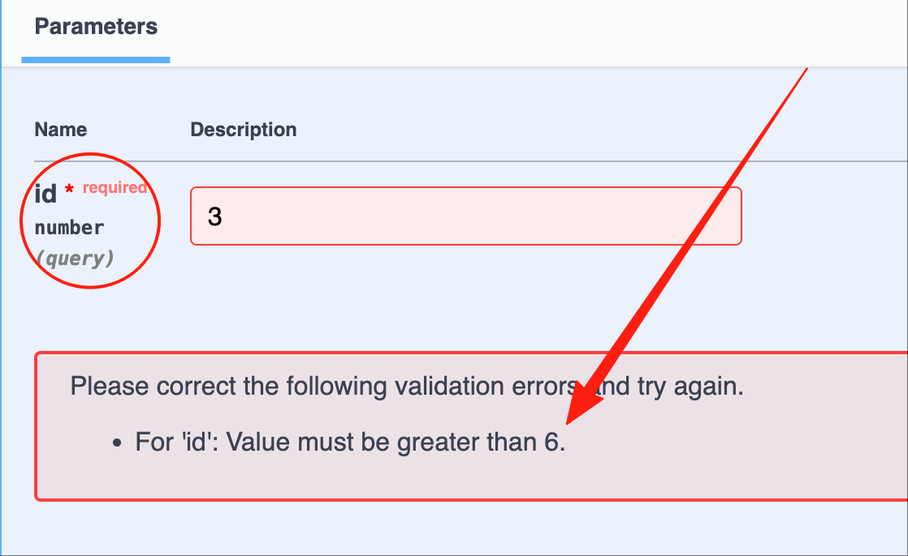
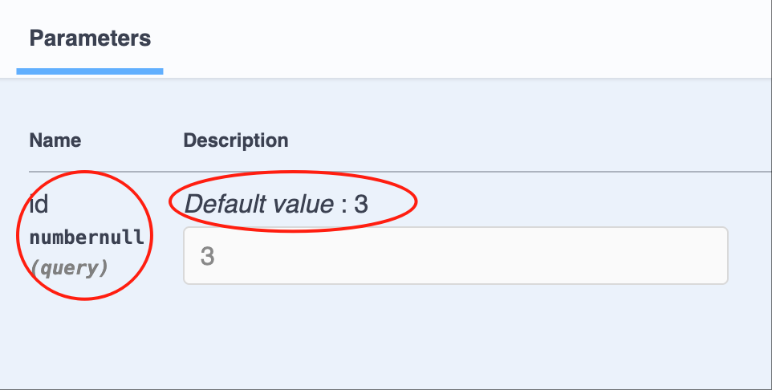
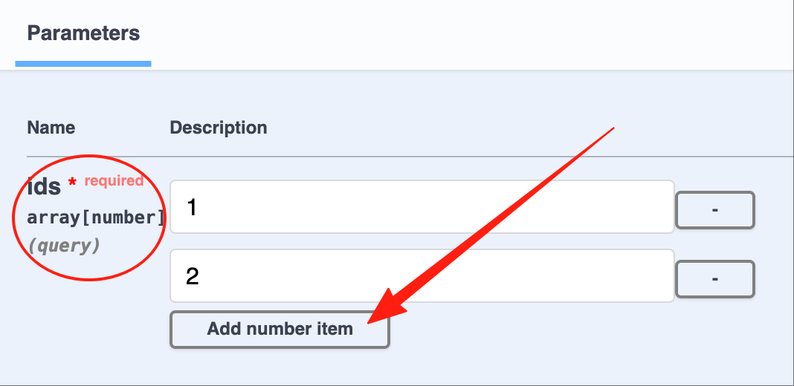
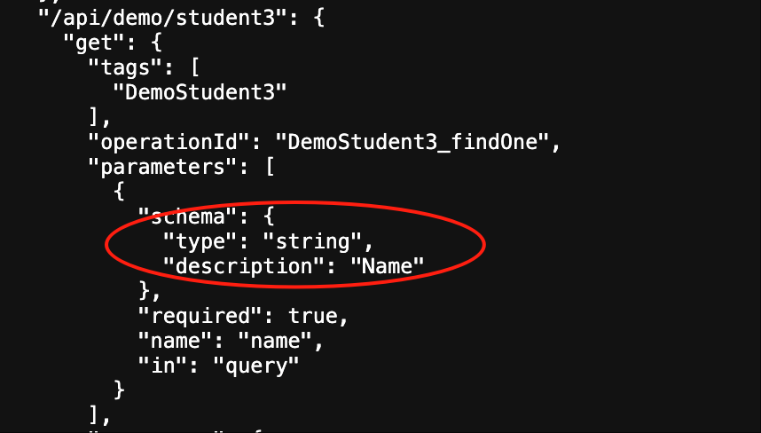
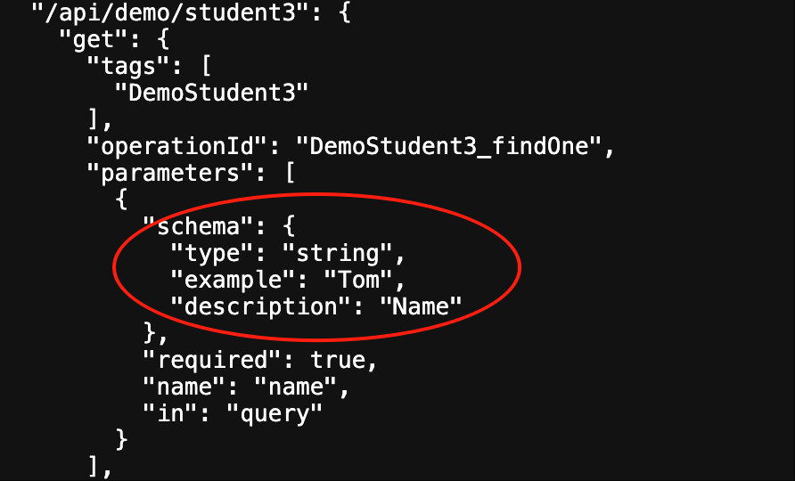
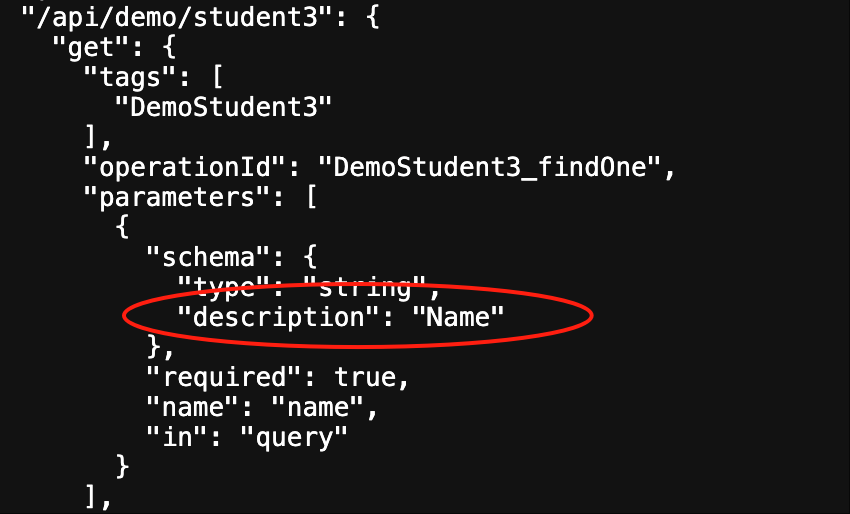
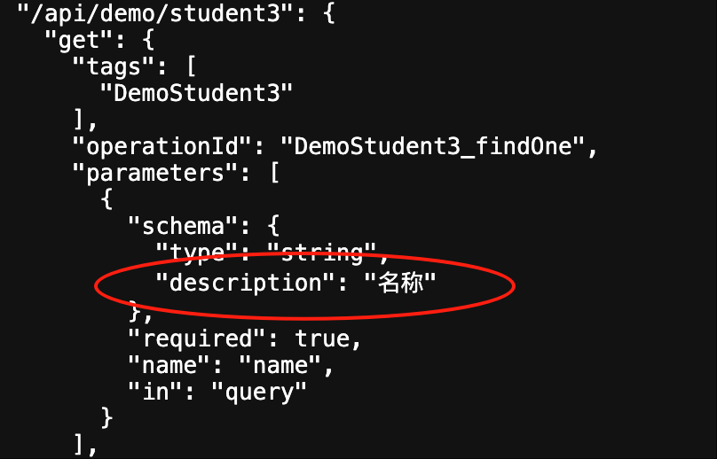

# Swagger/OpenAPI

Vona implements a very convenient `Swagger/OpenAPI` based on [@asteasolutions/zod-to-openapi](https://github.com/asteasolutions/zod-to-openapi). `Swagger/OpenAPI` in Vona still uses the decorators in [Validation](../validation/introduction.md), and provides extension tools to set metadata related to OpenAPI

## URL

Vona has a built-in `Swagger` module, which we can access directly through the URL:

|Name|URL|
|--|--|
|Swagger|http://localhost:7102/swagger|
|Openapi json| http://localhost:7102/swagger/json|
|Openapi json V3.1| http://localhost:7102/swagger/json?version=V31|
|Openapi json V3.0| http://localhost:7102/swagger/json?version=V30|

- The default version of Openapi json is `V3.1`

In addition, Vona also has built-in [RapiDoc](https://rapidocweb.com/), which provides a more elegant UI

|Name|URL|
|--|--|
|RapiDoc|http://localhost:7102/rapidoc|

## 1. Automatically infer Zod Schema: Basic type/Dto/Entity

If the parameter type is `Basic type/Dto/Entity`, then the system will automatically infer the corresponding Zod Schema, and automatically generate OpenAPI metadata

For example, `findOne(@Arg.query('id') id: number)`, the type of id is `number`, then the automatically inferred Schema is: `z.number()`. Then, the automatically generated Swagger/OpenAPI is as follows:



Another example, `findOne(@Arg.query() query: DtoStudentInfo)`, the query type is Dto: `DtoStudentInfo`, then the automatically inferred Schema is: `z.object({...})`. Then, the automatically generated Swagger/OpenAPI is as follows:



## 2. Specify Zod Schema

For example, `findOne(@Arg.query('id', z.number().min(6)) id: number)`, we specify that the type of id is `number`, and `>=6`. Then, the automatically generated Swagger/OpenAPI is as follows:



## 3. Extending Zod Schema properties

For example, `findOne(@Arg.query('id', v.default(3), v.optional()) id: number)`. First, the system automatically infers the schema as `z.number()`, then appends the `optional` and `default` attributes in sequence, and finally generates the schema: `z.number().optional().default(3)`. Then, the automatically generated Swagger/OpenAPI is as follows:



## 4. Special tool: Array

For example, `findOne(@Arg.query('ids', v.array(Number)) ids: number[])`, we specify ids as `number[]`. Then, the automatically generated Swagger/OpenAPI is as follows:



## Extension tools

Vona also provides many extension tools for setting metadata related to OpenAPI

|Name|Description|
|--|--|
|v.default|default|
|v.optional|optional|
|v.openapi|openapi|
|v.title|title|
|v.description|description|
|v.example|example|

### 1. Example: v.title

For example, we can specify `title` as `Name` for OpenAPI

``` typescript
class ControllerStudent3 {
  @Web.get()
  findOne(@Arg.query('name', v.title('Name')) name: string) {}
}
```

The automatically generated Swagger/OpenAPI is as follows: (Since Swagger do not display title information, we directly view the OpenAPI json data)



### 2. Example: v.openapi

We can use `v.openapi` to set more metadata at once. For example, we can specify `title` as `Name` and `example` as `Tom` for OpenAPI

``` typescript
class ControllerStudent3 {
  @Web.get()
  findOne(@Arg.query('name', v.openapi({ title: 'Name', example: 'Tom' })) name: string) {}
}
```

The automatically generated Swagger/OpenAPI is as follows:



## I18n

Vona provides I18n for OpenAPI. For example, `title` is `Name`, and the steps to support i18n ​​are as follows:

### 1. Provide language resources

For how to add language resources, see: [I18n](../../essentials/scope/locale.md)

* English: `src/module/demo-student/src/config/locale/en-us.ts`

``` typescript
export default {
  Name: 'Name',
};
```

* Chinese: `src/module/demo-student/src/config/locale/zh-cn.ts`

``` typescript
export default {
  Name: '姓名',
};
```

### 2. Use $locale

Use the `$locale` method for language translation, and support auto-complete hints for language resources

``` typescript
import { $locale } from '../.metadata/index.ts';

class ControllerStudent3 {
  @Web.get()
  findOne(@Arg.query('name', v.title($locale('Name'))) name: string) {}
}
```

The automatically generated Swagger/OpenAPI are as follows:

* English: http://localhost:7102/swagger/json?x-vona-locale=en-us



* Chinese: http://localhost:7102/swagger/json?x-vona-locale=zh-cn


