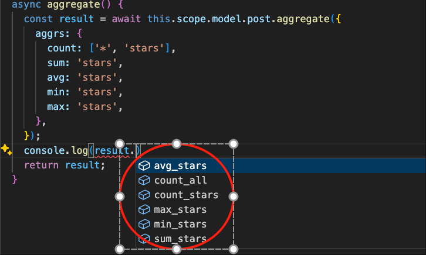
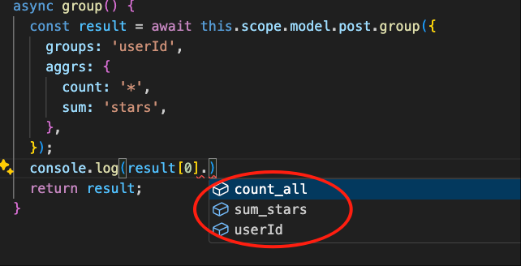

# Aggregate & Group

The following uses the module `test-vona` as an example to explain the usage of `aggregate and group`

## count

``` typescript
class ServicePost {
  async count() {
    return await this.scope.model.post.count();
  }
}  
```

* Params

|Name|Description|
|--|--|
|column|The column to be counted|
|distinct|Whether to enable distinct|
|where|Conditional statement|
|joins|Related tables|

## Aggregate

``` typescript
class ServicePost {
  async aggregate() {
    const result = await this.scope.model.post.aggregate({
      aggrs: {
        count: ['*', 'stars'],
        sum: 'stars',
        avg: 'stars',
        min: 'stars',
        max: 'stars',
      },
    });
    return result;
  }
}  
```

Vona ORM automatically infers the type of `result` from the `aggrs` parameter



* Params

|Name|Description|
|--|--|
|aggrs|The functions and columns to be aggregated. Functions: `count`/`sum`/`avg`/`min`/`max`. Columns: `string`/`string[]` |
|distinct|Whether to enable distinct|
|where|Conditional statement|
|joins|Related tables|

## Group

``` typescript
class ServicePost {
  async group() {
    const result = await this.scope.model.post.group({
      groups: 'userId',
      aggrs: {
        count: '*',
        sum: 'stars',
      },
    });
    return result;
  }
}  
```

Vona ORM automatically infers the type of `result` from the parameters `groups` and `aggrs`



* Params

|Name|Description|
|--|--|
|groups|The groups to be grouped: `string`/`string[]`|
|columns|The group columns to be displayed. If it is empty, the columns specified by the `groups` parameter will be displayed|
|aggrs|The functions and columns to be aggregated. Functions: `count`/`sum`/`avg`/`min`/`max`. Columns: `string`/`string[]` |
|distinct|Whether to enable distinct|
|where|Conditional statement|
|joins|Related tables|
|limit|Limit the range of data to be grouped|
|offset|Limit the range of data to be grouped|
|having|Filter the group results|
|orders|Sort the group results|

### Example: having

``` typescript
class ServicePost {
  async group() {
    const result = await this.scope.model.post.group({
      groups: 'userId',
      aggrs: {
        count: '*',
        sum: 'stars',
      },
      having: {
        count_all: {
          _gt_: 20,
        },
        sum_stars: {
          _gt_: 30,
          _lt_: 50,
        },
      },
    });
    return result;
  }
}  
```

### Example: orders

``` typescript
class ServicePost {
  async group() {
    const result = await this.scope.model.post.group({
      groups: 'userId',
      aggrs: {
        count: '*',
        sum: 'stars',
      },
      orders: [['count_all', 'desc']],
    });
    return result;
  }
}  
```
