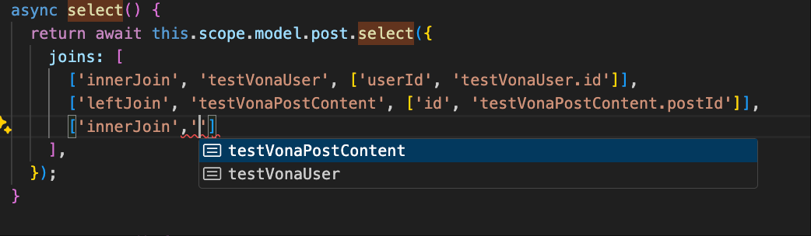
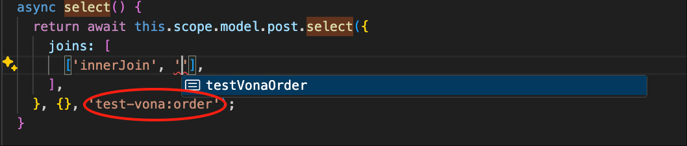
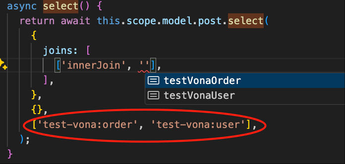

# CRUD (Select)

The following uses the `test-vona` module as an example to explain the usage of `Select` in CRUD

## Basic Query

The `test-vona` module defines the `Post` model. You can query `Post` data as follows

### 1. select

``` typescript
class ServicePost {
  async select() {
    return await this.scope.model.post.select();
  }
}
```

### 2. Count

``` typescript
class ServicePost {
  async count() {
    return await this.scope.model.post.count();
  }
}
```

### 3. get

``` typescript
class ServicePost {
  async get(id: TableIdentity) {
    return await this.scope.model.post.get({ id });
  }
}
```

### 4. mget

``` typescript
class ServicePost {
  async mget(ids: TableIdentity[]) {
    return await this.scope.model.post.mget(ids);
  }
}
```

### Select Type Definition

``` typescript
async select<
  T extends IModelSelectParams<TRecord>,
  ModelJoins extends TypeModelsClassLikeGeneral | undefined,
>(
  params?: T,
  options?: IModelMethodOptions,
  _modelJoins?: ModelJoins,
): Promise<any[]>;
```

* Example: A relatively complex select query:

``` typescript
class ServicePost {
  async select() {
    return await this.scope.model.post.select({
      columns: ['id', 'title', 'userId'],
      where: {
        'id': { _gt_: 1 },
        'testVonaUser.id': 1,
      },
      joins: [['innerJoin', 'testVonaUser', ['userId', 'testVonaUser.id']]],
      offset: 0,
      limit: 20,
      orders: [['createdAt', 'desc']],
    }, {
      disableDeleted: false,
    }, 'test-vona:user');
  }
}
```

## Select Parameter: Options

|Name|Type|Default Value|Description|
|--|--|--|--|
|disableDeleted|boolean|false|Disable soft deletion|
|disableCreateTime|boolean|false|Disable automatic creation time setting|
|disableUpdateTime|boolean|false|Disable automatic update time setting|
|disableCacheQuery|boolean|false|Disable `Cache Query`|
|disableCacheEntity|boolean|false|Disable `Cache Entity`|
|iid|number|undefined|Can explicitly set the `instance Id`|
|deleted|boolean|undefined|Can explicitly set the `deleted` value|

## Select Parameter: Params

|Name|Description|
|--|--|
|distinct|Whether to enable distinct|
|columns|List of fields to be queried|
|where|Conditional statement|
|joins|Related tables|
|orders|Sorting|
|limit|Can be used for paginated queries|
|offset|Can be used for paginated queries|
|include|Static relationships|
|with|Dynamic relationships|

## orders

This is an array type, and multiple orders can be specified:

``` typescript
async select() {
  return await this.scope.model.post.select({
    orders: [
      ['createdAt', 'desc'],
      ['title', 'asc'],
    ],
  });
}
```

## joins

You can use `joins` to join multiple tables

``` typescript
async select() {
  return await this.scope.model.post.select({
    joins: [
      ['innerJoin', 'testVonaUser', ['userId', 'testVonaUser.id']],
      ['leftJoin', 'testVonaPostContent', ['id', 'testVonaPostContent.postId']],
    ],
  });
}
```

`joins` supports type hinting, as shown in the figure:



So, where does the list of tables shown in the figure come from?

As mentioned earlier, you can define relationships between multiple entities in a `Model`. Therefore, the system automatically extracts the corresponding data tables from the relationships defined in the model. The relationships for the `Post` model are defined as follows:

``` typescript
@Model({
  relations: {
    postContent: $relation.hasOne('test-vona:postContent', 'postId', { columns: ['id', 'content'] }),
    user: $relation.belongsTo(ModelPost, () => ModelUser, 'userId', { autoload: true, columns: ['id', 'name'] }),
  },
})
class ModelPost {}
```

In a large business system, a model may not define all relationships. Alternatively, you can specify the models to be associated using the `_modelJoins` parameter, and the system will retrieve the corresponding data tables from these models

For example, the `test-vona` module defines the `order` model. Then, we can use `joins` like this:



We can also specify multiple models:



## where
