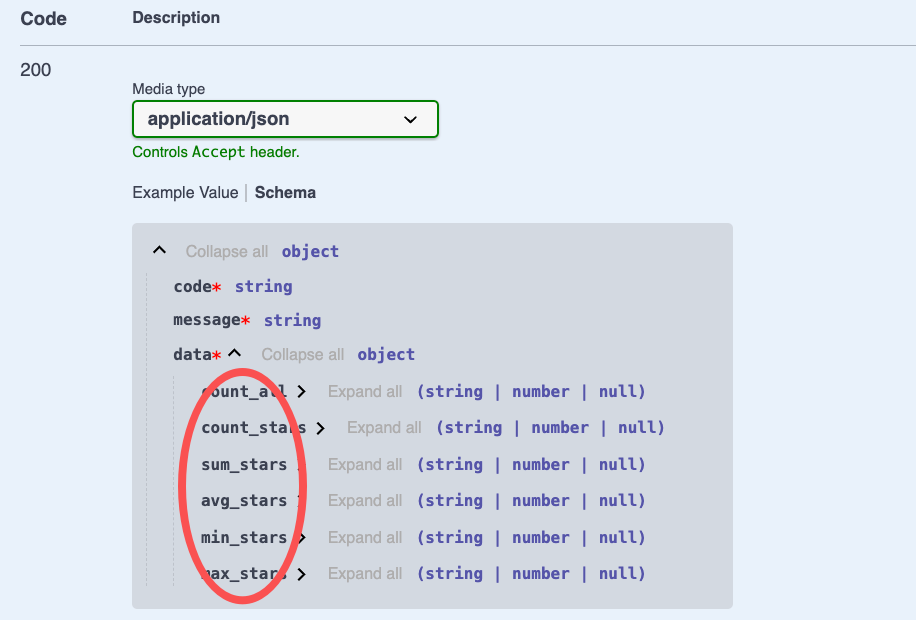

# $Dto.aggregate

`$Dto.aggregate` is used to annotate the return result of the aggregation operation

## How to use

### 1. Create DTO

In VSCode, use the `Vona Create/Dto` context menu to create a DTO code skeleton:

``` typescript
@Dto()
export class DtoPostAggregate {}
```

### 2. Inherit $Dto.aggregate

``` diff
@Dto()
export class DtoPostAggregate
+ extends $Dto.aggregate(() => ModelPost, {
+   count: ['*', 'stars'],
+   sum: 'stars',
+   avg: 'stars',
+   min: 'stars',
+   max: 'stars',
+ }) {}
```

## Annotating API Result

Taking the `aggregate` method of the `Post` controller as an example, we can annotate the API Result:

``` diff
class ControllerPost {
  @Web.get('aggregate')
+ @Api.body(DtoPostAggregate)
+ async aggregate(): Promise<DtoPostAggregate> {
    return await this.scope.model.post.aggregate({
      aggrs: {
        count: ['*', 'stars'],
        sum: 'stars',
        avg: 'stars',
        min: 'stars',
        max: 'stars',
      },
    });
  }
}
```

- `@Api.body`: passed in `DtoPostAggregate`, used to annotate the API return value

The automatically generated Swagger/Openapi is as follows:


