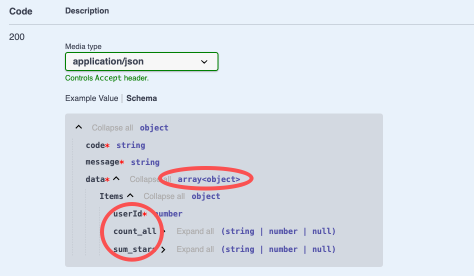

# $Dto.group

`$Dto.group` is used to annotate the return result of the grouping operation

## How to use

### 1. Create DTO

In VSCode, use the `Vona Create/Dto` context menu to create a DTO code skeleton:

``` typescript
@Dto()
export class DtoPostGroup {}
```

### 2. Inherit $Dto.group

``` diff
@Dto()
export class DtoPostGroup
+ extends $Dto.group(() => ModelPost, 'userId', {
+   count: '*',
+   sum: 'stars',
+ }) {}
```

## Annotating API Result

Taking the `group` method of the `Post` controller as an example, we can annotate the API Result:

``` diff
class ControllerPost {
  @Web.get('group')
+ @Api.body(v.array(DtoPostGroup))
+ async group(): Promise<DtoPostGroup[]> {
    return await this.scope.model.post.group({
      groups: 'userId',
      aggrs: {
        count: '*',
        sum: 'stars',
      },
    });
  }
}
```

- `@Api.body`: passed in `v.array(DtoPostGroup)`, used to annotate the API return value

The automatically generated Swagger/Openapi is as follows:


