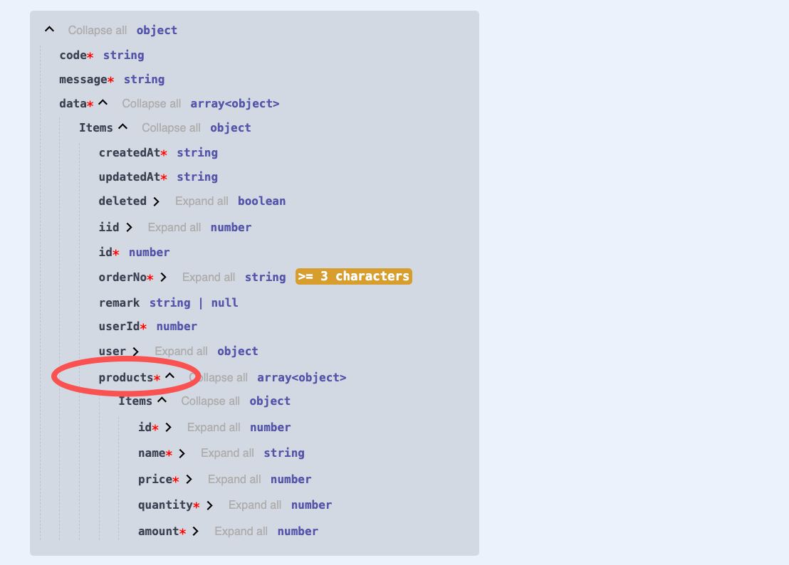

# Introduction

When developing backend API services, DTOs are crucial for `parameter validation` and `Swagger metadata generation`. If DTOs can't be dynamically inferred, similar to type inference, then we still need to manually create them. As the business grows, complex relations between models make manually creating DTOs increasingly cumbersome

Vona ORM pioneered the ability to dynamically infer and generate DTOs, freeing our hands and significantly improving productivity. It can even be said that being able to dynamically infer and generate DTOs is a very important `milestone` in building a more elegant Node.js backend framework

## DTO List

Vona ORM provides the following DTOs:

|Name|Description|
|--|--|
|$Dto.get|Annotate the return result|
|$Dto.query/DtoQueryBase|Annotate the query parameters|
|$Dto.queryPage/DtoQueryPageBase|Annotate the query parameters with paging|
|$Dto.selectAndCount|Annotate the return result with paging|
|$Dto.create|Annotate the Create parameters|
|$Dto.update|Annotate the Update parameters|
|$Dto.aggregate|Annotate the return result of the aggregation operation|
|$Dto.group|Annotate the return result of the grouping operation|

## DTO Usage

The following uses the `Order/Product` model as an example to demonstrate how to perform query operations on the `main-details` models

## 1. Model Relations Definition

First, define a `1:n` relation between the `Order` model and the `Product` model

``` typescript
@Model({
  entity: EntityOrder,
  relations: {
    products: $relation.hasMany(() => ModelProduct, 'orderId', {
      columns: ['id', 'name', 'price', 'quantity', 'amount'],
    }),
  },
})
class ModelOrder {}
```

## 2. Creating the API Endpoint

Create a `Controller` and Provide a `findAll` Method

``` typescript
class ControllerOrder {
  @Web.get('findAll')
  async findAll() {
    return this.scope.model.order.select({
      include: {
        products: true,
      },
    });
  }
}
```

## 3. Dynamically Inferring and Generating DTO

Since the result returned by this API is a `main-details` structure, we cannot simply use an `EntityOrder` array to annotate the return type. Instead, DTOs are used for dynamic inference and generation

``` diff
+ import { $Dto } from 'vona-module-a-orm';

class ControllerOrder {
  @Web.get('findAll')
+ @Api.body(v.array($Dto.get(() => ModelOrder, { include: { products: true } })))
  async findAll() {
    return this.scope.model.order.select({
      include: {
        products: true,
      },
    });
  }
}
```

- `@Api.body`: Annotates the return result
- `v.array`: Annotates an array
- `$Dto.get`: Used for dynamic DTO inference and generation

The DTO generated by `$Dto.get` uses a `main-details` structure, which Swagger/OpenAPI is as follows:



## 4. Encapsulating the DTO

We can also create a new DTO class to encapsulate the `$Dto.get` code for use elsewhere

1. In VSCode, use the `Vona Create/Dto` context menu to create a DTO code skeleton:

``` typescript
@Dto()
export class DtoOrderResult {}
```

2. Encapsulate the DTO using inheritance:

``` diff
+ import { $Dto } from 'vona-module-a-orm';

@Dto()
export class DtoOrderResult
+ extends $Dto.get(() => ModelOrder, { include: { products: true } }) {}
```

3. Now, let's refactor the previous code using `DtoOrderResult`:

``` diff
class ControllerOrder {
  @Web.get('findAll')
+ @Api.body(v.array(DtoOrderResult))
+ async findAll(): Promise<DtoOrderResult[]> {
    return this.scope.model.order.select({
      include: {
        products: true,
      },
    });
  }
}
```

- Line 3: Directly annotating the type with `v.array(DtoOrderResult)`
- Line 4: The method return type is `Promise<DtoOrderResult[]>`