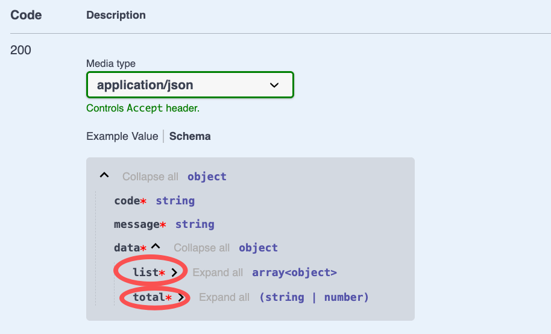

# $Dto.listAndCount

`$Dto.listAndCount` is used to annotate the return result with paging.

## Parameters

| Name     | Description                          |
| -------- | ------------------------------------ |
| classRef | DTO class generated using `$Dto.get` |

### 1. Create DTO

In VSCode, use the `Vona Create/Dto` context menu to create a DTO code skeleton:

```typescript
@Dto()
export class DtoOrderSelectRes {}
```

### 2. Inherit $Dto.listAndCount

```diff
+ import { DtoOrderSelectResItem } from './orderSelectResItem.ts';

@Dto()
export class DtoOrderSelectRes
+ extends $Dto.listAndCount(DtoOrderSelectResItem) {}
```

## DtoOrderSelectRes Fields

| Name  | Description                       |
| ----- | --------------------------------- |
| list  | list of items of the current page |
| total | total number of all items         |

## Annotating API Result

Taking the `findMany` method of the `Order` controller as an example, we can annotate the API Result:

```diff
class ControllerOrder extends BeanBase {
  @Web.get('findMany')
+ @Api.body(DtoOrderSelectRes)
  async findMany(
    @Arg.filter(DtoOrderQueryPage) params: IQueryParams<ModelOrder>,
+ ): Promise<DtoOrderSelectRes> {
    return this.scope.model.order.selectAndCount(params);
  }
}
```

- `@Api.body`: passed in `DtoOrderSelectRes`, used to annotate the API return value

The automatically generated Swagger/Openapi is as follows:


