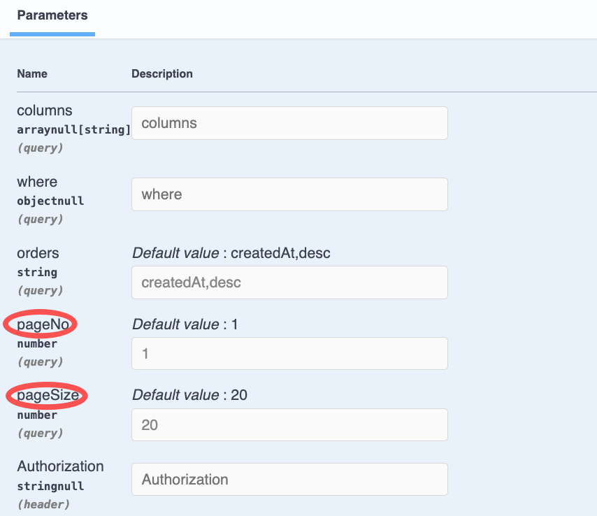
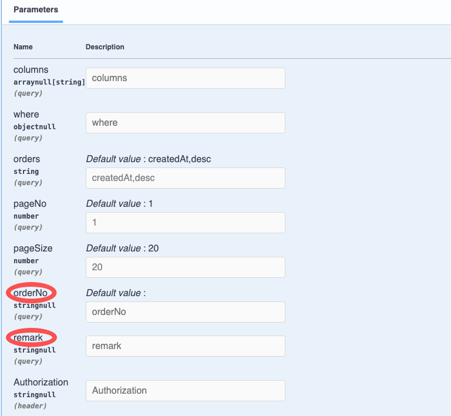

# $Dto.queryPage/DtoQueryPageBase

`$Dto.queryPage/DtoQueryPageBase` is used to annotate the `Query` parameters with paging

## Usage of DtoQueryPageBase

`DtoQueryPageBase` inherits from `DtoQueryBase` and provides paging-related Query parameters: `pageNo`, `pageSize`

### 1. Create DTO

In VSCode, use the `Vona Create/Dto` context menu to create a DTO code skeleton:

``` typescript
@Dto()
export class DtoOrderQueryPage {}
```

### 2. Inherit DtoQueryPageBase

``` typescript
@Dto()
export class DtoOrderQueryPage extends DtoQueryPageBase {}
```

## DtoQueryPageBase Fields

Since `DtoOrderQueryPage` inherits from `DtoQueryPageBase`, it has the following member fields:

|Name|Description|Example|
|--|--|--|
|columns|List of fields to query|`*`, `id,orderNo,remark`, `["id","orderNo","remark"]`|
|where|Query clause|`{ "orderNo": { "_include_":  "order001" } }`|
|orders|Sorting|`orderNo,desc`, `[["orderNo", "desc"], ["createdAt", "desc"]]`|
|pageNo|Page No|Default: `1`|
|pageSize|Page Size|Default: `20`|

## Annotating Query Parameters

Taking the `findMany` method of the `Order` controller as an example, we can annotate the Query parameters:

``` diff
+ import type { IQueryParams } from 'vona-module-a-orm';
+ import { Arg } from 'vona-module-a-web';

class ControllerOrder extends BeanBase {
  @Web.get('findMany')
  @Api.body(DtoOrderResultPage)
  async findMany(
+   @Arg.queryPro(DtoOrderQueryPage) params: IQueryParams<ModelOrder>,
  ): Promise<DtoOrderResultPage> {
    return this.scope.model.order.selectAndCount(params);
  }
}
```

- `@Arg.queryPro`: This Pipe transforms the Query parameter and needs to pass in the parameter `DtoOrderQueryPage`
- `IQueryParams`: The data type obtained by Pipe transforming the Query parameter is `IQueryParams`, and the generic parameter `ModelOrder` needs to be passed in to match the parameter type of the `model.order.selectAndCount` method

The automatically generated Swagger/Openapi is as follows:



## $Dto.queryPage

If you need to add query clause for business fields in DTO, you can use `$Dto.queryPage`

``` diff
@Dto()
export class DtoOrderQueryPage
+ extends $Dto.queryPage(EntityOrder, ['orderNo', 'remark']) {}
```

- `$Dto.queryPage`: Automatically extract the field `orderNo/remark` from `EntityOrder` and then merge it with the `DtoQueryPageBase` member fields

The automatically generated Swagger/Openapi is as follows:



## pageSize configuration

### 1. App Config

The default value of pageSize is `20`, which can be modified in App Config:

`src/backend/config/config/config.dev.ts`

``` typescript
// modules
config.modules = {
  'a-orm': {
    rest: {
      query: {
        pageSize: {
          default: 50,
          max: 200,
        },
      },
    },
  },
};
```

|Name|Description|
|--|--|
|default|The default value|
|max|The maxinum value|

### 2. DTO configuration

You can also provide different `pageSize` configurations for specific DTOs:

``` diff
@Dto()
export class DtoOrderQueryPage
+ extends $Class.omit($Dto.queryPage(EntityOrder, ['orderNo', 'remark']), ['pageSize']) {
+ @Api.field(z.number().min(1).max(300).default(30))
+ pageSize: number;
}
```

- `$Class.omit`: Exclude the `pageSize` field from the base class to avoid TypeScript errors
- For more information about `$Class`, see: [API: Dto](../../../essentials/api/dto.md)

Or:

``` diff
@Dto({
+ fields: {
+   pageSize: z.number().min(1).max(300).default(30),
+ },
})
export class DtoOrderQueryPage extends $Dto.queryPage(EntityOrder, ['orderNo', 'remark']) {}
```

- For more information about `fields`, see: [API: Dto](../../../essentials/api/dto.md)
