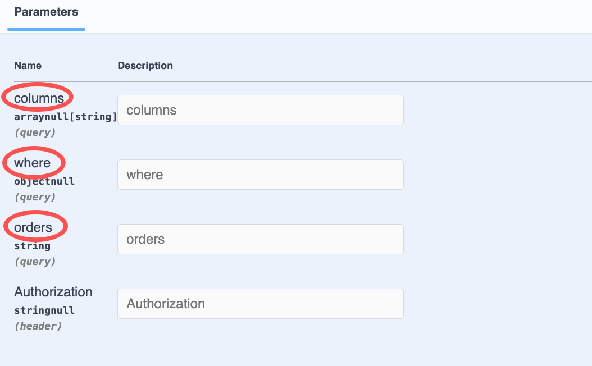
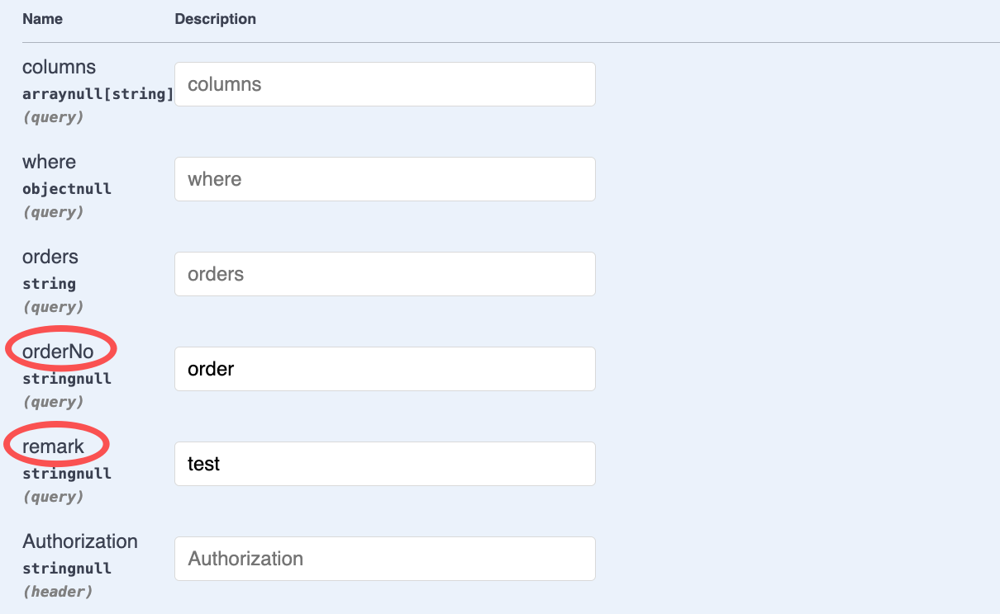
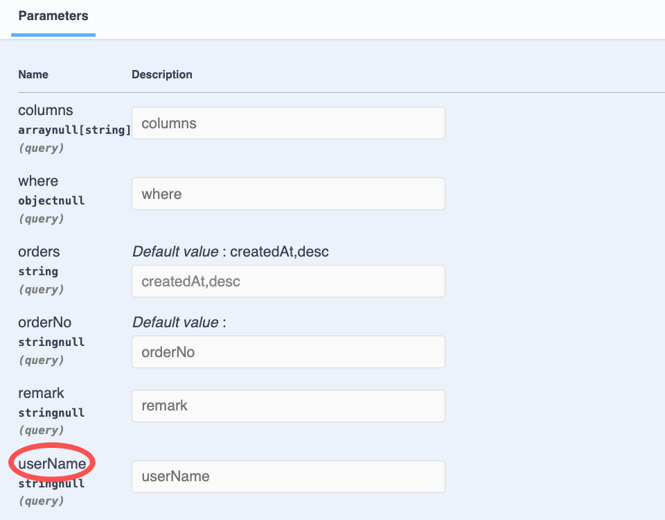

# $Dto.query/DtoQueryBase

`$Dto.query/DtoQueryBase` is used to annotate the `Query` parameters

## Usage of DtoQueryBase

### 1. Create DTO

In VSCode, use the `Vona Create/Dto` context menu to create a DTO code skeleton:

``` typescript
@Dto()
export class DtoOrderQuery {}
```

### 2. Inherit DtoQueryBase

``` typescript
@Dto()
export class DtoOrderQuery extends DtoQueryBase {}
```

## DtoQueryBase Fields

Since `DtoOrderQuery` inherits from `DtoQueryBase`, it has the following member fields:

|Name|Description|Example|
|--|--|--|
|columns|List of fields to query|`*`, `id,orderNo,remark`, `["id","orderNo","remark"]`|
|where|Query clause|`{ "orderNo": { "_include_":  "order001" } }`|
|orders|Sorting|`orderNo,desc`, `[["orderNo", "desc"], ["createdAt", "desc"]]`|

## Annotating Query Parameters

Still taking the `findAll` method of the `Order` controller as an example, we can annotate the Query parameters:

``` diff
+ import type { IQueryParams } from 'vona-module-a-orm';
+ import { Arg } from 'vona-module-a-web';

class ControllerOrder extends BeanBase {
  @Web.get('findAll')
  @Api.body(v.array(DtoOrderResult))
  async findAll(
+   @Arg.queryPro(DtoOrderQuery) params: IQueryParams<ModelOrder>,
  ): Promise<DtoOrderResult[]> {
    return this.scope.model.order.select({
+     ...params,
      include: {
        products: true,
      },
    });
  }
}
```

- `@Arg.queryPro`: This Pipe transforms the Query parameter and needs to pass in the parameter `DtoOrderQuery`
- `IQueryParams`: The data type obtained by Pipe transforming the Query parameter is `IQueryParams`, and the generic parameter `ModelOrder` needs to be passed in to match the parameter type of the `model.order.select` method

The automatically generated Swagger/Openapi is as follows:



## $Dto.query

If you need to add query clause for business fields in DTO, you can use `$Dto.query`

``` diff
@Dto()
export class DtoOrderQuery
+ extends $Dto.query(EntityOrder, ['orderNo', 'remark']) {}
```

- `$Dto.query`: Automatically extract the field `orderNo/remark` from `EntityOrder` and then merge it with the `DtoQueryBase` member fields

The automatically generated Swagger/Openapi is as follows:



## Add custom fields

You can also add custom fields directly in the DTO

``` diff
@Dto()
export class DtoOrderQuery
+ extends $Dto.query(EntityOrder, ['remark']) {
+ @Api.field(v.optional())
+ orderNo?: string;
}
```

- Automatically extract the field `remark` from `EntityOrder`
- Add custom field `orderNo`

## Openapi parameters

We can also specify OpenAPI parameters to support more capabilities

### 1. Relations

For example, if the Model `Order` and Model `User` have an `n:1` relation, we can pass `userName` as the query condition in the Query parameters. Then, we need to add the `userName` field in the DTO and set the OpenAPI parameters

``` typescript
@Dto()
export class DtoOrderQuery
  extends $Dto.query(EntityOrder, ['orderNo', 'remark']) {
  @Api.field(v.optional(), v.openapi({
    query: {
      table: $tableName(EntityUser),
      joinType: 'innerJoin',
      joinOn: ['userId', 'testVonaUser.id'],
      originalName: 'name',
    },
  }))
  userName?: string;
}
```

|Name|Description|
|--|--|
|table|Table name of relation|
|joinType|Relation Type, default is `innerJoin`|
|joinOn|Relation condition|
|originalName|Original field name|

The automatically generated Swagger/Openapi is as follows:



### 2. Orders of relations

When querying Model `Order` which joins with Model `User`, if the fields in `orders` exist in both tables, you must specify the table name prefix. For example: `testVonaOrder.createdAt,desc`

Vona ORM has built-in relations-based orders processing logic. You only need to set the Openapi parameters in the DTO:

``` diff
@Dto<IDtoOptionsOrderQuery>({
+ openapi: {
+   query: {
+     table: $tableName(EntityOrder),
+   },
+ },
})
export class DtoOrderQuery
  extends $Dto.query(EntityOrder, ['orderNo', 'remark']) {
  @Api.field(v.optional(), v.openapi({
    query: {
      table: $tableName(EntityUser),
      joinType: 'innerJoin',
      joinOn: ['userId', 'testVonaUser.id'],
      originalName: 'name',
    },
  }))
  userName?: string;
}
```

## Custom Query Transform

For custom fields, Vona ORM provides built-in Transform rules. For example:

- `orderNo` is a string, so the system automatically converts it to the conditional statement `'orderNo': { _includesI_: 'some input' }`
- `userName` is also a string, so the system automatically converts it to the conditional statement `'name': { _includesI_: 'some input' }`

To support more complex business needs, you can provide a custom Query Transform

### 1. Convention Name

For example, we use Query in the `findAll` method of the `Order` controller. Then, we only need to provide `findAllQueryTransform` in the current controller

``` diff
@Controller
class ControllerOrder {
+  findAllQueryTransform(_info: IPipeOptionsQueryTransformInfo): boolean | undefined {
+    return undefined;
+  }

  @Web.get('findAll')
  @Api.body(v.array(DtoOrderResult))
  async findAll(
    @Arg.queryPro(DtoOrderQuery) params: IQueryParams<ModelOrder>,
  ): Promise<DtoOrderResult[]> {
    return this.scope.model.order.select({
      ...params,
      include: {
        products: true,
      },
    });
  }
}
```

If you need to convert `userName` into a conditional statement `'name': 'some input'`, the code is as follows:

``` typescript
class ControllerOrder {
  findAllQueryTransform(info: IPipeOptionsQueryTransformInfo): boolean | undefined {
    if (info.key === 'userName') {
      info.params.where[info.fullName] = info.value;
      return true;
    }
    return undefined;
  }
}  
```

### 2. Query Transform Return Value

Query Transform returns the following values:

|Name|Description|
|--|--|
|true|Provides custom logic and ignores system built-in rules|
|false|No custom logic is provided, ignoring the system's built-in rules|
|undefined|No custom logic is provided, using the system's built-in rules|

### 2. Custom Name

We can also provide a custom name for `Query Transform`, such as: `myCustomQueryTransform`

``` diff
class ControllerOrder {
+ myCustomQueryTransform(info: IPipeOptionsQueryTransformInfo): boolean | undefined {
+   if (info.key === 'userName') {
+     info.params.where[info.fullName] = info.value;
+     return true;
+   }
+   return undefined;
+ }

  @Web.get('findAll')
  @Api.body(v.array(DtoOrderResult))
  async findAll(
+   @Arg.queryPro(DtoOrderQuery, 'myCustomQueryTransform') params: IQueryParams<ModelOrder>,
  ): Promise<DtoOrderResult[]> {
    return this.scope.model.order.select({
      ...params,
      include: {
        products: true,
      },
    });
  }
}
```

- `@Arg.queryPro`: This Pipe transforms the Query parameter, passing in the parameter `'myCustomQueryTransform'`

### 3. Custom Function

You can also provide a custom function directly:

``` diff
+ function myCustomQueryTransform(_ctx: VonaContext, info: IPipeOptionsQueryTransformInfo): boolean | undefined {
+   if (info.key === 'userName') {
+     info.params.where[info.fullName] = info.value;
+     return true;
+   }
+   return undefined;
+ }

class ControllerOrder {
  @Web.get('findAll')
  @Api.body(v.array(DtoOrderResult))
  async findAll(
+   @Arg.queryPro(DtoOrderQuery, myCustomQueryTransform) params: IQueryParams<ModelOrder>,
  ): Promise<DtoOrderResult[]> {
    return this.scope.model.order.select({
      ...params,
      include: {
        products: true,
      },
    });
  }
}
```
