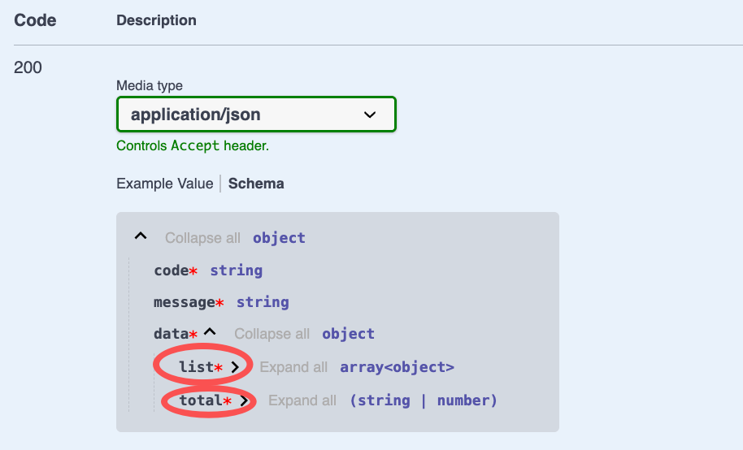

# $Dto.selectAndCount

`$Dto.selectAndCount` is used to annotate the return result with paging

## How to use

The usage of `$Dto.selectAndCount` can be referred to `$Dto.get`. The difference is that `$Dto.selectAndCount` returns the `list of items of the current page` and the `total number of all items`

### 1. Create DTO

In VSCode, use the `Vona Create/Dto` context menu to create a DTO code skeleton:

``` typescript
@Dto()
export class DtoOrderResultPage {}
```

### 2. Inherit $Dto.selectAndCount

``` diff
@Dto()
export class DtoOrderResultPage
+ extends $Dto.selectAndCount(() => ModelOrder) {}
```

## DtoOrderResultPage Fields

|Name|Description|
|--|--|
|list|list of items of the current page|
|total|total number of all items|

## Annotating API Result

Taking the `findMany` method of the `Order` controller as an example, we can annotate the API Result:

``` diff
class ControllerOrder extends BeanBase {
  @Web.get('findMany')
+ @Api.body(DtoOrderResultPage)
  async findMany(
    @Arg.queryPro(DtoOrderQueryPage) params: IQueryParams<ModelOrder>,
+ ): Promise<DtoOrderResultPage> {
    return this.scope.model.order.selectAndCount(params);
  }
}
```

- `@Api.body`: passed in `DtoOrderResultPage`, used to annotate the API return value

The automatically generated Swagger/Openapi is as follows:


