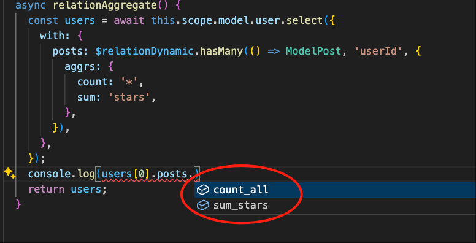
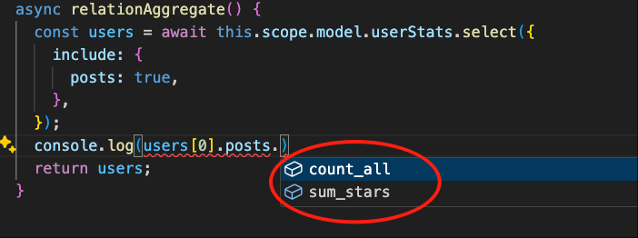

# Aggregate on Relations

The following uses the `test-vona` module as an example to explain how to use `Aggregate on Relations`

For example, the `User` model and the `Post` model have a `1:n` relation. When querying `User` data, we can query the aggregated data for the corresponding `Post` based on the relation

## Dynamic Relation

``` typescript
class ServiceUser {
  async relationAggregate() {
    const users = await this.scope.model.user.select({
      with: {
        posts: $relationDynamic.hasMany(() => ModelPost, 'userId', {
          aggrs: {
            count: '*',
            sum: 'stars',
          },
        }),
      },
    });
    return users;
  }
}  
```

Vona ORM automatically infers the type of `users`



|Name|Description|
|--|--|
|with.posts|Relation Name|
|$relationDynamic.hasMany|`1:n`|
|ModelPost|Target Model|
|'userId'|Foreign key|
|aggrs|The functions and columns to be aggregated. Functions: `count`/`sum`/`avg`/`min`/`max`. Columns: `string`/`string[]` |

## 静态关系

### 1. 定义关系

为了演示起见，新建一个 Model UserStats，定义一个静态关系`posts`

``` typescript
@Model({
  entity: EntityUser,
  relations: {
    posts: $relation.hasMany(() => ModelPost, 'userId', {
      aggrs: {
        count: '*',
        sum: 'stars',
      },
    }),
  },
})
class ModelUserStats {}
```

### 2. 使用关系

``` typescript
class ServiceUser {
  async relationAggregate() {
    const users = await this.scope.model.userStats.select({
      include: {
        posts: true,
      },
    });
    return users;
  }
}
```

Vona ORM 自动推断出`users`的类型



## autoload

也可以将静态关系设为`autoload: true`，从而实现自动加载，也可以让代码进一步简化

### 1. 定义关系

``` diff
@Model({
  entity: EntityUser,
  relations: {
    posts: $relation.hasMany(() => ModelPost, 'userId', {
+     autoload: true,
      aggrs: {
        count: '*',
        sum: 'stars',
      },
    }),
  },
})
class ModelUserStats {}
```

### 2. 使用关系

``` typescript
class ServiceUser {
  async relationAggregate() {
    const users = await this.scope.model.userStats.select();
    return users;
  }
}
```
