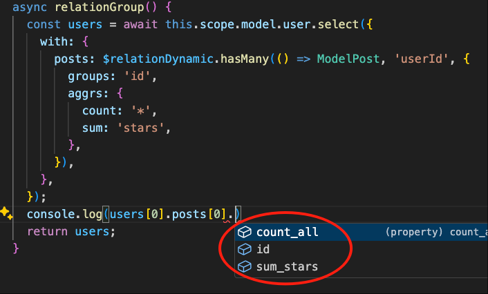
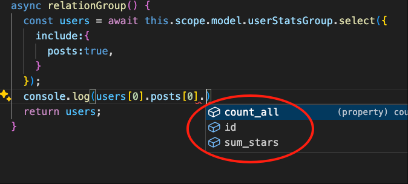

# Group on Relations

The following uses the `test-vona` module as an example to explain how to use `Group on Relations`

For example, the `User` model and the `Post` model have a `1:n` relation. When querying `User` data, we can query the grouped data for the corresponding `Post` based on the relation

## Dynamic Relation

``` typescript
class ServiceUser {
  async relationGroup() {
    const users = await this.scope.model.user.select({
      with: {
        posts: $relationDynamic.hasMany(() => ModelPost, 'userId', {
          groups: 'id',
          aggrs: {
            count: '*',
            sum: 'stars',
          },
        }),
      },
    });
    return users;
  }
}  
```

Vona ORM automatically infers the type of `users`



|Name|Description|
|--|--|
|with.posts|Relation Name|
|$relationDynamic.hasMany|`1:n`|
|ModelPost|Target Model|
|'userId'|Foreign key|
|groups|The groups to be grouped: `string`/`string[]`|
|columns|The group columns to be displayed. If it is empty, the columns specified by the `groups` parameter will be displayed|
|aggrs|The functions and columns to be aggregated. Functions: `count`/`sum`/`avg`/`min`/`max`. Columns: `string`/`string[]` |

## Static Relation

### 1. Define the relation

For demonstration purposes, create a new Model `UserStatsGroup` and define a static relation `posts`

``` typescript
@Model({
  entity: EntityUser,
  relations: {
    posts: $relation.hasMany(() => ModelPost, 'userId', {
      groups: 'id',
      aggrs: {
        count: '*',
        sum: 'stars',
      },
    }),
  },
})
class ModelUserStatsGroup {}
```

### 2. Using relations

``` typescript
class ServiceUser {
  async relationGroup() {
    const users = await this.scope.model.userStatsGroup.select({
      include: {
        posts: true,
      },
    });
    return users;
  }
}
```

Vona ORM automatically infers the type of `users`



## autoload

You can also set the static relation to `autoload: true` to achieve automatic loading, which can also further simplify the code

### 1. Define the relation

``` diff
@Model({
  entity: EntityUser,
  relations: {
    posts: $relation.hasMany(() => ModelPost, 'userId', {
+     autoload: true,
      groups: 'id',
      aggrs: {
        count: '*',
        sum: 'stars',
      },
    }),
  },
})
class ModelUserStatsGroup {}
```

### 2. Using relations

``` typescript
class ServiceUser {
  async relationGroup() {
    const users = await this.scope.model.userStatsGroup.select();
    return users;
  }
}
```
