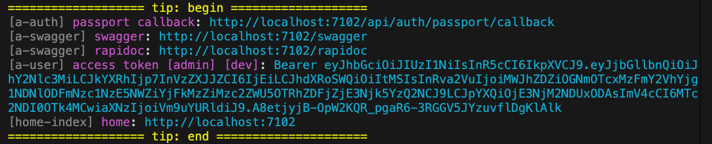

# PrintTip

VonaJS outputs a unified message to the console when the system starts. See the image below:



Custom messages can be added using `PrintTip`

## Create meta.printTip

For example, create `meta.printTip` in the module demo-student. Output `=== Hello World ===` to the console upon system startup

### 1. Cli Command

``` bash
$ vona :create:bean meta printTip --module=demo-student
```

### 2. Menu Command

::: tip
Context menu - [Module Path]: `Vona Meta/Print Tip`
:::

## meta.printTip Definition

``` typescript
@Meta()
export class MetaPrintTip extends BeanBase implements IMetaPrintTipExecute {
  async execute(): Promise<TypeMetaPrintTipResult> {
    return {
      title: 'Test',
      message: '=== Hello World ===',
    };
  }
}
```

- `execute`: Returns the tip/tips, supports array type

See the image below:


