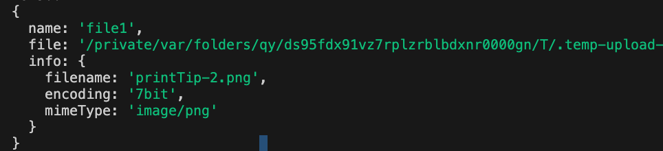

# Upload

VonaJS implements file upload capabilities based on [busboy](https://github.com/mscdex/busboy)

## Single File Upload

``` typescript
class ControllerStudent {
  @Web.post('file')
  @Core.fileUpload()
  @Api.contentType('application/json')
  async uploadFile(
    @Arg.file('file1', v.title('Upload Single File')) file1: IUploadFile,
  ) {
    console.log(file1);
    return file1.file;
  }
}  
```

- `@Core.fileUpload`: This decorator enables the Upload interceptor. The interceptor parses the uploaded file and stores it in a temporary file. After completing the business logic, the interceptor will automatically clean up the temporary file
- `@Api.contentType`: If the API needs to return JSON data, it's best to explicitly specify `application/json`. Because some clients may not provide an explicit ContentType when sending API requests
- `@Arg.file`: This decorator is used to annotate the parameter `file1`, retrieving the file with `name=file1` from the uploaded data

### IUploadFile

|Name|Description|
|--|--|
|name|File field name|
|file|Temporary file path|
|info.filename|File name|
|info.encoding|File encoding|
|info.mimeType|File type|

As shown in the image below:



## Multiple Files Upload

``` typescript
class ControllerStudent {
  @Web.post('files')
  @Core.fileUpload()
  @Api.contentType('application/json')
  async uploadFiles(
    @Arg.files('files', v.title('Upload Multiple Files')) files: IUploadFile[],
  ) {
    console.log(files);
    return files.map(item => item.file);
  }
}
```

- `@Arg.files`: This decorator is used to annotate the parameter `files`, retrieving the file with `name=files` from the uploaded data

## Form Fields

Multiple form fields can be attached along with the uploaded file

For array-type fields, different parameter decorators are needed depending on the method used by the front-end to construct the uploaded data

### 1. @Arg.field

* Frontend

``` typescript
const formData = new FormData();
formData.append('name', 'vona');
formData.append('tags', ['node', 'typescript']);
```

* API

``` diff
export class ControllerStudent extends BeanBase {
  @Web.post('file')
  @Core.fileUpload()
  @Api.contentType('application/json')
  async uploadFile(
+   @Arg.field('name', v.title('Name')) name: string,
+   @Arg.field('tags', v.title('Tags'), v.array(z.string())) tags: string[],
    @Arg.file('file1', v.title('Upload Single File')) file1: IUploadFile,
  ) {
    console.log(name, tags);
    console.log(file1);
    return file1.file;
  }
}
```

- `@Arg.field`: This decorator is used to annotate the parameter `name/tags`, retrieving the field value of `name=name/tags` from the uploaded data

### 2. @Arg.fields

* Frontend

``` typescript
const formData = new FormData();
formData.append('name', 'vona');
formData.append('tags', 'node');
formData.append('tags', 'typescript');
```

* API

``` diff
export class ControllerStudent extends BeanBase {
  @Web.post('file')
  @Core.fileUpload()
  @Api.contentType('application/json')
  async uploadFile(
+   @Arg.field('name', v.title('Name')) name: string,
+   @Arg.fields('tags', v.title('Tags'), v.array(z.string())) tags: string[],
    @Arg.file('file1', v.title('Upload Single File')) file1: IUploadFile,
  ) {
    console.log(name, tags);
    console.log(file1);
    return file1.file;
  }
}
```

- `@Arg.fields`: This decorator is used to annotate the parameter `tags`, retrieving the field value of `name=tags` from the uploaded data
