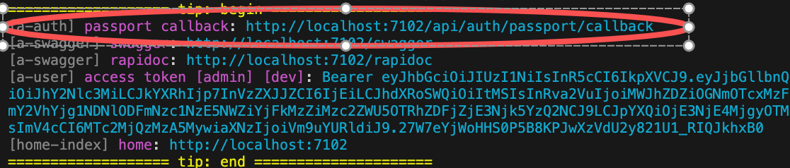

# Github认证

此模块提供了`Github认证`，并且支持在开发环境采用模拟用户登录，使得开发与调试非常方便

## 安装模块

``` bash
$ pnpm add vona-module-a-authgithub -w
```

## 如何使用

### 1. 登录

``` typescript
class ControllerStudent {
  @Web.get('login')
  @Passport.public()
  async login() {
    await this.bean.auth.authenticate(
      'a-authgithub:github',
      { state: { redirect: '/' } },
    );
  }
}
```

### 2. 退出登录

``` typescript
await this.bean.passport.signout();
```

### 3. 设置认证凭据

在 App Config 中设置认证凭据

`src/backend/config/config/config.ts`

``` typescript
// onions
config.onions = {
  authProvider: {
    'a-authgithub:github': {
      clients: {
        default: {
          clientID: 'xxxxxx',
          clientSecret: 'xxxxxxx',
        },
      },
    },
  },
};
```

- `clients.default`: 一个 Provider 可以设置多个 Clients，默认是`default`

### 4. 添加更多Client凭据

* 首先采用接口合并机制添加 Client 类型定义

在 VSCode 编辑器中，输入代码片段`recordauthclient`，自动生成代码骨架:

``` typescript
declare module 'vona-module-x-x' {
  export interface IAuthProvider_xxx_ClientRecord {
    : never;
  }
}
```

调整代码:

``` typescript
declare module 'vona-module-a-authgithub' {
  export interface IAuthProviderGithubClientRecord {
    another: never;
  }
}
```

* 然后在 App Config 中设置认证凭据

``` diff
// onions
config.onions = {
  authProvider: {
    'a-authgithub:github': {
      clients: {
        default: {
          clientID: 'xxxxxx',
          clientSecret: 'xxxxxxx',
        },
+       another: {
+         clientID: 'yyyyyy',
+         clientSecret: 'yyyyyyy',
+       },
      },
    },
  },
};
```

### 5. OAuth认证Callback URL

在使用 OAuth 认证时，需要在 OAuth 网站提供系统的 Callback URL

VonaJS 提供了统一的 Callback URL 值，并且在开发阶段直接输出在控制台，方便我们直接使用



### 6. 禁用`useMockForDev`

在默认情况下，允许在开发环境模块用户登录

可以在 App Config 中禁用`useMockForDev`

`src/backend/config/config/config.ts`

```typescript
// onions
config.onions = {
  authProvider: {
    'a-authgithub:github': {
      useMockForDev: false,
    },
  },
};
```

## 源码解析

这里对模块`a-authgithub`的核心源码进行解析，从而说明如何开发一个新的 Provider

比如，在模块`a-authgithub`中创建一个 Auth Provider: `github`

### 1. Cli命令

``` bash
$ vona :create:bean authProvider github --module=a-authgithub
```

### 2. 菜单命令

::: tip
右键菜单 - [模块路径]: `Vona Bean/Auth Provider`
:::

## Auth Provider定义

``` diff
export interface IAuthProviderGithubClientRecord extends IAuthProviderClientRecord {}

export interface IAuthProviderGithubClientOptions extends IAuthProviderOauth2ClientOptions {
  userProfileURL?: string;
  userAgent?: string;
}

export interface IAuthProviderOptionsGithub extends IDecoratorAuthProviderOptions<
  keyof IAuthProviderGithubClientRecord,
  IAuthProviderGithubClientOptions
> {
  useMockForDev: boolean;
}

@AuthProvider({ useMockForDev: true, default: { confirmed: true, clientID: 'xxxxxx', clientSecret: 'xxxxxx' } })
class AuthProviderGithub {
  async strategy(_clientOptions, options) {
    return (this.app.meta.isTest || this.app.meta.isDev) && options.useMockForDev ? StrategyMock : StrategyGithub;
  }

  async verify(
    args,
    _clientOptions,
    _options,
    _state?,
  ) {
    return getStrategyOauth2Profile(args);
  }
}
```

- `IAuthProviderGithubClientRecord`: 定义多个 Clients，默认有`default`的定义
- `IAuthProviderGithubClientOptions`: 定义 Client options
- `IAuthProviderOptionsGithub`: 定义 Auth Provider 的参数
- `strategy`: 返回认证策略
- `verify`: 使用工具方法`getStrategyOauth2Profile`从认证结果中提取出 Profile 数据，并返回给系统

## Profile

1. Provider 的`verify`只需返回 Profile 数据。系统将根据 Profile 数据生成 User 对象
2. Profile 中存在`id`字段值
3. 由 OAuth 提供方确保为不同的用户生成唯一的`id`值

Profile 具有统一的接口定义:

``` typescript
export interface IAuthUserProfile {
  id: string;
  username?: string;
  displayName?: string;
  name?: IAuthUserProfileName;
  gender?: string; // male/female
  profileUrl?: string;
  emails?: IAuthUserProfilePropSlice[];
  photos?: IAuthUserProfilePropSlice[];
  locale?: keyof ILocaleInfos;
  confirmed?: boolean;
}
```

* `confirmed`: 如果为`true`，意味着用户已经确认，不需要后续的`激活`操作
