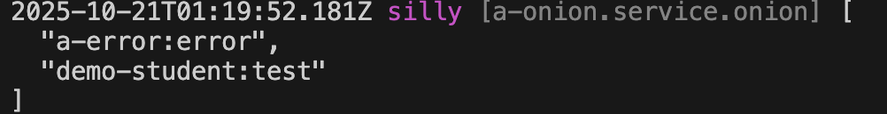

# 全局过滤器

## 创建过滤器

比如，在模块 demo-student 中创建一个全局过滤器: `test`，对自定义错误`demo-student:1001`定制日志输出

### 1. Cli命令

``` bash
$ vona :create:bean filter test --module=demo-student --boilerplate=global
```

### 2. 菜单命令

::: tip
右键菜单 - [模块路径]: `Vona Aspect/Filter Global`
:::

## 过滤器定义

``` typescript
export interface IFilterOptionsTest extends IDecoratorFilterOptionsGlobal {}

@Filter<IFilterOptionsTest>()
@Global()
class FilterTest {
  async log(err: Error, _options: IFilterOptionsTest, next: Next): Promise<boolean> {
    // next
    if ((await next()) === true) return true;
    // custom
    if (err.code === 'demo-student:1001') {
      console.error(`Custom Error: ${err.code}, ${err.message}`);
      return true;
    }
    return false;
  }
}
```

- 先调用`next()`，如果返回 true，说明 Error 已经被处理，那么就直接返回
- 处理指定的 Error，返回 true，就意味着已经处理，忽略系统默认的日志输出行为

## 使用过滤器

与局部过滤器不同，系统会自动加载全局过滤器，并使其生效

## 过滤器参数

可以为过滤器定义参数，通过参数更灵活的配置过滤器逻辑

比如，为 test 过滤器定义`prefix`参数，用于定制日志输出的格式

### 1. 定义参数类型

``` diff
export interface IFilterOptionsTest extends IDecoratorFilterOptionsGlobal {
+  prefix: string;
}
```

### 2. 提供参数缺省值

``` diff
@Filter<IFilterOptionsTest>({
+ prefix: 'Custom Error',
})
```

### 3. 使用参数

``` diff
export interface IFilterOptionsTest extends IDecoratorFilterOptionsGlobal {
  prefix: string;
}

@Filter<IFilterOptionsTest>({
  prefix: 'Custom Error',
})
export class FilterTest extends BeanBase implements IFilterLog {
  async log(err: Error, options: IFilterOptionsTest, next: Next): Promise<boolean> {
    // next
    if ((await next()) === true) return true;
    // custom
    if (err.code === 'demo-student:1001') {
-     console.error(`Custom Error: ${err.code}, ${err.message}`);
+     console.error(`${options.prefix}: ${err.code}, ${err.message}`);
      return true;
    }
    return false;
  }
}
```

### 4. 使用时指定参数

可以针对某个 API 单独指定全局过滤器的参数

``` diff
class ControllerStudent {
  @Web.post()
+ @Aspect.filterGlobal('demo-student:test', { prefix: 'Test Error' })
  async create(){}
}
```

- 在使用过滤器时直接提供参数值即可

### 5. App Config

可以在 App Config 中配置过滤器参数

`src/backend/config/config/config.ts`

``` typescript
// onions
config.onions = {
  filter: {
    'demo-student:test': {
      prefix: 'Test Error',
    },
  },
};
```

### 6. 参数优先级

`使用时指定参数` > `App Config` > `参数缺省值`

## 过滤器顺序

由于全局过滤器是默认加载并生效的，所以，VonaJS 提供了两个参数，用于控制过滤器的加载顺序

### 1. dependencies

比如，系统有一个内置全局过滤器`a-error:error`，希望加载顺序如下：`a-error:error` > `Current`

``` diff
@Filter({
+ dependencies: 'a-error:error',
  prefix: 'Custom Error',
})
class FilterTest {}
```

### 2. dependents

`dependents`的顺序刚好与`dependencies`相反，希望加载顺序如下：`Current` > `a-error:error`

``` diff
@Filter({
+ dependents: 'a-error:error',
  prefix: 'Custom Error',
})
class FilterTest {}
```

## 过滤器启用/禁用

可以针对某些 API 控制全局过滤器的`启用/禁用`

### 1. Enable

* 针对某个 API 禁用

``` diff
class ControllerStudent {
  @Web.post()
+ @Aspect.filterGlobal('demo-student:test', { enable: false })
  async create() {}
}
```

* 针对所有 API 禁用

`src/backend/config/config/config.ts`

``` diff
// onions
config.onions = {
  filter: {
    'demo-student:test': {
+     enable: false,
    },
  },
};
```

### 2. Meta

可以让全局过滤器在指定的运行环境生效

|名称|类型|说明|
|--|--|--|
|flavor|string\|string[]|参见: [运行环境与Flavor](../../env-config/mode-flavor/introduction.md)|
|mode|string\|string[]|参见: [运行环境与Flavor](../../env-config/mode-flavor/introduction.md)|

* 举例

``` diff
@Filter({
+ meta: {
+   flavor: 'normal',
+   mode: 'dev',
+ },
})
class FilterTest {}
```

### 3. match/ignore
    
可以针对指定的 API 启用/禁用全局过滤器

|名称|类型|说明|
|--|--|--|
|match|string\|regexp\|(string\|regexp)[]|针对哪些API启用|
|ignore|string\|regexp\|(string\|regexp)[]|针对哪些API禁用|

## 查看当前生效的全局过滤器清单

可以直接在 Controller action 中输出当前生效的全局过滤器清单

``` diff
class ControllerStudent {
  @Web.post()
  async create() {
+   this.bean.onion.filter.inspect();
  }
}
```

- `this.bean.onion`: 取得全局 Service 实例 `onion`
- `.filter`: 取得与过滤器相关的 Service 实例
- `.inspect`: 输出当前生效的全局过滤器清单

当访问`create` API 时，会自动在控制台输出当前生效的全局过滤器清单，效果如下：


