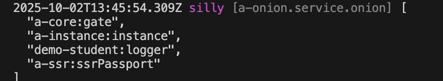

# 全局守卫

## 创建守卫

比如，在模块 demo-student 中创建一个 全局守卫: `admin`

### 1. Cli命令

``` bash
$ vona :create:bean guard admin --module=demo-student --boilerplate=cli/guardGlobal/boilerplate
```

### 2. 菜单命令

::: tip
右键菜单 - [模块路径]: `Vona Aspect/Guard Global`
:::

## 守卫定义

``` typescript
export interface IGuardOptionsAdmin extends IDecoratorGuardOptionsGlobal {}

@Guard<IGuardOptionsAdmin>({ global: true })
export class GuardAdmin {
  async execute(_options: IGuardOptionsAdmin, next: Next): Promise<boolean> {
    const user = this.bean.passport.getCurrentUser();
    if (!user || user.name !== 'admin') this.app.throw(403);
    // next
    return next();
  }
}
```

- `getCurrentUser`: 取得当前用户

## 使用守卫

与局部守卫不同，系统会自动加载全局守卫，并使其生效

## 守卫参数

可以为守卫定义参数，通过参数更灵活的配置守卫逻辑

比如，为 admin 守卫定义`name`参数，用于控制需要判断的用户名

### 1. 定义参数类型

``` diff
export interface IGuardOptionsAdmin extends IDecoratorGuardOptionsGlobal {
+ name: string;
}
```

### 2. 提供参数缺省值

``` diff
@Guard<IGuardOptionsAdmin>({
  global: true,
+ name: 'admin',
})
```

### 3. 使用参数

``` diff
export interface IGuardOptionsAdmin extends IDecoratorGuardOptionsGlobal {
  name: string;
}

@Guard<IGuardOptionsAdmin>({
  global: true,
  name: 'admin',
})
export class GuardAdmin extends BeanBase implements IGuardExecute {
  async execute(options: IGuardOptionsAdmin, next: Next): Promise<boolean> {
    const user = this.bean.passport.getCurrentUser();
-   if (!user || user.name !== 'admin') this.app.throw(403);
+   if (!user || user.name !== options.name) this.app.throw(403);
    // next
    return next();
  }
}
```

### 4. 使用时指定参数

可以针对某个 API 单独指定全局守卫的参数

``` diff
class ControllerStudent {
  @Web.get()
+ @Aspect.guardGlobal('demo-student:admin', { name: 'other-name' })
  async findMany() {}
}
```

在使用守卫时直接提供参数值即可

### 5. App config配置

可以在 App config 中配置守卫参数

`src/backend/config/config/config.ts`

``` typescript
// onions
config.onions = {
  guard: {
    'demo-student:admin': {
      name: 'other-name',
    },
  },
};
```

### 6. 参数优先级

`使用时指定参数` > `App config配置` > `参数缺省值`

## 守卫顺序

由于全局守卫是默认加载并生效的，所以，VonaJS 提供了两个参数，用于控制守卫的加载顺序

### 1. dependencies

比如，系统有一个内置全局守卫`a-user:passport`，我们希望加载顺序如下：`a-user:passport` > `Current`

``` diff
@Guard({
  global: true,
+ dependencies: 'a-user:passport',
  name: 'admin',
})
class GuardAdmin {}
```

### 2. dependents

`dependents`的顺序刚好与`dependencies`相反，我们希望加载顺序如下：`Current` > `a-user:passport`

``` diff
@Guard({
  global: true,
+ dependents: 'a-user:passport',
  name: 'admin',
})
class GuardAdmin {}
```

## 守卫启用/禁用

可以针对某些 API 控制全局中间件的`启用/禁用`

### 1. Enable

* 针对某个 API 禁用

``` diff
class ControllerStudent {
  @Web.get()
+ @Aspect.middlewareGlobal('demo-student:logger', { enable: false })
  async findMany() {}
}
```

* 针对所有 API 禁用

`src/backend/config/config/config.ts`

``` diff
// onions
config.onions = {
  middleware: {
    'demo-student:logger': {
+     enable: false,
    },
  },
};
```

### 2. Meta

可以让全局中间件在指定的运行环境生效

|名称|类型|说明|
|--|--|--|
|flavor|string\|string[]|参见: [运行环境与Flavor](../../techniques/mode-flavor/introduction.md)|
|mode|string\|string[]|参见: [运行环境与Flavor](../../techniques/mode-flavor/introduction.md)|
|instanceName|string\|string[]|参见: [多实例/多租户](../../techniques/instance/introduction.md)|
|host|string\|string[]|主机名|

* 举例

``` diff
@Middleware({
  global: true,
+ meta: {
+   flavor: 'normal',
+   mode: 'dev',
+   instanceName: '',
+   host: 'localhost:7102',
+ },
})
class MiddlewareLogger {}
```

### 3. match/ignore
    
可以针对指定的 API 启用/禁用全局中间件

|名称|类型|说明|
|--|--|--|
|match|string\|regexp\|(string\|regexp)[]|针对哪些API启用|
|ignore|string\|regexp\|(string\|regexp)[]|针对哪些API禁用|

## 查看当前生效的全局中间件清单

可以直接在 Controller action 中输出当前生效的全局中间件清单

``` diff
class ControllerStudent {
  @Web.get()
  async findMany() {
+   this.bean.onion.middleware.inspect();
  }
}
```

- `this.bean.onion`: 取得全局 Service 实例 `onion`
- `.middleware`: 取得与中间件相关的 Service 实例
- `.inspect`: 输出当前生效的全局中间件清单

当访问`findMany` API 时，会自动在控制台输出当前生效的全局中间件清单，效果如下：


