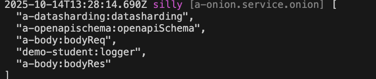

# 全局拦截器

## 创建拦截器

比如，在模块 demo-student 中创建一个 全局拦截器: `logger`

### 1. Cli命令

``` bash
$ vona :create:bean interceptor logger --module=demo-student --boilerplate=cli/interceptorGlobal/boilerplate
```

### 2. 菜单命令

::: tip
右键菜单 - [模块路径]: `Vona Aspect/Interceptor Global`
:::

## 拦截器定义

``` typescript
export interface IInterceptorOptionsLogger extends IDecoratorInterceptorOptionsGlobal {}

@Interceptor<IInterceptorOptionsLogger>({ global: true })
export class InterceptorLogger extends BeanBase implements IInterceptorExecute {
  async execute(_options: IInterceptorOptionsLogger, next: Next) {
    const timeBegin = Date.now();
    const res = await next();
    const timeEnd = Date.now();
    console.log('time: ', timeEnd - timeBegin);
    return res;
  }
}
```

- `IInterceptorOptionsLogger`: 定义拦截器参数
- `execute`: 输出执行时长

## 使用拦截器

与局部拦截器不同，系统会自动加载全局拦截器，并使其生效

## 拦截器参数

可以为拦截器定义参数，通过参数更灵活的配置拦截器逻辑

比如，为 logger 拦截器定义`prefix`参数，用于控制输出格式

### 1. 定义参数类型

``` diff
export interface IInterceptorOptionsLogger extends IDecoratorInterceptorOptionsGlobal {
+ prefix: string;
}
```

### 2. 提供参数缺省值

``` diff
@Interceptor<IInterceptorOptionsLogger>({
  global: true,
+ prefix: 'time',
})
```

### 3. 使用参数

``` diff
export interface IInterceptorOptionsLogger extends IDecoratorInterceptorOptionsGlobal {
  prefix: string;
}

@Interceptor<IInterceptorOptionsLogger>({
  global: true,
  prefix: 'time',
})
class InterceptorLogger {
  async execute(options: IInterceptorOptionsLogger, next: Next) {
    const timeBegin = Date.now();
    const res = await next();
    const timeEnd = Date.now();
-   console.log('time: ', timeEnd - timeBegin);
+   console.log(`${options.prefix}: `, timeEnd - timeBegin);
    return res;
  }
}
```

### 4. 使用时指定参数

可以针对某个 API 单独指定全局拦截器的参数

``` diff
class ControllerStudent {
  @Web.get()
+ @Aspect.interceptorGlobal('demo-student:logger', { prefix: 'elapsed' })
  async findMany() {}
}
```

- 在使用拦截器时直接提供参数值即可

### 5. App config配置

可以在 App config 中配置拦截器参数

`src/backend/config/config/config.ts`

``` typescript
// onions
config.onions = {
  interceptor: {
    'demo-student:logger': {
      prefix: 'elapsed',
    },
  },
};
```

### 6. 参数优先级

`使用时指定参数` > `App config配置` > `参数缺省值`

## 拦截器顺序

由于全局拦截器是默认加载并生效的，所以，VonaJS 提供了两个参数，用于控制拦截器的加载顺序

### 1. dependencies

比如，系统有一个内置全局拦截器`a-body:bodyRes`，我们希望加载顺序如下：`a-body:bodyRes` > `Current`

``` diff
@Interceptor({
  global: true,
+ dependencies: 'a-body:bodyRes',
  prefix: 'time',
})
class InterceptorLogger {}
```

### 2. dependents

`dependents`的顺序刚好与`dependencies`相反，我们希望加载顺序如下：`Current` > `a-body:bodyRes`

``` diff
@Interceptor({
  global: true,
+ dependents: 'a-body:bodyRes',
  prefix: 'time',
})
class InterceptorLogger {}
```

## 拦截器启用/禁用

可以针对某些 API 控制全局拦截器的`启用/禁用`

### 1. Enable

* 针对某个 API 禁用

``` diff
class ControllerStudent {
  @Web.get()
+ @Aspect.interceptorGlobal('demo-student:logger', { enable: false })
  async findMany() {}
}
```

* 针对所有 API 禁用

`src/backend/config/config/config.ts`

``` diff
// onions
config.onions = {
  interceptor: {
    'demo-student:logger': {
+     enable: false,
    },
  },
};
```

### 2. Meta

可以让全局拦截器在指定的运行环境生效

|名称|类型|说明|
|--|--|--|
|flavor|string\|string[]|参见: [运行环境与Flavor](../../techniques/mode-flavor/introduction.md)|
|mode|string\|string[]|参见: [运行环境与Flavor](../../techniques/mode-flavor/introduction.md)|
|instanceName|string\|string[]|参见: [多实例/多租户](../../techniques/instance/introduction.md)|
|host|string\|string[]|主机名|

* 举例

``` diff
@Interceptor({
  global: true,
+ meta: {
+   flavor: 'normal',
+   mode: 'dev',
+   instanceName: '',
+   host: 'localhost:7102',
+ },
})
class InterceptorLogger {}
```

### 3. match/ignore
    
可以针对指定的 API 启用/禁用全局拦截器

|名称|类型|说明|
|--|--|--|
|match|string\|regexp\|(string\|regexp)[]|针对哪些API启用|
|ignore|string\|regexp\|(string\|regexp)[]|针对哪些API禁用|

## 查看当前生效的全局拦截器清单

可以直接在 Controller action 中输出当前生效的全局拦截器清单

``` diff
class ControllerStudent {
  @Web.get()
  async findMany() {
+   this.bean.onion.interceptor.inspect();
  }
}
```

- `this.bean.onion`: 取得全局 Service 实例 `onion`
- `.interceptor`: 取得与拦截器相关的 Service 实例
- `.inspect`: 输出当前生效的全局拦截器清单

当访问`findMany` API 时，会自动在控制台输出当前生效的全局拦截器清单，效果如下：


