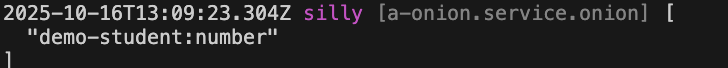

# 全局管道

## 创建管道

比如，在模块 demo-student 中创建一个 全局管道: `number`，将请求参数转换为`number`类型

### 1. Cli命令

``` bash
$ vona :create:bean pipe number --module=demo-student --boilerplate=global
```

### 2. 菜单命令

::: tip
右键菜单 - [模块路径]: `Vona Aspect/Pipe Global`
:::

## 管道定义

``` typescript
export type TypePipeNumberData = unknown;

export type TypePipeNumberResult = number;

export interface IPipeOptionsNumber extends IDecoratorPipeOptionsGlobal {}

@Pipe<IPipeOptionsNumber>({ global: true })
class PipeNumber {
  async transform(value: TypePipeNumberData, _metadata: RouteHandlerArgumentMeta, _options: IPipeOptionsNumber): Promise<TypePipeNumberResult> {
    const valueNew = Number(value);
    if (Number.isNaN(valueNew)) this.app.throw(400);
    return valueNew;
  }
}
```

- `TypePipeNumberData`: 入参类型
- `TypePipeNumberResult`: 结果类型
- `IPipeOptionsNumber`: 定义管道参数
- `transform`: 对参数进行判断和转换

## 使用管道

与局部管道不同，系统会自动加载全局管道，并使其生效

## 管道参数

可以为管道定义参数，通过参数更灵活的配置管道逻辑

比如，为 number 管道定义`errorCode`参数，如果传入的请求参数不是 number 类型就抛出异常，错误代码为`errorCode`

### 1. 定义参数类型

``` diff
export interface IPipeOptionsNumber extends IDecoratorPipeOptionsGlobal {
+ errorCode: number;
}
```

### 2. 提供参数缺省值

``` diff
@Pipe<IPipeOptionsNumber>({
+ errorCode: 400,
})
```

### 3. 使用参数

``` diff
export interface IPipeOptionsNumber extends IDecoratorPipeOptionsGlobal {
  errorCode: number;
}

@Pipe<IPipeOptionsNumber>({
  global: true,
  errorCode: 400,
})
export class PipeNumber extends BeanBase implements IPipeTransform<TypePipeNumberData, TypePipeNumberResult> {
  async transform(value: TypePipeNumberData, _metadata: RouteHandlerArgumentMeta, options: IPipeOptionsNumber): Promise<TypePipeNumberResult> {
    const valueNew = Number(value);
-   if (Number.isNaN(valueNew)) this.app.throw(400);
+   if (Number.isNaN(valueNew)) this.app.throw(options.errorCode);
    return valueNew;
  }
}
```

### 4. 使用时指定参数

可以针对某个 API 单独指定全局管道的参数

``` diff
class ControllerStudent {
  @Web.get(':id')
+ @Aspect.pipeGlobal('demo-student:number', { errorCode: 500 })
  async findOne(id: number) {}
}
```

- 在使用管道时直接提供参数值即可

### 5. App config配置

可以在 App config 中配置管道参数

`src/backend/config/config/config.ts`

``` typescript
// onions
config.onions = {
  pipe: {
    'demo-student:number': {
      errorCode: 500,
    },
  },
};
```

### 6. 参数优先级

`使用时指定参数` > `App config配置` > `参数缺省值`

## 管道顺序

由于全局管道是默认加载并生效的，所以，VonaJS 提供了两个参数，用于控制管道的加载顺序

### 1. dependencies

比如，系统有一个内置全局管道`a-xxx:yyy`，我们希望加载顺序如下：`a-xxx:yyy` > `Current`

``` diff
@Pipe({
  global: true,
+ dependencies: 'a-xxx:yyy',
  errorCode: 400,
})
class PipeNumber {}
```

### 2. dependents

`dependents`的顺序刚好与`dependencies`相反，我们希望加载顺序如下：`Current` > `a-xxx:yyy`

``` diff
@Pipe({
  global: true,
+ dependents: 'a-xxx:yyy',
  errorCode: 400,
})
class PipeNumber {}
```

## 管道启用/禁用

可以针对某些 API 控制全局管道的`启用/禁用`

### 1. Enable

* 针对某个 API 禁用

``` diff
class ControllerStudent {
  @Web.get(':id')
+ @Aspect.pipeGlobal('demo-student:number', { enable: false })
  async findOne(id: number) {}
}
```

* 针对所有 API 禁用

`src/backend/config/config/config.ts`

``` diff
// onions
config.onions = {
  pipe: {
    'demo-student:number': {
+     enable: false,
    },
  },
};
```

### 2. Meta

可以让全局管道在指定的运行环境生效

|名称|类型|说明|
|--|--|--|
|flavor|string\|string[]|参见: [运行环境与Flavor](../../techniques/mode-flavor/introduction.md)|
|mode|string\|string[]|参见: [运行环境与Flavor](../../techniques/mode-flavor/introduction.md)|
|instanceName|string\|string[]|参见: [多实例/多租户](../../techniques/instance/introduction.md)|
|host|string\|string[]|主机名|

* 举例

``` diff
@Pipe({
  global: true,
+ meta: {
+   flavor: 'normal',
+   mode: 'dev',
+   instanceName: '',
+   host: 'localhost:7102',
+ },
})
class PipeNumber {}
```

### 3. match/ignore
    
可以针对指定的 API 启用/禁用全局管道

|名称|类型|说明|
|--|--|--|
|match|string\|regexp\|(string\|regexp)[]|针对哪些API启用|
|ignore|string\|regexp\|(string\|regexp)[]|针对哪些API禁用|

## 查看当前生效的全局管道清单

可以直接在 Controller action 中输出当前生效的全局管道清单

``` diff
class ControllerStudent {
  @Web.get(':id')
  async findOne(id: number)() {
+   this.bean.onion.pipe.inspect();
  }
}
```

- `this.bean.onion`: 取得全局 Service 实例 `onion`
- `.pipe`: 取得与管道相关的 Service 实例
- `.inspect`: 输出当前生效的全局管道清单

当访问`findOne` API 时，会自动在控制台输出当前生效的全局管道清单，效果如下：


