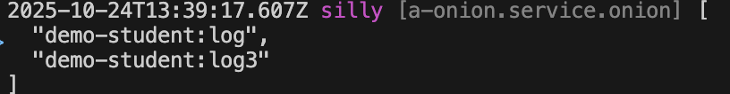

# 外部切面

在不改变 Class 源码的前提下，从外部为任何 Class 的任何方法切入逻辑

## 创建目标Class

可以针对任何 Class 实现外部切面。下面，以 Service 为例，在模块 demo-student 中创建一个 Service `test`，代码如下：

``` typescript
@Service()
export class ServiceTest extends BeanBase {
  private _name: string;

  protected __init__() {
    this._name = '';
  }

  protected async __dispose__() {
    this._name = '';
  }

  get name() {
    return this._name;
  }

  set name(value) {
    this._name = value;
  }

  actionSync(a: number, b: number) {
    return a + b;
  }

  async actionAsync(a: number, b: number) {
    return Promise.resolve(a + b);
  }
}
```

## 创建外部切面

接下来，创建一个外部切面`log`，为 Class `ServiceTest`的属性和方法分别提供扩展逻辑

### 1. Cli命令

``` bash
$ vona :create:bean aop log --module=demo-student
```

### 2. 菜单命令

::: tip
右键菜单 - [模块路径]: `Vona Aspect/Aop`
:::

## AOP定义

``` typescript
import { BeanAopBase } from 'vona';
import { Aop } from 'vona-module-a-aspect';

@Aop({ match: 'demo-student.service.test' })
export class AopLog extends BeanAopBase {}
```

- `@Aop`: 此装饰器用于实现`外部切面`
- `match`: 用于将 Class `AopLog`与 Class `ServiceTest`关联，`ServiceTest`的 beanFullName 是`demo-student.service.test`

|名称|类型|说明|
|--|--|--|
|match|string\|regexp\|(string\|regexp)[]|针对哪些 Class 启用|

## 切面：同步方法

为`ServiceTest#actionSync`输出运行时长

在 VSCode 编辑器中，输入代码片段`aopactionsync`，自动生成代码骨架:

``` typescript
action: AopAction<ClassSome, 'action'> = (_args, next, _receiver) => {
  return next();
};
```

调整代码，然后添加 log 逻辑

``` typescript
actionSync: AopAction<ServiceTest, 'actionSync'> = (_args, next, _receiver) => {
  const timeBegin = Date.now();
  const res = next();
  const timeEnd = Date.now();
  console.log('actionSync: ', timeEnd - timeBegin);
  return res;
};
```

- `actionSync`: 提供与`ServiceTest`同名的方法`actionSync`

## 切面：异步方法

为`ServiceTest#actionAsync`输出运行时长

在 VSCode 编辑器中，输入代码片段`aopaction`，自动生成代码骨架:

``` typescript
action: AopAction<ClassSome, 'action'> = async (_args, next, _receiver) => {
  return await next();
};
```

调整代码，然后添加 log 逻辑

``` typescript
actionAsync: AopAction<ServiceTest, 'actionAsync'> = async (_args, next, _receiver) => {
  const timeBegin = Date.now();
  const res = await next();
  const timeEnd = Date.now();
  console.log('actionAsync: ', timeEnd - timeBegin);
  return res;
};
```

- `actionAsync`: 提供与`ServiceTest`同名的方法`actionAsync`

## 切面：getter

为`ServiceTest#get name`输出运行时长

在 VSCode 编辑器中，输入代码片段`aopgetter`，自动生成代码骨架:

``` typescript
protected __get_xxx__: AopActionGetter<ClassSome, 'xxx'> = function (next, _receiver) {
  const value = next();
  return value;
};
```

调整代码，然后添加 log 逻辑

``` typescript
protected __get_name__: AopActionGetter<ServiceTest, 'name'> = function (next, _receiver) {
  const timeBegin = Date.now();
  const value = next();
  const timeEnd = Date.now();
  console.log('get name: ', timeEnd - timeBegin);
  return value;
};
```

- `__get_name__`: 对应`ServiceTest`的 getter 方法`get name`

## 切面：setter

为`ServiceTest#set name`输出运行时长

在 VSCode 编辑器中，输入代码片段`aopsetter`，自动生成代码骨架:

``` typescript
protected __set_xxx__: AopActionSetter<ClassSome, 'xxx'> = function (value, next, _receiver) {
  return next(value);
}
```

调整代码，然后添加 log 逻辑

``` typescript
protected __set_name__: AopActionSetter<ServiceTest, 'name'> = function (value, next, _receiver) {
  const timeBegin = Date.now();
  const res = next(value);
  const timeEnd = Date.now();
  console.log('set name: ', timeEnd - timeBegin);
  return res;
};
```

- `__set_name__`: 对应`ServiceTest`的 setter 方法`set name`

## 切面：`__init__`

为`ServiceTest#__init__`输出运行时长

在 VSCode 编辑器中，输入代码片段`aopinit`，自动生成代码骨架:

``` typescript
protected __init__: AopActionInit<ClassSome> = (_args, next, _receiver) => {
  next();
};
```

调整代码，然后添加 log 逻辑

``` typescript
protected __init__: AopActionInit<ServiceTest> = (_args, next, _receiver) => {
  const timeBegin = Date.now();
  next();
  const timeEnd = Date.now();
  console.log('__init__: ', timeEnd - timeBegin);
};
```

- `__init__`: 提供与`ServiceTest`同名的方法`__init__`

## 切面：`__dispose__`

为`ServiceTest#__dispose__`输出运行时长

在 VSCode 编辑器中，输入代码片段`aopdispose`，自动生成代码骨架:

``` typescript
protected __dispose__: AopActionDispose<ClassSome> = async (_args, next, _receiver) => {
  await next();
};
```

调整代码，然后添加 log 逻辑

``` typescript
protected __dispose__: AopActionDispose<ServiceTest> = async (_args, next, _receiver) => {
  const timeBegin = Date.now();
  await next();
  const timeEnd = Date.now();
  console.log('__dispose__: ', timeEnd - timeBegin);
};
```

- `__dispose__`: 提供与`ServiceTest`同名的方法`__dispose__`

## 切面：`__get__`

为`ServiceTest`扩展魔术方法

- 参见: [魔术方法](../internal/magic-method.md)

在 VSCode 编辑器中，输入代码片段`aopget`，自动生成代码骨架:

``` typescript
protected __get__: AopActionGet<ClassSome> = (_prop, next, _receiver) => {
  const value = next();
  return value;
};
```

调整代码，然后添加自定义字段`red`

``` typescript
protected __get__: AopActionGet<ServiceTest> = (prop, next, _receiver) => {
  if (prop === 'red') return '#FF0000';
  const value = next();
  return value;
};
```

- `__get__`: 约定的魔术方法名称

通过接口类型合并的机制为颜色提供类型定义

``` typescript
declare module 'vona-module-demo-student' {
  export interface ServiceTest {
    red: string;
  }
}
```

## 切面：`__set__`

为`ServiceTest`扩展魔术方法

- 参见: [魔术方法](../internal/magic-method.md)

在 VSCode 编辑器中，输入代码片段`aopset`，自动生成代码骨架:

``` typescript
protected __set__: AopActionSet<ClassSome> = (_prop, value, next, _receiver) => {
  return next(value);
};
```

调整代码，为自定义字段`red`设置值

``` typescript
private _colorRed: string | undefined;

protected __set__: AopActionSet<ServiceTest> = (prop, value, next, _receiver) => {
  if (prop === 'red') {
    this._colorRed = value;
    return true;
  }
  return next(value);
};
```

- `__set__`: 约定的魔术方法名称
- 如果为`prop`设置了值，返回`true`，否则调用`next`方法

然后调整`__get__`的逻辑:

``` diff
protected __get__: AopActionGet<ServiceTest> = (prop, next, _receiver) => {
- if (prop === 'red') return '#FF0000';
+ if (prop === 'red') return this._colorRed;
  const value = next();
  return value;
}
```

## 切面：`__method__`

为`ServiceTest`的任何方法扩展逻辑

在 VSCode 编辑器中，输入代码片段`aopmethod`，自动生成代码骨架:

``` typescript
protected __method__: AopActionMethod<ClassSome> = (_method, _args, next, _receiver) => {
  return next();
};
```

调整代码，然后为方法`actionSync`和`actionAsync`添加 log 逻辑

``` typescript
protected __method__: AopActionMethod<ServiceTest> = (method, _args, next, _receiver) => {
  if (method !== 'actionSync' && method !== 'actionAsync') {
    return next();
  }
  const timeBegin = Date.now();
  function done(res) {
    const timeEnd = Date.now();
    console.log(`method ${method}: `, timeEnd - timeBegin);
    return res;
  }
  const res = next();
  if (res?.then) {
    return res.then((res: any) => {
      return done(res);
    });
  }
  return done(res);
};
```

- `__method__`: 约定的魔术方法名称
- `res?.then`: 判断返回值是否是 Promise 对象，进行不同处理，从而兼容`同步方法`和`异步方法`

## AOP顺序

针对同一个目标 Class，可以关联多个 AOP。所以，VonaJS 提供了两个参数，用于控制 AOP 的执行顺序

### 1. dependencies

比如，还有一个 AOP `demo-student:log3`，我们希望执行顺序如下：`demo-student:log3` > `Current`

``` diff
@Aop({
  match: 'demo-student.service.test',
+ dependencies: 'demo-student:log3',
})
class AopLog {}
```

### 2. dependents

`dependents`的顺序刚好与`dependencies`相反，我们希望执行顺序如下：`Current` > `demo-student:log3`

``` diff
@Aop({
  match: 'demo-student.service.test',
+ dependents: 'demo-student:log3',
})
class AopLog {}
```

## AOP启用/禁用

可以控制 AOP 的`启用/禁用`

### 1. Enable

`src/backend/config/config/config.ts`

``` diff
// onions
config.onions = {
  aop: {
    'demo-student:log': {
+     enable: false,
    },
  },
};
```

### 2. Meta

可以让 AOP 在指定的运行环境生效

|名称|类型|说明|
|--|--|--|
|flavor|string\|string[]|参见: [运行环境与Flavor](../../env-config/mode-flavor/introduction.md)|
|mode|string\|string[]|参见: [运行环境与Flavor](../../env-config/mode-flavor/introduction.md)|

* 举例

``` diff
@Aop({
+ meta: {
+   flavor: 'normal',
+   mode: 'dev',
+ },
})
class AopLog {}
```

## 查看当前生效的AOP清单

可以直接在目标 Class action 中输出当前生效的 AOP 清单

``` diff
class ServiceTest {
  protected async __dispose__() {
+   this.bean.onion.aop.inspect();
    this._name = '';
  }
```

- `this.bean.onion`: 取得全局 Service 实例 `onion`
- `.aop`: 取得与 AOP 相关的 Service 实例
- `.inspect`: 输出当前生效的 AOP 清单

当方法被执行时，会自动在控制台输出当前生效的 AOP 清单，效果如下：


