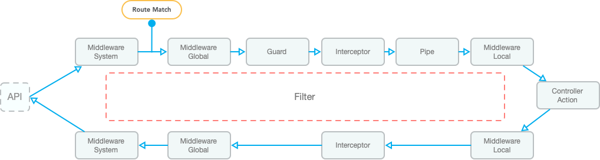

# 介绍

VonaJS AOP 编程包括三个方面的能力：

1. `控制器切面`: 为 Controller 方法切入逻辑
2. `内部切面`: 在 Class 内部，为任何 Class 的任何方法切入逻辑
3. `外部切面`: 在不改变 Class 源码的前提下，从外部为任何 Class 的任何方法切入逻辑

## 控制器切面

### 控制器切面清单

* Middleware
* Guard
* Interceptor
* Pipe
* Filter

### 执行时序图

控制器切面的执行时序图如下：



- `洋葱模型`: `Middleware`和`Interceptor`支持`洋葱模型`，允许在`Controller Action`之前和之后执行切面逻辑
- `Middleware`: 针对不同的执行时序节点，系统提供了三种 Middleware: `Middleware System`、`Middleware Global`和`Middleware Local`，从而可以实现更精细化的切面逻辑
- `Route Match`: 只有`Middleware System`在路由匹配之前执行，其余在路由匹配之后执行
- `Filter`: 任何环节抛出异常，都会执行`Filter`，从而自定义`错误信息`和`错误日志`的处理逻辑

## 内部切面

内部切面提供两个机制：`AOP Method`和`魔术方法`

### 1. AOP Method

直接在 Class Method 上通过装饰器切入逻辑

#### 举例：数据库事务

``` diff
class ServiceStudent {
+ @Database.transaction()
  async update(id: TableIdentity, student: DtoStudentUpdate) {
    return await this.scope.model.student.updateById(id, student);
  }
}
```

- `@Database.transaction`：通过`AOP Method`机制实现的装饰器，可以直接提供数据库事务能力

#### 举例：日志

``` diff
class ServiceStudent {
+ @Log()
  async update(id: TableIdentity, student: DtoStudentUpdate) {
    return await this.scope.model.student.updateById(id, student);
  }
}
```

- `@Log`：通过`AOP Method`机制实现的装饰器，可以直接提供日志能力

### 2. 魔术方法

可以在 Class 内部通过`__get__`和`__set__`切入动态属性或方法

#### 举例：获取 model 实例

``` diff
class ServiceStudent {
  async update(id: TableIdentity, student: DtoStudentUpdate) {
+   return await this.scope.model.student.updateById(id, student);
  }
}
```

- `this.scope.model.xxx`: 没有使用`依赖注入`，而是使用`依赖查找`，直接通过 scope 对象获取 model 实例，从而简化代码的书写风格

#### 实现思路

系统提供了一个 Class `ServiceModelResolver`，用于实现 model 实例的动态解析，代码如下：

``` typescript
class ServiceModelResolver {
  protected __get__(prop: string) {
    const beanFullName = `${this[SymbolModuleScope]}.model.${prop}`;
    return this.bean._getBean(beanFullName as any);
  }
}
```

1. 当调用`this.scope.model.student`时，会自动执行`__get__`方法，并且传入参数`prop: 'student'`
2. 将参数`prop`与当前模块名称合并成`beanFullName`
3. 通过`beanFullName`从全局容器中获取 model 实例，并返回给调用者

## 外部切面

仍以 Class `ServiceStudent`的`update`方法为例，通过`外部切面`来实现日志能力：

``` typescript
import { Aop } from 'vona-module-a-aspect';

@Aop({ match: 'demo-student.service.student' })
class AopLog {
  async update(_args: Parameters<any>, next: Function, _receiver: any) {
    const timeBegin = Date.now();
    const res = await next();
    const timeEnd = Date.now();
    console.log('time: ', timeEnd - timeBegin);
    return res;
  }
}
```

- `@Aop`: 此装饰器用于实现`外部切面`
- `match`: 用于将 Class `AopLog`与 Class `ServiceStudent`关联，`ServiceStudent`的 beanFullName 是`demo-student.service.student`
- `update`: 在`AopLog`中提供与`ServiceStudent`同名的方法`update`，实现自定义逻辑即可
