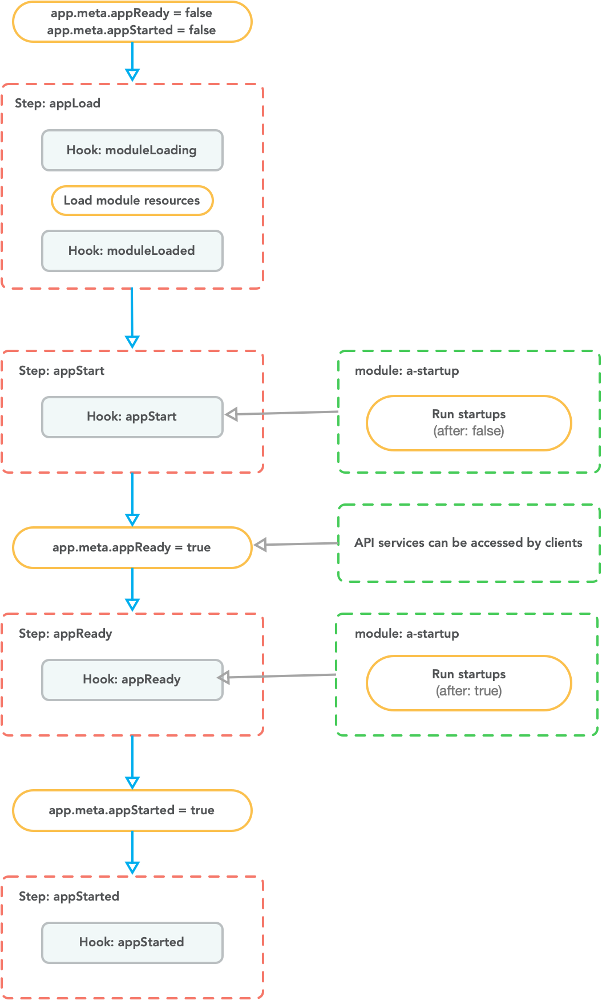
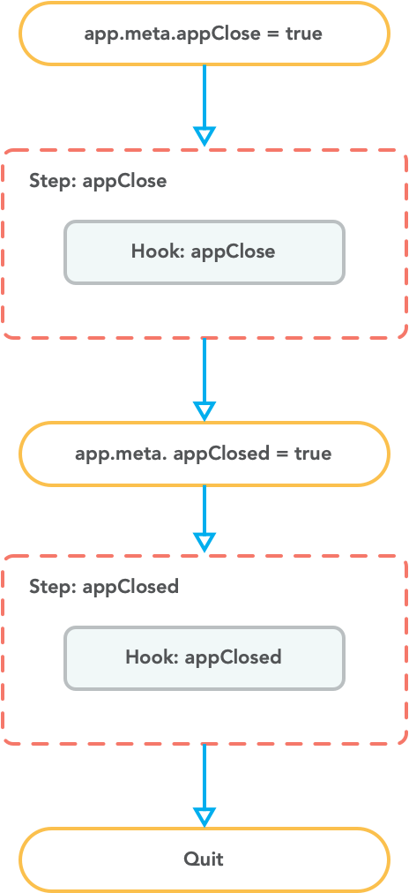

# 应用启动自定义

对于常规业务需求，一般只需创建[启动项](../distributed/startup/introduction.md)即可

对于特殊的底层需求，可以使用 VonaJS 提供的`Monkey`机制

在解释`Monkey`机制之前，有必要先了解应用启动/停止的时序

## 应用启动时序

应用启动时序分四个步骤：

1. `appLoad`: 加载所有的模块。针对每个模块均触发钩子`moduleLoading`和`moduleLoaded`
2. `appStart`: 触发钩子`appStart`。比如，模块`a-startup`响应此钩子，执行`应用启动项`(after: false)
   - 当`appStart`执行后，会设置`app.meta.appReady=true`。此时，系统提供的所有 API 服务可以接受客户端的请求
3. `appReady`: 触发钩子`appReady`。比如，模块`a-startup`响应此钩子，执行`应用启动项`(after: true)
4. `appStarted`: 触发钩子`appStarted`

## 应用停止时序

应用停止时序分两个步骤：

1. `appClose`: 触发钩子`appClose`
4. `appClosed`: 触发钩子`appClosed`