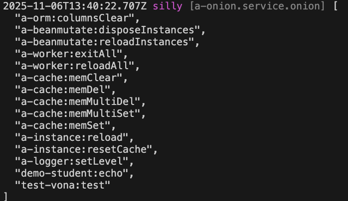

# 广播

可以向系统的多个工作进程发送广播，从而让每个工作进程执行业务逻辑

## 创建广播

比如，在模块 demo-student 中创建一个广播: `echo`，让每个工作进程在控制台输出`Hello world`

### 1. Cli命令

``` bash
$ vona :create:bean broadcast echo --module=demo-student
```

### 2. 菜单命令

::: tip
右键菜单 - [模块路径]: `Vona Bean/Broadcast`
:::

## 广播定义

``` typescript
export interface TypeBroadcastEchoJobData { message: string }

@Broadcast()
export class BroadcastEcho
  extends BeanBroadcastBase<TypeBroadcastEchoJobData>
  implements IBroadcastExecute<TypeBroadcastEchoJobData> {
  async execute(data: TypeBroadcastEchoJobData, isEmitter?: boolean) {
    if (!isEmitter) {
      console.log(`pid: ${process.pid} message: ${data.message}`);
    }
  }
}
```

- `TypeBroadcastEchoJobData`: 定义广播数据
- `execute`: 在控制台输出消息

* execute 参数

|名称|说明|
|--|--|
|data|广播数据|
|isEmitter|是否是发送广播的工作进程|

## 发送广播

``` typescript
class ControllerStudent {
  test() {
    const data = { message: 'Hello world' };
    console.log(`pid: ${process.pid} message: ${data.message}`);
    this.scope.broadcast.echo.emit(data);
  }
}  
```

- `this.scope.broadcast.echo`: 通过模块 scope 取得广播实例
- `emit`: 发送广播，传入广播数据

::: tip
如果在当前工作进程已经执行了业务逻辑，那么在`execute`方法中就可以判断`isEmitter`忽略掉发送广播的工作进程
:::

## 广播参数

可以为广播配置参数

``` typescript
@Broadcast({
  instance: true,
  transaction: true,
})
class BroadcastEcho {}
```

|名称|说明|
|--|--|
|instance|是否确保实例已初始化，缺省值为`true`|
|transaction|是否启用数据库事务|

- `instance`: VonaJS 支持`多实例/多租户`。如果广播的业务逻辑需要操作实例数据，则需要确保实例已初始化
- `transaction`: 如果设置为 true，系统会自动将广播的`execute`方法放入数据库事务当中

## App Config

可以在 App Config 中配置广播参数

`src/backend/config/config/config.ts`

``` typescript
// onions
config.onions = {
  broadcast: {
    'demo-student:echo': {
      instance: true,
      transaction: true,
    },
  },
};
```

## 查看当前生效的广播清单

可以直接输出当前生效的广播清单

``` diff
class ControllerStudent {
  @Web.get('test')
  test() {
+   this.bean.onion.broadcast.inspect();
  }
}
```

- `this.bean.onion`: 取得全局 Service 实例 `onion`
- `.broadcast`: 取得与广播相关的 Service 实例
- `.inspect`: 输出当前生效的广播清单

当访问`test` API 时，会自动在控制台输出当前生效的广播清单，效果如下：


