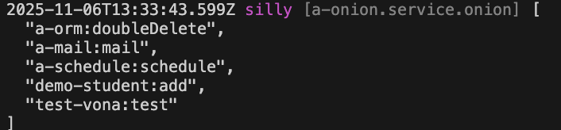

# 队列

VonaJS 基于[BullMQ](https://github.com/taskforcesh/bullmq)提供了强大的队列组件

## 创建队列

比如，在模块 demo-student 中创建一个队列: `add`，将传入的参数作加法运算

### 1. Cli命令

``` bash
$ vona :create:bean queue add --module=demo-student
```

### 2. 菜单命令

::: tip
右键菜单 - [模块路径]: `Vona Bean/Queue`
:::

## 队列定义

``` typescript
export interface TypeQueueAddJobData { a: number; b: number }

export type TypeQueueAddJobResult = number;

@Queue()
export class QueueAdd
  extends BeanQueueBase<TypeQueueAddJobData, TypeQueueAddJobResult>
  implements IQueueExecute<TypeQueueAddJobData, TypeQueueAddJobResult> {
  async execute(data: TypeQueueAddJobData, _options?: IQueuePushOptions): Promise<TypeQueueAddJobResult> {
    return data.a + data.b;
  }
}
```

- `TypeQueueAddJobData`: 定义任务数据
- `TypeQueueAddJobResult`: 定义任务结果
- `execute`: 执行任务

* execute 参数

|名称|说明|
|--|--|
|data|任务数据|
|options|任务参数|

## 推送任务

### 1. 没有返回值

``` typescript
class ControllerStudent {
  test() {
    const data = { a: 1, b: 2 };
    this.scope.queue.add.push(data);
  }
}  
```

- `this.scope.queue.add`: 通过模块 scope 取得队列实例
- `push`: 推送任务，不需要等待结果返回

### 2. 有返回值

``` typescript
class ControllerStudent {
  async test() {
    const data = { a: 1, b: 2 };
    const result = await this.scope.queue.add.pushAsync(data);
    console.log(result);
  }
}  
```

- `this.scope.queue.add`: 通过模块 scope 取得队列实例
- `pushAsync`: 推送任务，可以等待结果返回

## `push/pushAsync`

``` typescript
push(data: DATA, options?: IQueuePushOptions);
async pushAsync(data: DATA, options?: IQueuePushOptions): Promise<RESULT>;
```

|名称|说明|
|--|--|
|data|任务数据|
|options|任务参数|

* options

|名称|类型|说明|
|--|--|--|
|queueNameSub|string|子队列名称|
|jobName|string|任务名称|
|jobOptions|Bull.JobsOptions|任务选项|
|dbInfo.level|number|默认使用当前上下文的数据源分级`+1`，参见: [数据源分级](./db-level.md)|
|dbInfo.clientName|string|默认使用当前上下文的数据源名称|
|locale|string|默认使用当前上下文的locale|
|instanceName|string|实例名，默认使用当前上下文的instanceName|
|extraData|object|参见: [扩展数据](./extra-data.md)|

## 队列参数

可以为队列配置参数

``` typescript
@Queue({
  concurrency: false,
  transaction: false,
  options: {
    queue: {},
    worker: {},
    job: {},
    redlock: {},
  },
})
class QueueAdd {}
```

|名称|类型|说明|
|--|--|--|
|concurrency|boolean|是否并行执行，默认为`false`|
|transaction|boolean|是否启用数据库事务，默认为`false`|
|options.queue|Bull.QueueOptions|Bull Queue选项|
|options.worker|Bull.WorkerOptions|Bull Worker选项|
|options.job|Bull.JobsOptions|Bull Job选项|
|options.redlock|Redlock.Redlock|Redlock选项|

- `options.redlock`: 当`concurrency=false`时，需要使用分布式锁实现任务的串行执行。系统提供了默认的分布式锁，也可以自行提供

## App Config配置

可以在 App Config 中配置队列参数

`src/backend/config/config/config.ts`

``` typescript
// onions
config.onions = {
  queue: {
    'demo-student:add': {
      concurrency: false,
      transaction: false,
      options: {
        queue: {},
        worker: {},
        job: {},
        redlock: {},
      },
    },
  },
};
```

## 队列启用/禁用

可以控制队列的`启用/禁用`

### 1. Enable

`src/backend/config/config/config.ts`

``` diff
// onions
config.onions = {
  queue: {
    'demo-student:add': {
+     enable: false,
    },
  },
};
```

### 2. Meta

可以让队列在指定的运行环境生效

|名称|类型|说明|
|--|--|--|
|flavor|string\|string[]|参见: [运行环境与Flavor](../../env-config/mode-flavor/introduction.md)|
|mode|string\|string[]|参见: [运行环境与Flavor](../../env-config/mode-flavor/introduction.md)|

* 举例

``` diff
@Queue({
+ meta: {
+   flavor: 'normal',
+   mode: 'dev',
+ },
})
class QueueAdd {}
```

## 查看当前生效的队列清单

可以直接输出当前生效的队列清单

``` diff
class ControllerStudent {
  @Web.get('test')
  test() {
+   this.bean.onion.queue.inspect();
  }
}
```

- `this.bean.onion`: 取得全局 Service 实例 `onion`
- `.queue`: 取得与队列相关的 Service 实例
- `.inspect`: 输出当前生效的队列清单

当访问`test` API 时，会自动在控制台输出当前生效的队列清单，效果如下：


