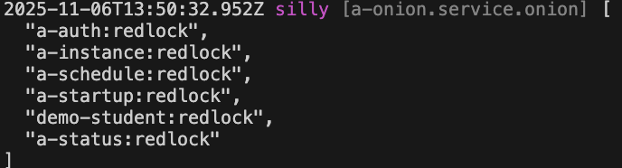

# 分布式锁

VonaJS 基于[Redlock](https://github.com/sesamecare/redlock/)提供了直观、易用的分布式锁

## 创建分布式锁

比如，在模块 demo-student 中创建分布式锁

### 1. Cli命令

``` bash
$ vona :create:bean meta redlock --module=demo-student
```

### 2. 菜单命令

::: tip
右键菜单 - [模块路径]: `Vona Meta/Redlock`
:::

## 分布式锁定义

``` typescript
export type TypeRedlockLockResource = never;
export type TypeRedlockLockIsolateResource = never;

@Meta()
export class MetaRedlock extends BeanRedlockBase<TypeRedlockLockResource, TypeRedlockLockIsolateResource> {}
```

- `TypeRedlockLockResource`: 定义`lock`方法使用的锁资源
- `TypeRedlockLockIsolateResource`: 定义`lockIsolate`方法使用的锁资源

## 定义锁资源

当我们使用分布式锁时，需要指定对应的锁资源。比如，为`lock`方法定义锁资源`name`:

``` diff
- export type TypeRedlockLockResource = never;
+ export type TypeRedlockLockResource = 'name';
```

## 使用分布式锁

``` typescript
class ControllerStudent {
  async test() {
    const res = await this.scope.redlock.lock('name', async () => {
      // do nothing in lock
      return 'some result';
    });
  }
}  
```

- `redlock.lock`：传入锁资源`name`

## `lock/lockIsolate`

VonaJS 提供了两个锁方法: `lock/lockIsolate`。二者的区别是：`lockIsolate`自动实现了`数据源分级`，从而避免因数据源竞争而导致的死锁情况

- 参见: [数据源分级](./queue/db-level.md)

### 定义锁资源: lockIsolate

为`lockIsolate`方法定义锁资源:

``` diff
- export type TypeRedlockLockIsolateResource = never;
+ export type TypeRedlockLockIsolateResource = 'name';
```

### 使用分布式锁: lockIsolate

``` typescript
class ControllerStudent {
  async test() {
    const res = await this.scope.redlock.lockIsolate('name', async () => {
      // do nothing in lock
      return 'some result';
    });
  }
}  
```

## 定义锁资源: 字面量模版

锁资源还可以是`字面量模版`

比如，如果要为不同的用户单独提供锁资源，那么可以使用形如`user-${userId}`的字符串，作为锁资源名称

``` diff
- export type TypeRedlockLockIsolateResource = 'name';
+ export type TypeRedlockLockIsolateResource = 'name' | `user-${string}`;
```

这样，在使用`lockIsolate`方法时同样可以提供类型提示

``` typescript
class ControllerStudent {
  async test() {
    const userId = 1;
    const res = await this.scope.redlock.lockIsolate(`user-${userId}`, async () => {
      // do nothing in lock
      return 'some result';
    });
  }
}  
```

## 查看当前生效的分布式锁清单

可以直接输出当前生效的分布式锁清单

``` diff
class ControllerStudent {
  @Web.get('test')
  test() {
+   this.bean.onion.meta.inspectMeta('redlock');
  }
}
```

- `this.bean.onion`: 取得全局 Service 实例 `onion`
- `.meta`: 取得与 meta 相关的 Service 实例
- `.inspectMeta`: 输出当前生效的分布式锁清单

当访问`test` API 时，会自动在控制台输出当前生效的分布式锁清单，效果如下：


