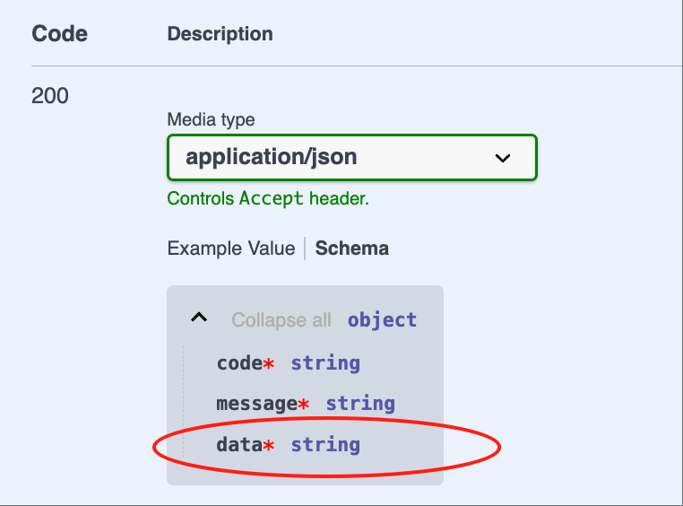

# Controller

## 创建Controller

比如，我们在模块 demo-student 中创建一个 Controller: `student`

### 1. Cli命令

``` bash
$ vona :create:bean controller student --module=demo-student
```

### 2. 菜单命令

::: tip
右键菜单 - [模块路径]: `Vona Create/Controller`
:::

## Controller定义

``` typescript{1,3}
@Controller<IControllerOptionsStudent>('student')
export class ControllerStudent extends BeanBase {
  @Web.post('')
  @Api.body(v.object(EntityStudent))
  async create(@Arg.body() student: DtoStudentCreate): Promise<EntityStudent> {
    return await this.scope.service.student.create(student);
  }
}
```

- Controller Path: `'student'`
- Action Path : `''`

## 路由

与`Fastify`一样，Vona 也采用[find-my-way](https://github.com/delvedor/find-my-way)作为路由库。所有使用了`@Web`装饰器的 Controller Action，会自动注册到路由表中

路由路径由 Controller Path 和 Action Path 组合而成

### 常规格式

``` bash
Route Path = GlobalPrefix + Module Url + Controller Path + Action Path
```

- GlobalPrefix: 项目配置：`app.config.server.globalPrefix`，默认为`/api`
- Module Url: 通过模块名称生成的 Url 片段。比如，模块 demo-student 的 module Url 就是`demo/student`

比如，模块 demo-student 中的 Controller `teacher`，路由如下：

|Controller Path|Action Path| Route Path|
|--|--|--|
|teacher|empty|/api/demo/student/teacher|
|teacher|:id|/api/demo/student/teacher/:id|

### 简化规则1

如果 Controller Path 与模块名称重名，那么自动去除重复部分

比如，模块 demo-student 中的 Controller `student`，路由如下：

|Controller Path|Action Path| Route Path|
|--|--|--|
|student|empty|/api/demo/student|
|student|:id|/api/demo/student/:id|

### 简化规则2

如果 Controller Path 或者 Action Path 以`/`为前缀，那么就自动去除 Module Url

|Controller Path|Action Path| Route Path|
|--|--|--|
|/student|empty|/api/student|
|/student|:id|/api/student/:id|

### 简化规则3

如果 Controller Path 或者 Action Path 以`//`为前缀，那么就自动去除 GlobalPrefix 和 Module Url

|Controller Path|Action Path| Route Path|
|--|--|--|
|//student|empty|/student|
|//student|:id|/student/:id|

再比如，项目的首页，路由如下：

|Controller Path|Action Path| Route Path|
|--|--|--|
|any value|//|/|

## 请求方法

Vona 使用装饰器来定义请求方法。这些装饰器都放入一个分组`@Web`中。因为装饰器比较多，采用分组的机制，可以减轻心智负担。比如：我们为 create 设置一个 post 方法：

``` typescript
import { Web } from 'vona-module-a-web';

class ControllerStudent {
  @Web.post()
  async create() {}
}  
```

* Method 装饰器清单

|名称|说明|
|--|--|
|@Web.post|post|
|@Web.get|get|
|@Web.delete|delete|
|@Web.put|put|
|@Web.patch|patch|
|@Web.options|options|
|@Web.head|head|

## 请求参数

我们需要从请求中取得各种参数，比如 Query、Params、Body、Headers，等等。同样，Vona 也提供了许多装饰器用于获取参数。我们也将所有参数装饰器放入分组`@Arg`中，从而减轻心智负担。比如，我们要获取某位学生的数据，请求的 URL 为`/?id=1`：

``` typescript
class ControllerStudent3 {
  @Web.get()
  findOne(@Arg.query('id') id: number) {}
}
```

根据参数的特点，不同类型的参数允许指定字段名称，比如在 query 装饰器中指定`id`。我们也可以不指定字段名称，从而取得整个 query 对象。

比如，URL 为`/?id=1&name=tom`:

``` typescript
class DtoStudentInfo {
  id: number;
  name: string;
}

class ControllerStudent3 {
  @Web.get()
  findOne(@Arg.query() query: DtoStudentInfo) {
    console.log(query.id, query.name);
  }
}
```

* 参数装饰器清单

|名称|说明|
|--|--|
|@Arg.param|Param|
|@Arg.query|Query|
|@Arg.body|Body|
|@Arg.headers|Headers|
|@Arg.fields|Fields|
|@Arg.field|Field|
|@Arg.files|Files|
|@Arg.file|File|
|@Arg.user|The current user|

## 参数校验  

Vona 基于[Zod](https://zod.dev) 提供了非常简洁、灵活的机制对请求参数作校验

- 参见：[参数校验](../../techniques/validation/introduction.md)

## Swagger/OpenAPI

Vona 基于[@asteasolutions/zod-to-openapi](https://github.com/asteasolutions/zod-to-openapi)实现了非常便利的`Swagger/OpenAPI`。Vona 中的 `Swagger/OpenAPI` 仍然延续[参数校验](../../techniques/validation/introduction.md)中的装饰器，同时提供扩展工具，用于设置与 OpenAPI 相关的信息

- 参见：[Swagger/OpenAPI](../../techniques/openapi/introduction.md)

## Response Body

Vona 提供了与[参数校验](../../techniques/validation/introduction.md)类似的机制，指定 Response body 的类型，并自动生成 Swagger/OpenAPI 元数据

### 1. 自动推断Zod Schema：基础类型/Dto/Entity

如果 body 类型是`基础类型/Dto/Entity`，那么，系统就会自动推断出对应的 Zod Schema，并自动生成 Swagger/OpenAPI

* 举例：`string`

``` typescript{3}
class ControllerStudent {
  @Web.get()
  findOne(): string {
    return 'Tom';
  }
}  
```



* 举例：`EntityStudent`

``` typescript{3}
class ControllerStudent {
  @Web.get()
  findOne(): EntityStudent {
    return {} as EntityStudent;
  }
}  
```


* 可自动推断的类型清单

|名称|说明|
|--|--|
|string|z.string()|
|number|z.number()|
|boolean|z.boolean()|
|Dto|z.object({...})|
|Entity|z.object({...})|

### 2. 指定Zod Schema

我们还可以显式的指定 Zod Schema，并自动生成 Swagger/OpenAPI

* 举例：`string[]`

使用装饰器`@Api.body`指定 Zod Schema。Zod Schema 的使用规则与[参数校验](../../techniques/validation/introduction.md)一致

``` typescript{5}
import { Api } from 'vona-module-a-openapi';

class ControllerStudent {
  @Web.get()
  @Api.body(v.array(String))
  findOne(): string[] {
    return ['Tom'];
  }
}  
```


* 举例：`Promise<EntityStudent>`

``` typescript{3}
class ControllerStudent {
  @Web.get()
  @Api.body(EntityStudent)
  async findOne(): Promise<EntityStudent> {
    return {} as EntityStudent;
  }
}  
```


## Response Body包装对象

在默认情况下，Vona 自动为 Response body 提供一个包装对象。比如，我们要返回 string 类型的 body，那么实际返回的数据类型是：

``` typescript
{
  code: string;
  message: string;
  data: string;
}
```

我们还可以使用装饰器`@Api.bodyCustom`来自定义包装对象

### 1. 禁用包装对象

可以禁用包装对象，直接返回 Response body 本身

``` typescript{3}
class ControllerStudent {
  @Web.get()
  @Api.bodyCustom(false)
  findOne(): string {
    return 'Tom';
  }
}  
```


### 2. 提供自定义包装对象

* 首先，定义包装函数：

``` typescript
export function bodySchemaWrapperCustom(bodySchema: any) {
  return z.object({
    status: z.number(),
    msg: z.string(),
    data: bodySchema,
  });
}
```

* 然后将包装函数`bodySchemaWrapperCustom`传入装饰器`@Api.bodyCustom`

``` typescript{3}
class ControllerStudent {
  @Web.get()
  @Api.bodyCustom(bodySchemaWrapperCustom)
  findOne(): string {
    return 'Tom';
  }
}  
```


* 如果 Response body 的类型是`Promise<EntityStudent>`，那么代码如下：

``` typescript{3}
class ControllerStudent {
  @Web.get()
  @Api.bodyCustom(bodySchemaWrapperCustom, EntityStudent)
  async findOne(): Promise<EntityStudent> {
    return {} as EntityStudent;
  }
}  
```


## 更多Swagger/Openapi配置

### 1. @Api.contentType

设置 Response 的响应类型

``` typescript
@Api.contentType('application/xml')
```

### 2. @Api.exclude

不在 Swagger/Openapi 元数据中显示此 API。此装饰器可作用于 Controller/Action

``` typescript
@Api.exclude()
```

### 3. @Api.header/@Api.headers

定义 Request headers

``` typescript
@Api.header({ name: 'x-request-header', description: 'request header' })
// 一次定义多个headers
@Api.headers([{ name: 'x-request-header', description: 'request header' }])
```

### 4. @Api.httpCode

设置 Response 的响应码

``` typescript
@Api.httpCode(400)
```

### 5. @Api.setHeader

设置 Response 的响应码

``` typescript
@Api.setHeader('x-response-header', 'value')
// 一次设置多个headers
@Api.setHeader({ 'x-response-header1': 'value1', 'x-response-header2': 'value2' })
```

### 6. @Api.tags

设置在 Swagger/Openapi 中的分组信息。此装饰器可作用于 Controller/Action

``` typescript
@Api.tags(['Student'])
```

## Action options

### 1. 举例

可以在定义 Action 的请求方法时传递更多选项

``` typescript
class ControllerBook {
  @Web.get(':id', {
    tags: ['Book'],
    description: 'Find a book',
  })
  findOne(@Arg.param('id') id: number): EntityBook {}
}
```

- tags: 设置在 Swagger/Openapi 中的分组信息
- description: 设置在 Swagger/Openapi 中的描述信息

### 2. description支持多语言国际化

首先，定义语言资源：

* 英文：`src/module/demo-student/src/config/locale/en-us.ts`

``` typescript
export default {
  FindBook: 'Find a book',
};
```

* 中文：`src/module/demo-student/src/config/locale/zh-cn.ts`

``` typescript
export default {
  FindBook: '查找一本书',
};
```

使用`$locale`方法进行语言翻译，支持语言资源的类型自动提示

``` typescript
import { $locale } from '../.metadata/index.ts';

@Web.get(':id', {
  description: $locale('FindBook'),
})
```

### 3. Action options清单

|名称|描述|
|--|--|
|public|是否需要Request Header: `authentication`，默认为true|
|description|API的描述|
|summary|API的摘要|
|httpCode|Response的响应码|
|contentType|Response的响应类型|
|bodySchema|Response body的Schema|
|bodySchemaWrapper|Response body的包装对象|
|exclude|不在 Swagger/Openapi 元数据中显示此 API|
|tags|API的标签分组|
|operationId|API的操作Id，默认为methodName|
|headers|定义Resquest Headers|
|setHeaders|设置Response Headers|

## Controller options

### 1. 举例

可以在定义 Controller 时传递更多选项

``` typescript
@Controller('book', {
  exclude: false,
  tags: ['Book'],
})
class ControllerBook {}
```

- exclude: 不在 Swagger/Openapi 元数据中显示此 Controller 的所有 API
- tags: API 的标签分组

### 2. Controller options清单

|名称|描述|
|--|--|
|exclude|不在 Swagger/Openapi 元数据中显示此 Controller 的所有 API|
|tags|API 的标签分组|
|actions|定义Action options|
|enable|是否启用Controller|
|meta|根据条件启用Controller|

### 3. App config配置

可以在 App config 中配置 Controller options

比如，在默认情况下，`http://localhost:7102/swagger`只能在单元测试/本地开发环境有效。如果要让 Swagger 在生产环境也能访问，那么，可以在 App config 中进行配置

`src/backend/config/config/config.prod.ts`

``` typescript
// onions
config.onions = {
  controller: {
    'a-swagger:swagger': {
      meta: {
        mode: ['test', 'local', 'prod'],
      },
    },
  },
};
```

### 4. actions

在 Controller options 中提供 actions 选项，从而允许我们在 App config 中配置任何 Controller 中的 Action options

比如，我们在 App config 中设置`ControllerBook`类中的`findOne`的 action options：

`src/backend/config/config/config.local.ts`

``` typescript
// onions
config.onions = {
  controller: {
    'demo-student:book': {
      actions: {
        findOne: {
          description: 'Find a book!!!',
        },
      },
    },
  },
};
```

