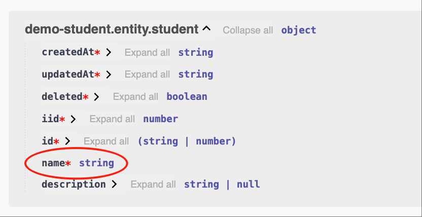
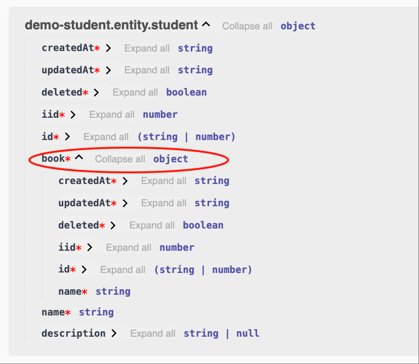
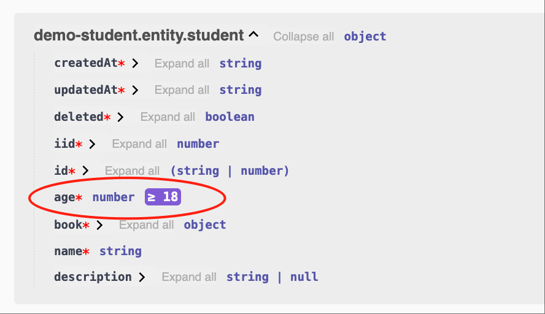
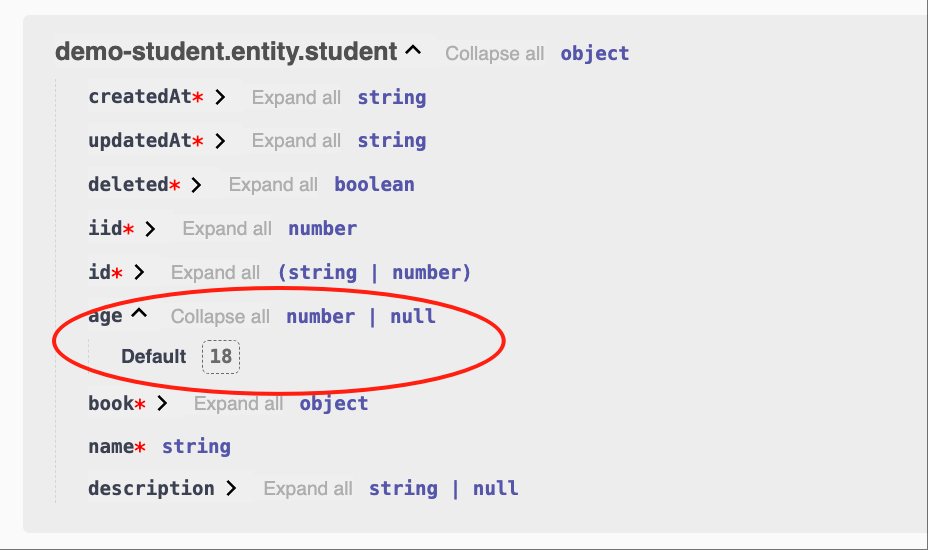
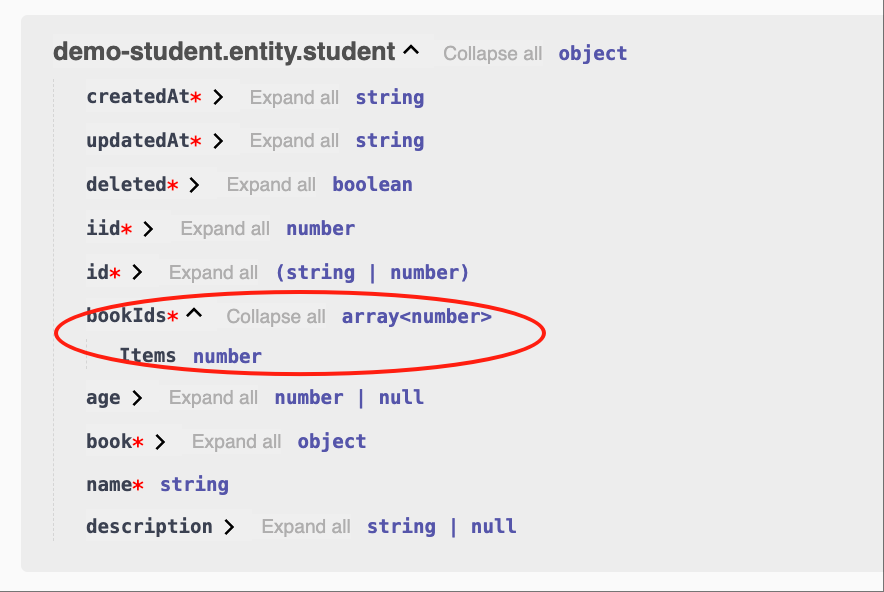
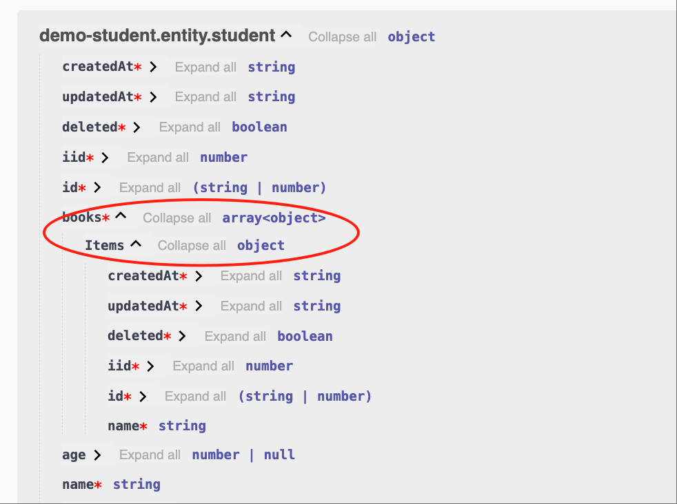
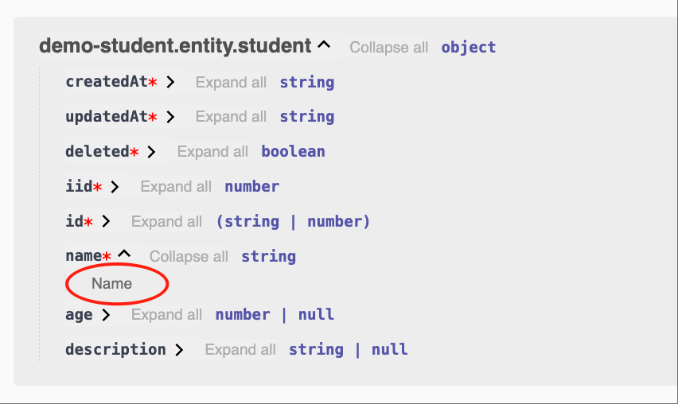
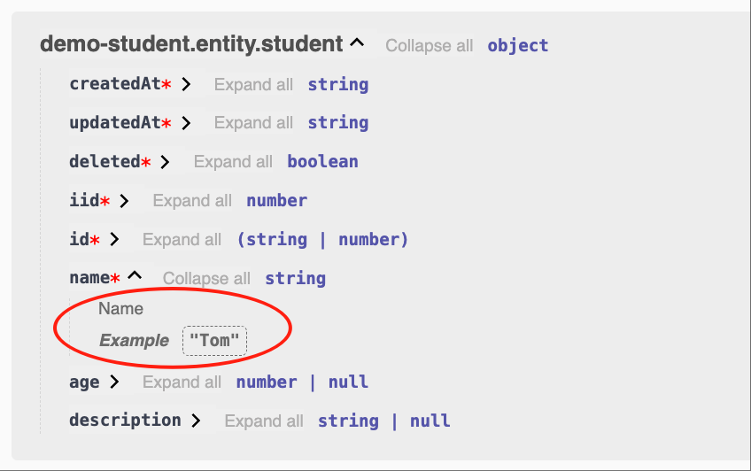
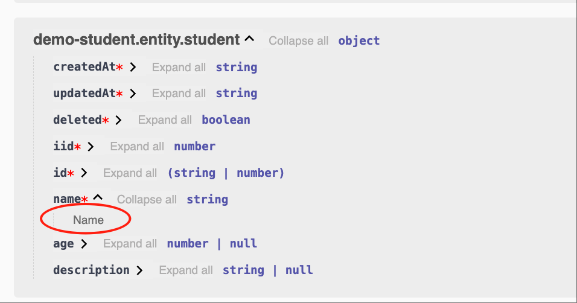
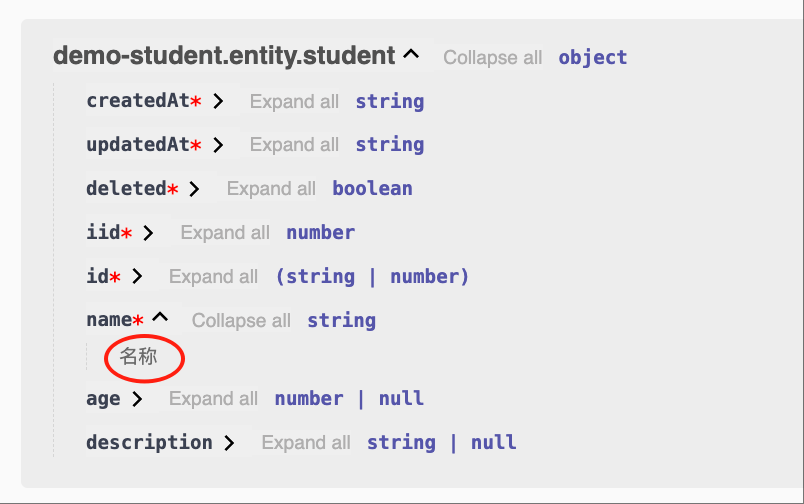

# Entity

## 创建Entity

比如，我们在模块 demo-student 中创建一个 Entity: `student`

### 1. Cli命令

``` bash
$ vona :create:bean entity student --module=demo-student
```

### 2. 菜单命令

::: tip
右键菜单 - [模块路径]: `Vona Create/Entity`
:::

## Entity定义

``` typescript
@Entity<IEntityOptionsStudent>('demoStudent')
export class EntityStudent extends EntityBase {}
```

- 继承自 EntityBase 基类
- 使用 Entity 装饰器
- 设置对应的数据表名

## 数据表名

Vona 是模块化系统，不同的模块可以独立管理自身的数据表。为了避免表名的冲突，Vona 约定了数据表名默认的组合机制。当然，你也可以提供自己的表名，但需要自行评估表名冲突的风险

### 1. 常规格式

``` bash
tableName = moduleName + entityName
```

比如，模块 demo-student 的 entity `book`，对应的数据表名是：`demoStudentBook`

### 2. 简化规则

如果`entityName`与`moduleName`重名，那么自动去除重复部分

比如，模块 demo-student 的 entity `student`，对应的数据表名是：`demoStudent`

## @Api.field

一般而言，在定义字段时，需要指定字段的类型、验证规则、Swagger/Openapi 元数据

在 Entity 中只需要使用`@Api.field`装饰器即可提供以上所有信息，从而让代码更加简洁、直观

`@Api.field`装饰器的参数使用机制，与 Controller 请求参数类似，参见：
  - [参数校验](../../techniques/validation/introduction.md)
  - [Swagger/Openapi](../../techniques/openapi/introduction.md)

## 字段类型与验证规则

### 1. 自动推断Zod Schema：基础类型/Dto/Entity

如果字段类型是`基础类型/Dto/Entity`，那么，系统就会自动推断出对应的 Zod Schema，并自动生成 Swagger/Openapi

* 举例：`string`

``` typescript
class EntityStudent {
  @Api.field()
  name: string;
}  
```



* 举例：`EntityBook`

``` typescript
class EntityStudent {
  @Api.field()
  book: EntityBook;
}
```



* 可自动推断的类型清单

|名称|说明|
|--|--|
|string|z.string()|
|number|z.number()|
|boolean|z.boolean()|
|Dto|z.object({...})|
|Entity|z.object({...})|

### 2. 指定Zod Schema

我们还可以显式的指定 Zod Schema，并自动生成 Swagger/Openapi

* 举例：`number，>=18`

``` typescript
class EntityStudent {
  @Api.field(z.number().min(18))
  age: number;
}
```



### 3. 扩展Zod Schema的属性

我们还可以在现有的 Zod Schema 基础之上扩展新的属性

* 举例：`number，可选，默认值为18`

``` typescript
class EntityStudent {
  @Api.field(v.default(18), v.optional())
  age?: number;
}
```

上述代码等价于：

``` typescript
class EntityStudent {
  @Api.field(z.number().optional().default(18))
  age?: number;
}
```

也等价于：

``` typescript
class EntityStudent {
  @Api.field(v.default(18), z.number().optional())
  age?: number;
}
```



### 4. 特殊工具：Array

对于 Array 类型的参数，Vona 也提供了便利的工具

* 举例：`number[]`

``` typescript
class EntityStudent {
  @Api.field(v.array(Number))
  bookIds: number[];
}
```

等价于：

``` typescript
class EntityStudent {
  @Api.field(v.array(z.number()))
  bookIds: number[];
}
```



* 举例：`EntityBook[]`

``` typescript
class EntityStudent {
  @Api.field(v.array(EntityBook))
  books: EntityBook[];
}
```



这些用于扩展 Zod Schema 的工具方法都放入装饰器分组`v`中，从而减轻心智负担

## Swagger/Openapi

Vona 还提供了许多扩展工具，用于设置与 Openapi 相关的元数据

|名称|说明|
|--|--|
|v.default|default|
|v.optional|optional|
|v.openapi|openapi|
|v.title|title|
|v.description|description|
|v.example|example|

### 1. 举例：v.title

`title='Name'`

``` typescript
class EntityStudent {
  @Api.field(v.title('Name'))
  name: string;
}  
```



### 2. 举例：v.openapi

我们可以使用`v.openapi`一次设置更多的元数据

`title='Name', example='Tom'`

``` typescript
class EntityStudent {
  @Api.field(v.openapi({ title: 'Name', example: 'Tom' }))
  name: string;
}  
```



## I18n国际化

Vona 为 Openapi 提供了 I18n 国际化。比如，`title`为`Name`，支持多语言的步骤如下：

### 1. 提供语言资源

如何添加语言资源，参见：[I18n国际化](../../essentials/scope/locale.md)

* 英文：`src/module/demo-student/src/config/locale/en-us.ts`

``` typescript
export default {
  Name: 'Name',
};
```

* 中文：`src/module/demo-student/src/config/locale/zh-cn.ts`

``` typescript
export default {
  Name: '名称',
};
```

### 2. 使用$locale

使用`$locale`方法进行语言翻译，支持语言资源的类型自动提示

``` typescript
import { $locale } from '../.metadata/index.ts';

@Api.field(v.title($locale('Name')))
```

- 英文



- 中文



## Entity Options

|名称|说明|
|--|--|
|table|entity对应的表名|
|independent|是否独立显示在Swagger/Openapi中，默认为false|
|openapi|与Swagger/Openapi相关的元数据|
|fields|定义Fields options|

- independent: 如果 Controller Action 引用了 entity，那么该 entity 就是自动输出到 Swagger/Openapi 中。如果指定`independent: true`，那么该 entity 就总会输出到 Swagger/Openapi 中

### 1. 举例：openapi

为 entity 提供 description 信息，从而在 Swagger/Openapi 中显示

``` typescript
@Entity({
  openapi: { description: 'Student' },
})
class EntityStudent {}
```

* 支持 I18n 国际化

（创建语言资源：略）

``` typescript
import { $locale } from '../.metadata/index.ts';

@Entity({
  openapi: { description: $locale('Student') },
})
class EntityStudent {}
```

### 2. 举例：fields

将字段`age`验证规则改为：`number，可选，默认值为16`

将字段`name`的 openapi 信息改为：`title: 'Student Name'`

``` typescript
@Entity({
  fields: {
    age: z.number().optional().default(16),
    name: { title: 'Student Name' },
  },
})
class EntityStudent {}
```

## App config配置

可以在 App config 中配置 Entity options

`src/backend/config/config/config.dev.ts`

``` typescript
// onions
config.onions = {
  entity: {
    'demo-student:student': {
      openapi: { 
        description: 'Student',
      },
      fields: {
        age: z.number().optional().default(16),
        name: { title: 'Student Name' },
      },
    },
  },
};
```

## 基类：EntityBase

默认情况下，entity 继承自基类`EntityBase`。EntityBase 内置提供了几个常用字段。可以根据业务需要实现自己的基类

|名称|类型|说明|
|--|--|--|
|id|TableIdentity|TableIdentity是string和number的联合类型|
|createdAt|Date|创建时间|
|updatedAt|Date|更新时间|
|deleted|boolean|软删除|
|iid|number|实例Id/租户Id|

## id: TableIdentity

关键字段`id`使用`TableIdentity`类型，从而支持任何规模的业务系统。当我们使用`int64`作为数据库字段类型时，从数据库读取出来的值是`string`类型

``` typescript
export type TableIdentity = string | number;
```

* 设置默认字段类型

在创建数据表时，系统会根据当前的配置使用`int`或者`int64`作为 id 字段的类型，默认为`int64`

`src/backend/config/config/config.dev.ts`

``` typescript
// modules
config.modules = {
  'a-orm': {
    'table': {
      // number -> int
      // string -> int64
      identityType: 'number',
    },
  },
};
```
