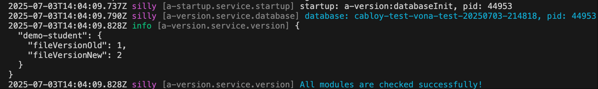
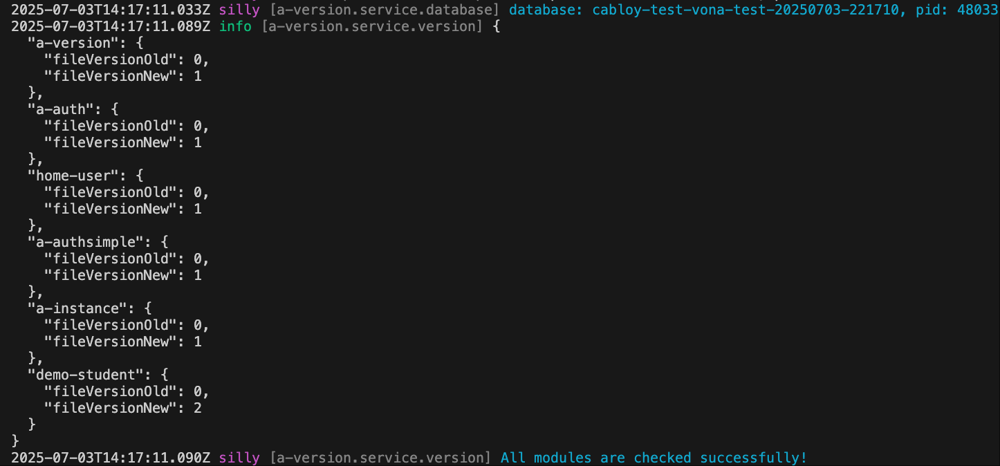

# 迁移与变更

Vona 提供了与众不同的迁移机制，适应大型项目的开发与持续迭代

## 特性

1. `支持模块化体系`：以业务模块为单位，在系统启动时，自动检测模块是否有变更，并且自动执行变更逻辑
2. `支持多租户`：为不同的租户提供独立的初始化数据
3. `支持单元测试`：为测试环境提供测试数据
4. `支持生产环境`：在生产环境中可以安全有效的执行
5. `支持类型系统`：提供类型校验与类型提示，让代码质量更高，更容易维护
6. `更强大的执行环境`：迁移代码可以使用 Vona 提供的完整的生态

## 定义数据版本

在模块的`package.json`中配置模块的当前数据版本

`src/module/demo-student/package.json`

``` typescript
{
  "name": "vona-module-demo-student",
  "vonaModule": {
    "fileVersion": 1
  },
}  
```

- fileVersion: 当模块已经发布后，下次再发生数据架构变更时，`fileVersion`需要递增`+1`

## 创建meta.version

Vona 使用 Bean `meta.version`统一管理模块的迁移代码

### 1. Cli命令

``` bash
$ vona :create:bean meta version --module=demo-student
```

### 2. 菜单命令

::: tip
右键菜单 - [模块路径]: `Vona Meta/Version`
:::

## meta.version定义

``` typescript
@Meta()
export class MetaVersion extends BeanBase {}
```

- 继承自 BeanBase 基类
- 使用 Meta 装饰器

## 变更场景

Vona 提供了三个变更场景，可以根据业务需求，继承相应的接口，并实现约定的方法即可

|场景|接口|方法|说明|
|--|--|--|--|
|update|IMetaVersionUpdate|update|数据架构的变更，比如新建数据表、添加字段，等等|
|init|IMetaVersionInit|init|为不同的实例/租户提供初始化数据|
|test|IMetaVersionTest|test|为测试环境提供测试数据|

## update：架构迁移

比如，模块 demo-student 当前数据版本为`1`，我们为`版本1`创建数据表`demoStudent`

``` typescript
@Meta()
export class MetaVersion extends BeanBase implements IMetaVersionUpdate {
  async update(options: IMetaVersionUpdateOptions) {
    if (options.version === 1) {
      await this.bean.model.createTable('demoStudent', table => {
        table.basicFields();
        table.string('name', 50);
        table.string('description', 255);
      });
    }
  }
}
```

- `table.basicFields`：创建 5 个基本字段：id/iid/deleted/createdAt/updatedAt
- `table.string`：创建 string 类型的字段

Vona 底层采用 knex，更多细节，参见：[knex](https://knexjs.org/)

为了让代码质量更高，更容易维护，我们还可以使用类型化的代码风格

``` typescript
@Meta()
export class MetaVersion extends BeanBase implements IMetaVersionUpdate {
  async update(options: IMetaVersionUpdateOptions) {
    if (options.version === 1) {
      const entityStudent = this.scope.entity.student;
      await this.bean.model.createTable(entityStudent.$table, table => {
        table.basicFields();
        table.string(entityStudent.name, 50);
        table.string(entityStudent.description, 255);
      });
    }
  }
}
```

## init：初始化数据

比如，我们初始化一个学生数据

``` typescript
@Meta()
export class MetaVersion extends BeanBase implements IMetaVersionInit {
  async init(options: IMetaVersionInitOptions) {
    if (options.version === 1) {
      await this.scope.model.student.insert({
        name: 'Tom',
        description: 'This is a student',
      });
    }
  }
}
```

在数据库中自动写入数据：

``` typescript
{
  id: '1',
  createdAt: 2025-07-03T13:39:22.642Z,
  updatedAt: 2025-07-03T13:39:22.642Z,
  deleted: false,
  iid: 1,
  name: 'Tom',
  description: 'This is a student'
}
```

其中`iid: 1`就是当前实例/租户的 Id。因此，如果有多个实例/租户，那么就会针对每个实例/租户执行一次`init`方法。因此，实例/租户的数据是隔离的

## test：测试数据

比如，添加一个学生数据，此数据只在测试环境中使用

``` typescript
@Meta()
export class MetaVersion extends BeanBase implements IMetaVersionTest {
  async test(_options: IMetaVersionTestOptions) {
    await this.scope.model.student.insert({
      name: 'Jimmy',
      description: 'Only used in unit test',
    });
  }
}
```

- 在`test`方法中添加的数据仅在测试环境/开发环境有效，在生产环境不会执行`test`方法

## 版本变更

如果我们在后续业务迭代中需要创建新的数据表，比如`Book`。那么，执行步骤如下：

### 1. 递增fileVersion

``` typescript
{
  "name": "vona-module-demo-student",
  "vonaModule": {
    "fileVersion": 2 // 1 -> 2
  },
}  
```

### 2. 创建 Entity：EntityBook

``` typescript
@Entity('demoStudentBook')
export class EntityBook {
  @Api.field()
  name: string;
}
```

### 3. 修改update/init/test

根据需要，在`update/init/test`中编写迁移代码。在这里，我们仅需在`update`中创建新的数据表

``` typescript
@Meta()
export class MetaVersion extends BeanBase implements IMetaVersionUpdate {
  async update(options: IMetaVersionUpdateOptions) {
    if (options.version === 1) {
      ...
    }
    if (options.version === 2) {
      const entityBook = this.scope.entity.book;
      await this.bean.model.createTable(entityBook.$table, table => {
        table.basicFields();
        table.string(entityBook.name, 255);
      });
    }
  }
}
```

### 4. 执行迁移代码

当系统启动时，会自动检测模块是否需要变更，并且会自动执行迁移代码

``` bash
# 开发环境
$ npm run dev
# 生产环境
$ npm run start
```



## 支持本地开发

我们在本地开发时，针对当前的数据版本，需要频繁的更新数据库架构。那么，我们并不需要修改`fileVersion`，而是执行以下命令，让迁移代码生效

``` bash
$ npm run test
```

当我们执行单元测试时，系统就会自动删除旧数据库，并创建一个新的数据库，从而会重新执行迁移代码，然后执行单元测试的代码

``` bash
$ npm run db:rest
```

此命令仅用于重新创建数据库，并重新执行迁移代码

