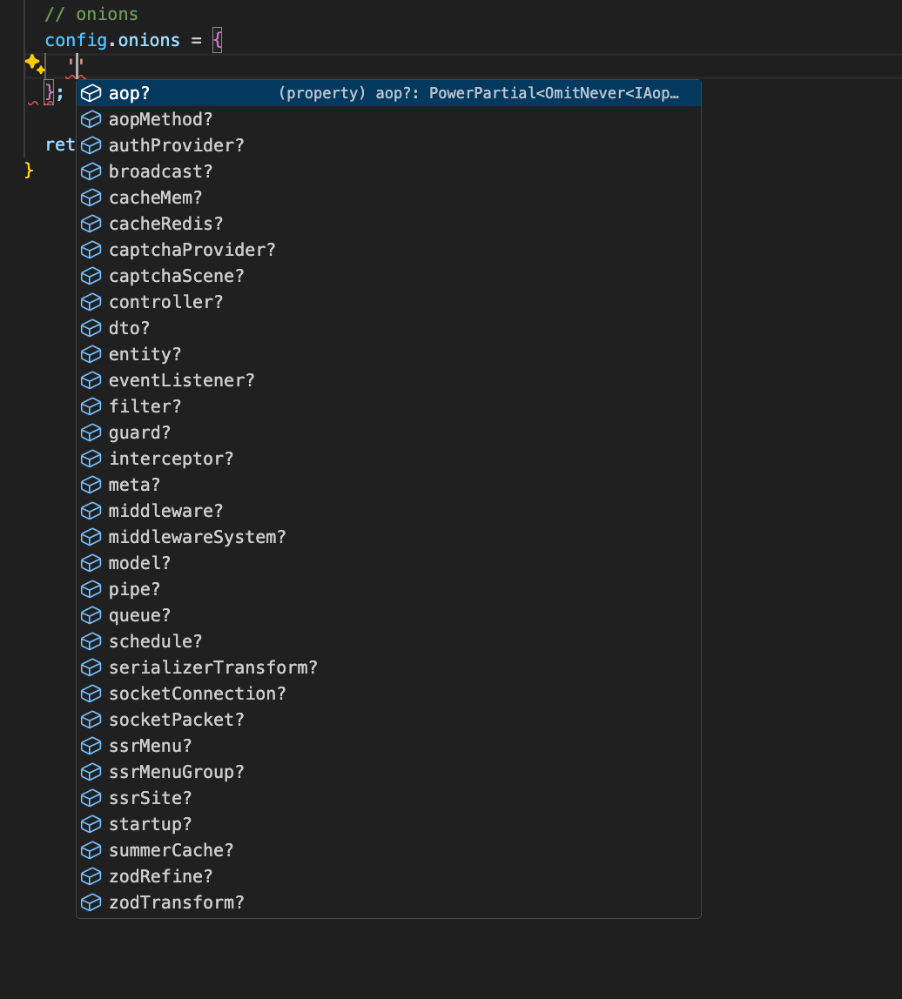
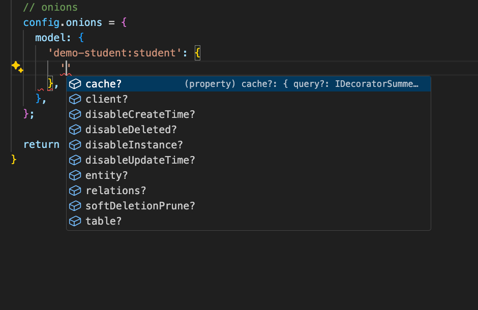

# Onion名称

系统会为每一个 bean class 自动分配一个 Onion 名称，格式如下：

```bash
{moduleName}:{beanName}
```

## 举例

* 模块 home-base 的 Service bean：ServiceMenu

|Class 名称|Scene 名称|Bean 标识|Onion 名称|Service 名称|
|--|--|--|--|--|
|ServiceMenu|service|home-base.service.menu|home-base:menu|home-base:menu|

* 模块 demo-student 的 Model bean：ModelStudent

|Class 名称|Scene 名称|Bean 标识|Onion 名称|Model 名称|
|--|--|--|--|--|
|ModelStudent|model|demo-student.model.student|demo-student:student|demo-student:student|

## App Config

有了通用的 Onion 名称，就可以在 App Config 中修改所有 bean class 的参数配置

`src/backend/config/config/config.ts`

``` typescript
// onions
config.onions = {
  middleware: {
    'a-core:gate': {
      enable: false,
    },
  },
  model: {
    'demo-student:student': {
      cache: {
        query: false,
        entity: false,
      },
    },
  },
  schedule: {
    'a-orm:softDeletionPrune': {
      repeat: { every: 24 * 3600 * 1000 },
    },
  },
};
```

所有的配置都有类型提示，如下图所示：

* 所有 SceneName 提示



* 所有 OnionName 提示


* 所有配置提示



