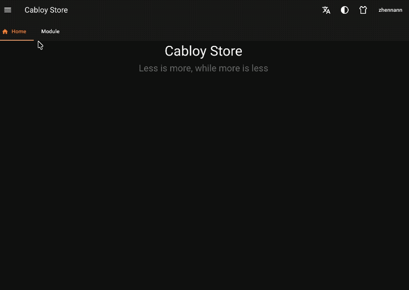

# 简介

::: tip
直播时间：周一至周五`晚7:30`，欢迎围观：[B站: 濮水代码](https://space.bilibili.com/454737998)
:::

## 什么是Vona？

Vona 是一款全栈元框架，可在同一个代码库中实现`SSR/SPA/Web网站/Admin中后台`

- 首创 DTO 动态推断与生成能力，解放我们的双手，显著提升生产力。甚至可以说，对于构建更加优雅的 Node.js 后端框架而言，能够动态推断与生成 DTO，是非常重要的`里程碑`
- 首创双层页签导航，可以更加便捷的在多个页面中切换，并保持页面状态，从而可以同时处理多个业务，提升用户交互体验
- 可动态渲染 CRUD 的列表页、条目页、搜索表单，并且提供了`Tanstack Table/Tanstack Form/Tanstack Query`的最佳实践

## 全栈机制

Vona 与 Zova 完美协同，延续前后端分离的架构风格。采用 Zova 构建的前端项目，既可以独立运行，也可以将 JS bundle 放入 Vona 后端，在后端直接进行 SSR 渲染

- Vona 可以生成完整的 Openapi Schema，从而在 Zova 中生成 Api SDK
- Zova 可以生成路由和组件的类型，从而在 Vona 中提供类型提示

## 在线演示

使用同一套代码实现 Cabloy Store 的`Web网站`和`Admin中后台`

- Web 网站：[https://cabloy.com](https://cabloy.com)
- Admin 中后台：[https://cabloy.com/admin](https://cabloy.com/admin)

## 动图演示

- 首创双层页签导航

## 特性

- `全栈能力`：可在同一个代码库中实现`SSR/SPA/Web网站/Admin中后台`。Admin 中后台也支持 SSR，并且代码直观、优雅
- `CRUD动态渲染`：可动态渲染 CRUD 的列表页、条目页、搜索表单，并且提供了`Tanstack Table/Tanstack Form/Tanstack Query`的最佳实践
- `DTO动态推断与生成`：首创 DTO 动态推断与生成能力，从而显著提升开发效率和开发体验
- `双层页签导航`：首创双层页签导航，可以更加便捷的在多个页面中切换，并保持页面状态，从而可以同时处理多个业务，提升用户交互体验
- `基于Typescript开发`：提供完备的 Typescript 类型提示
- `全部采用ESM模块`：使项目启动更快
- `文件级别的精确HMR`：让开发体验更丝滑、更高效
- `完备的模块化系统`：以模块为基础对业务进行切分，让代码更内聚，复用与分享更容易
- `IOC容器与依赖查找`：推荐使用`依赖查找`，直接从容器中获取 Bean 实例，使代码书写更加直观、优雅
- `通用的Bean配置能力`：所有 Bean Class 都可以在 App Config 中修改配置，从而显著提升整个系统的扩展性，也能够节约大量的与配置相关的代码
- `Bean全局单例`：底层采用`Async Local Storage`实现了完整的全局单例机制，从而让整个系统的内存占用非常低，也能显著改善 gc 的性能
- `多租户`：支持多租户 SAAS 系统的开发，共享数据表架构，但运行中产生的数据是相互隔离的
- `多数据库、多数据源`：支持多数据库、多数据源，还提供了开箱即用的读写分离和动态数据源能力
- `数据库事务`：内置数据库事务能力，支持事务传播机制
- `Cli命令`：提供了大量的 Cli 命令，用于生成各类资源的代码骨架
- `菜单命令`：通过菜单来执行 Cli 命令，从而显著降低心智负担，提升开发体验
- `基于多维变量的配置能力`：基于多维变量加载 Env/Config，从而提供更加灵活的配置机制，支持更复杂的业务场景
- `更完善的AOP编程`：提供了更加完善的 AOP 编程能力，包括控制器切面、内部切面、外部切面
- `练习场`：专门提供了练习场，让我们可以非常方便的进行代码演练

## 技术栈

### 通用

| 名称       | 版本      |
| ---------- | --------- |
| pnpm       | >=10.19.0 |
| Nodejs     | >=24.8.0  |
| Typescript | >=5.9.3   |

### 后端(Vona)

| 名称       | 版本     |
| ---------- | -------- |
| Koa        | >=3.0.0  |
| Knex       | >=3.1.0  |
| Zod        | >=4.1.13 |
| Redis      | >=7.2.6  |
| Sqlite3    | 内置     |
| MySQL      | >=8      |
| Postgresql | >=16     |

- `Redis`: VonaJS 基于 Redis 提供了以下能力:
  - `队列、定时任务、启动项、广播、缓存、二级缓存、分布式锁`
- `Sqlite3`: 需要预先准备 node-gyp 环境，确保在安装依赖时可以正常编译出`better_sqlite3.node`

### 前端(Zova)

| 名称           | 版本     |
| -------------- | -------- |
| Vite           | >=8.0.0  |
| Vue            | >=3.5.6  |
| Vue Router     | >=4.4.5  |
| Zod            | >=4.1.13 |
| Tanstack Query | >=5.92.5 |
| Tanstack Form  | >=1.23.5 |
| Tanstack Table | >=8.21.3 |

### UI库

Zova 可以搭配任何 UI 库使用，并且内置了几款 UI 库的项目模版，便于开箱即用

| 名称        | 版本     |
| ----------- | -------- |
| Daisyui     | >=5.3.2  |
| Tailwindcss | >=4.1.14 |
| Quasar      | >=2.18.1 |
| Vuetify     | >=4.0.1  |

## 架构哲学

### 1. 关于编码

许多框架使用最简短的用例来证明设计是否优雅，而忽略了业务复杂性带来的编码挑战。随着业务的增长和变更，项目代码迅速劣化，难以维护。而 Vona 正视大型业务的复杂性，提出一系列工程化的解决方案，让我们在开发大型业务系统时，一样可以让代码保持优雅、直观，从而提升开发效率和开发体验，更有利于后续代码迭代与维护

### 2. 关于性能

许多框架使用最简短的用例来证明是否高性能，而忽略了业务复杂性带来的性能挑战。随着业务的增长和变更，项目性能就会断崖式下降，各种优化补救方案让项目代码繁杂冗长。而 Vona 正视大型业务的复杂性，从框架核心引入缓存策略，并实现了`二级缓存`、`Query缓存`和`Entity缓存`等机制，轻松应对大型业务系统的开发，可以始终保持代码的优雅和直观

## 联系方式

- [Twitter](https://x.com/zhennann2024)
- [B站：濮水代码](https://space.bilibili.com/454737998)

## License

MIT License

Copyright (c) 2016-present, Vona
