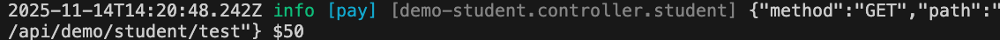
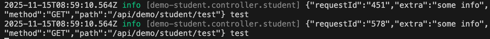

# Logger日志

VonaJS 基于[winston](https://github.com/winstonjs/winston)提供了强大而灵活的日志系统

## 特性

1. `多Client`: 每个 Client 有独立的配置
2. `多Child`: 可以为不同的场景创建 Child 日志
3. `Rotate`: 按指定的规则对日志文件进行轮换
4. `日志分级`: 可以基于分级控制写入日志文件的内容

## 日志目录

针对不同的运行环境默认使用不同的日志目录:

- `测试环境/开发环境`: `{project path}/.app/logs`
- `生产环境`: `{home}/vona/{project name}/logs`

可以在 App Config 或者.env 文件中修改配置

### 1. App Config

`src/backend/config/config/config.ts`

``` typescript
// logger
config.logger = {
  baseDir: '/new/path',
};
```

### 2. .env

`env/.env`

``` typescript
# logger
LOGGER_DIR = /new/path
```

## App Config配置

可以在 App Config 中进行日志配置：

`src/backend/config/config/config.ts`

``` typescript
// logger
config.logger = {
  baseDir: '/new/path',
  rotate: {},
  base: {},
  clients: {},
};
```

|名称|说明|
|--|--|
|baseDir|日志目录|
|rotate|日志Rotate|
|base|基础配置，为所有Client提供通用的基础配置|
|clients|配置多个Client。系统提供了内置的`default` Client，实现开箱即用的日志能力|

## Rotate

系统提供了默认的轮换配置，并且处于开启状态。可以在 App Config 或者.env 文件中修改配置

### 1. App Config

`src/backend/config/config/config.ts`

``` typescript
// logger
config.logger = {
  rotate: {
    enable: true,
    options(filename: string) {
      return {
        filename: `${filename}-%DATE%.log`,
        datePattern: 'YYYY-MM-DD',
        maxSize: '20m',
        maxFiles: '7d',
      };
    },
  },
};
```

|名称|说明|
|--|--|
|enable|是否启用Rotate|
|options|通过函数返回Rotate配置|
|options.filename|文件名模版|
|options.datePattern|日期模式|
|options.maxSize|每个文件的最大尺寸|
|options.maxFiles|只保留几天之内的文件|

### 2. .env

`env/.env`

``` typescript
# logger
LOGGER_ROTATE_ENABLE = true
LOGGER_ROTATE_FILENAME = '{{filename}}-%DATE%.log'
LOGGER_ROTATE_DATEPATTERN = YYYY-MM-DD
LOGGER_ROTATE_MAXSIZE = 20m
LOGGER_ROTATE_MAXFILES = 7d
```

## 添加新Client

下面通过添加新 Client 解释 Client 的配置

### 1. 添加类型定义

采用接口合并机制添加新 Client 的类型定义，比如`order`，用于输出独立的与订单相关的日志

在 VSCode 编辑器中，输入代码片段`recordloggerclient`，自动生成代码骨架:

``` typescript
declare module 'vona' {
  export interface ILoggerClientRecord {
    : never;
  }
}
```

调整代码，然后添加`order`

``` diff
declare module 'vona' {
  export interface ILoggerClientRecord {
+   order: never;
  }
}
```

### 2. 增加Client配置

`src/backend/config/config/config.ts`

``` typescript
// logger
config.logger = {
  clients: {
    order(this: VonaApplication, clientInfo) {
      const transports = [
        this.bean.logger.makeTransportFile(clientInfo, 'order'),
        this.bean.logger.makeTransportConsole(clientInfo),
      ].filter(item => !!item);
      return { transports };
    },
  },
};
```

- `order`: 通过函数返回 Client 配置。该配置将与系统提供的默认配置进行合并
  - 因此，在一般情况下，只需构造所需的`transports`即可
- `clientInfo`: 包含环境信息，用于构造`transport`
- `makeTransportFile`: 用于构造文件通道，需要提供日志文件名`order`
  - 由于文件名模版是`${filename}-%DATE%.log`，那么实际生成的文件名是`order-2025-11-14.log`
- `makeTransportConsole`: 用于构造控制台通道
- `filter`: 新建的通道实例有可能为 undefined，因此需要进行 filter

## 获取Logger Client实例

获取 Logger Client 实例有两种方式:

* `方式1`

``` typescript
class ControllerStudent extends BeanBase {
  async test() {
    // logger: default
    const loggerDefault = this.bean.logger.default;
    // logger: order
    const loggerOrder = this.bean.logger.get('order');
  }
}
```

* `方式2`

``` typescript
class ControllerStudent extends BeanBase {
  async test() {
    // logger: default
    const loggerDefault = this.$logger;
    // logger: order
    const loggerOrder = this.$loggerClient('order');
  }
}
```

`方式2`不仅代码更加简洁，而且还会自动在日志中带上当前 Bean Class 的`beanFullName`，便于排查问题

* 举例：

``` typescript
const loggerOrder = this.bean.logger.get('order');
loggerOrder.info('test');
```


``` typescript
// logger: default
this.$logger.info('test');
// logger: order
this.$loggerClient('order').info('test');
```


图中输出了 beanFullName: `[demo-student.controller.student]`

## 获取Logger Child实例

对于同一个 Logger Client，可以生成多个 Child 实例，不同的 Child 对应不同的场景

比如，生成 Child `pay`，从而在日志中可以明确提示`pay`信息

``` typescript
// child of logger-default
this.$loggerChild('pay').info('$50');
// child of logger-order
this.$loggerChild('pay', 'order').info('$50');
```



图中输出了 child name: `[pay]`

### 添加类型定义

同样，需要提供`pay`的类型定义，从而支持类型提示

在 VSCode 编辑器中，输入代码片段`recordloggerchild`，自动生成代码骨架:

``` typescript
declare module 'vona' {
  export interface ILoggerChildRecord {
    : never;
  }
}
```

调整代码，然后添加`pay`

``` diff
declare module 'vona' {
  export interface ILoggerChildRecord {
+   pay: never;
  }
}
```

## 日志消息

### 1. 一般用法

``` typescript
this.$logger.info('test');
```

### 2. 字符串插值

基于[util.format](https://nodejs.org/dist/latest/docs/api/util.html#util_util_format_format_args)实现字符串插值

``` typescript
this.$logger.info('%s has %d apples', 'Tom', 3);
```

### 3. 延迟消息

由于存在日志分级，有些分级的消息并不会写入文件。那么，如果构造消息内容太大，则会浪费系统性能

* 举例

``` typescript
const obj = { data: 'more info' };
this.$logger.debug(JSON.stringify(obj));
```

如果当前分级是`info`，那么`debug`分级的日志就不会写入文件。那么，`JSON.stringify`就会空耗系统性能

* 解决方案

可以提供回调函数，当需要写入文件时才会执行回调函数，从而生成实际的消息

``` typescript
const obj = { data: 'more info' };
this.$logger.debug(() => {
  return JSON.stringify(obj);
});
```

### 4. 多级Child

可以从当前 Logger 实例创建多级 Child Logger，从而向日志消息中传入更多 metadata

``` typescript
this.$logger.child({ requestId: '451' }).child({ extra: 'some info' }).info('test');
this.$logger.child({ requestId: '578', extra: 'some info' }).info('test');
```

如下图所示：`requestId/extra`


