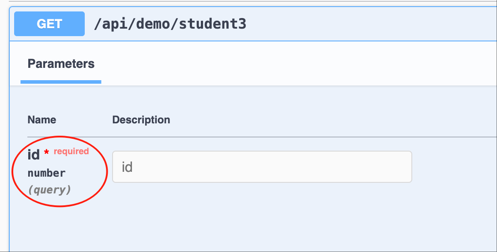
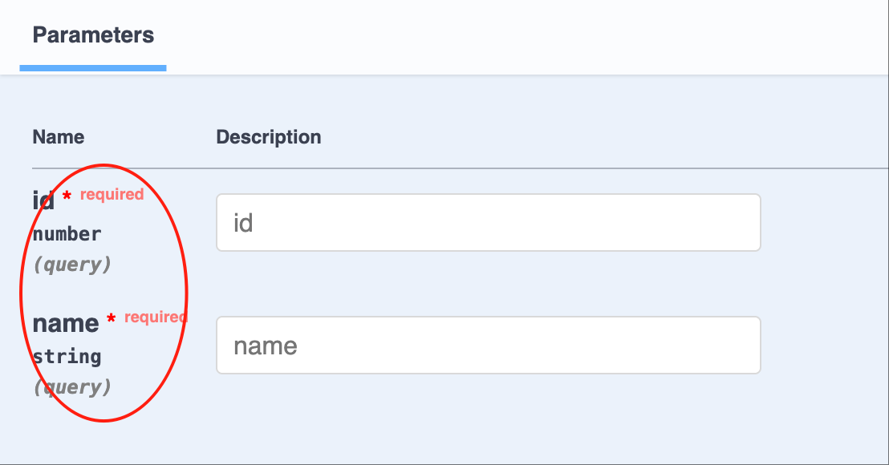
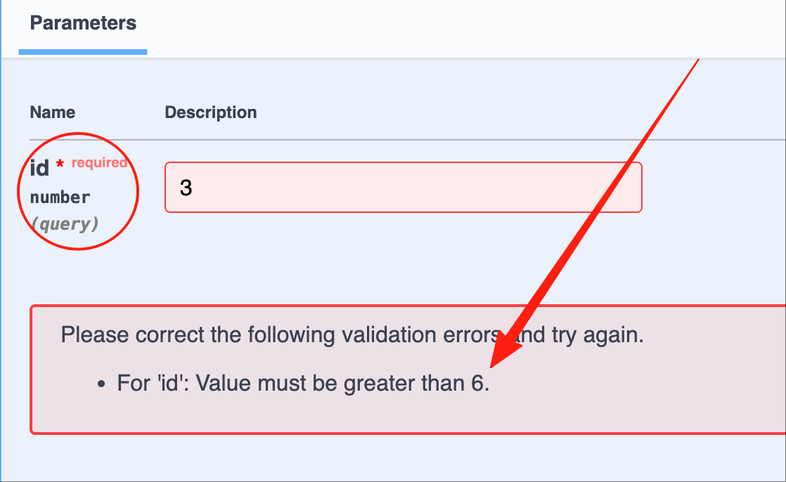
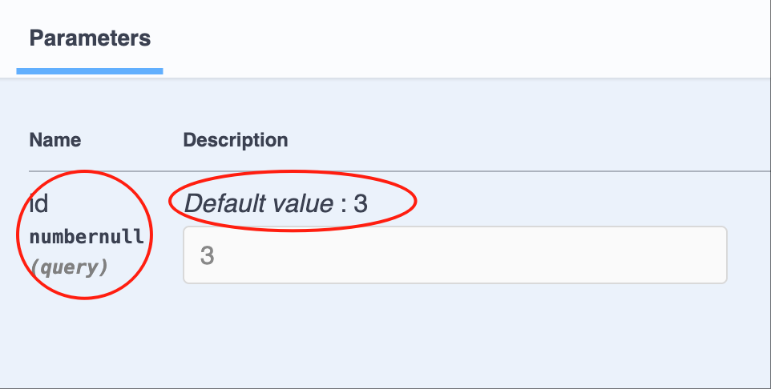
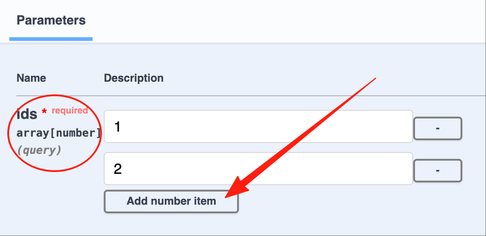
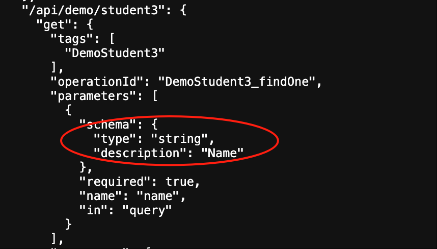
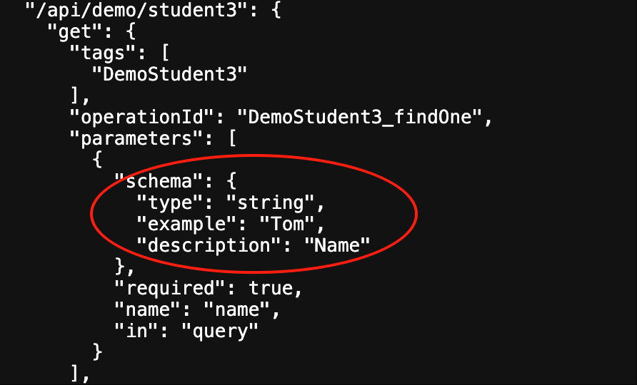
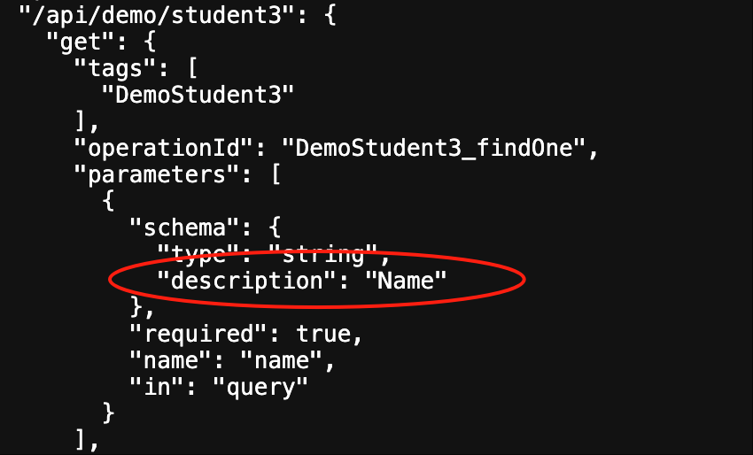
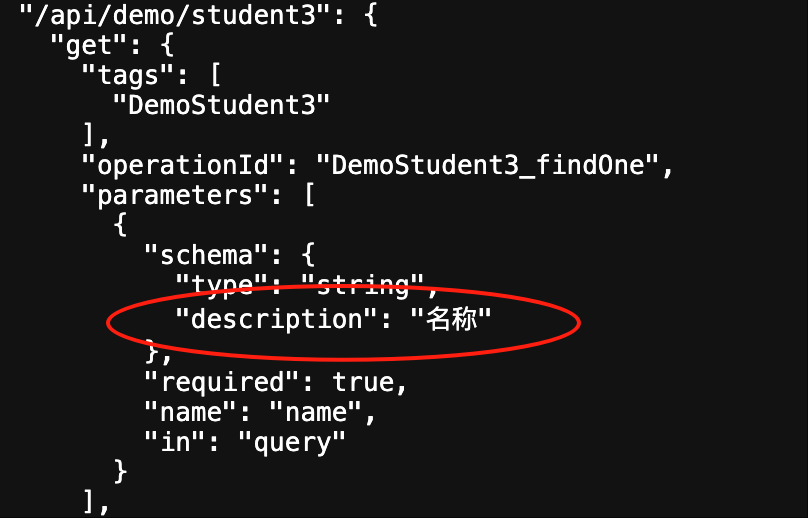

# Swagger/OpenAPI

Vona 基于[@asteasolutions/zod-to-openapi](https://github.com/asteasolutions/zod-to-openapi)实现了非常便利的`Swagger/OpenAPI`。Vona 中的 `Swagger/OpenAPI` 仍然延续[参数校验](../validation/introduction.md)中的装饰器，同时提供扩展工具，用于设置与 OpenAPI 相关的元数据

## URL

Vona 内置了 Swagger 模块，我们可以直接通过 URL 访问：

|名称|URL|
|--|--|
|Swagger|http://localhost:7102/swagger|
|Openapi json| http://localhost:7102/swagger/json|
|Openapi json V3.1| http://localhost:7102/swagger/json?version=V31|
|Openapi json V3.0| http://localhost:7102/swagger/json?version=V30|

- Openapi json 默认是`V3.1`

此外，Vona 还内置了[RapiDoc](https://rapidocweb.com/)，提供了更加优雅的 UI

|名称|URL|
|--|--|
|RapiDoc|http://localhost:7102/rapidoc|

## 1. 自动推断Zod Schema：基础类型/Dto/Entity

如果参数类型是`基础类型/Dto/Entity`，那么，系统就会自动推断出对应的 Zod Schema，从而自动生成 OpenAPI 元数据

比如，`findOne(@Arg.query('id') id: number)`，id 的类型是`number`，那么自动推断出来的 Schema 就是：`z.number()`。那么，自动生成的 Swagger/OpenAPI 如下：



再比如，`findOne(@Arg.query() query: DtoStudentInfo)`，query 的类型是 Dto: `DtoStudentInfo`，那么自动推断出来的 Schema 就是：`z.object({...})`。那么，自动生成的 Swagger/OpenAPI 如下：



## 2. 指定Zod Schema

比如，`findOne(@Arg.query('id', z.number().min(6)) id: number)`，我们指定 id 的类型是`number`，并且`>=6`。那么，自动生成的 Swagger/OpenAPI 如下：



## 3. 扩展Zod Schema的属性

比如，`findOne(@Arg.query('id', v.default(3), v.optional()) id: number)`。首先，系统自动推断出 schema 为`z.number()`，然后，依次附加`optional`和`default`属性，最终会生成 schema：`z.number().optional().default(3)`。那么，自动生成的 Swagger/OpenAPI 如下：



## 4. 特殊工具：Array

比如，`findOne(@Arg.query('ids', v.array(Number)) ids: number[])`，我们指定 ids 为`number[]`。那么，自动生成的 Swagger/OpenAPI 如下：



## 扩展工具

Vona 还提供了许多扩展工具，用于设置与 OpenAPI 相关的元数据

|名称|说明|
|--|--|
|v.default|default|
|v.optional|optional|
|v.openapi|openapi|
|v.title|title|
|v.description|description|
|v.example|example|

### 1. 举例：v.title

比如，我们可以为 OpenAPI 指定`title`为`Name`

``` typescript
class ControllerStudent3 {
  @Web.get()
  findOne(@Arg.query('name', v.title('Name')) name: string) {}
}  
```

自动生成的 Swagger/OpenAPI 如下：(由于 Swagger 没有在界面显示 title 信息，我们直接查看 OpenAPI json 数据)



### 2. 举例：v.openapi

我们可以使用`v.openapi`一次设置更多的元数据。比如，我们可以为 OpenAPI 指定`title`为`Name`，`example`为`Tom`

``` typescript
class ControllerStudent3 {
  @Web.get()
  findOne(@Arg.query('name', v.openapi({ title: 'Name', example: 'Tom' })) name: string) {}
}  
```

自动生成的 Swagger/OpenAPI 如下：



## I18n国际化

Vona 为 OpenAPI 提供了 I18n 国际化。比如，`title`为`Name`，支持多语言的步骤如下：

### 1. 提供语言资源

如何添加语言资源，参见：[I18n国际化](../../essentials/scope/locale.md)

* 英文：`src/module/demo-student/src/config/locale/en-us.ts`

``` typescript
export default {
  Name: 'Name',
};
```

* 中文：`src/module/demo-student/src/config/locale/zh-cn.ts`

``` typescript
export default {
  Name: '名称',
};
```

### 2. 使用$locale

使用`$locale`方法进行语言翻译，支持语言资源的类型自动提示

``` typescript
import { $locale } from '../.metadata/index.ts';

class ControllerStudent3 {
  @Web.get()
  findOne(@Arg.query('name', v.title($locale('Name'))) name: string) {}
}  
```

自动生成的 Swagger/OpenAPI 如下：

* 英文：http://localhost:7102/swagger/json?x-vona-locale=en-us



* 中文：http://localhost:7102/swagger/json?x-vona-locale=zh-cn


